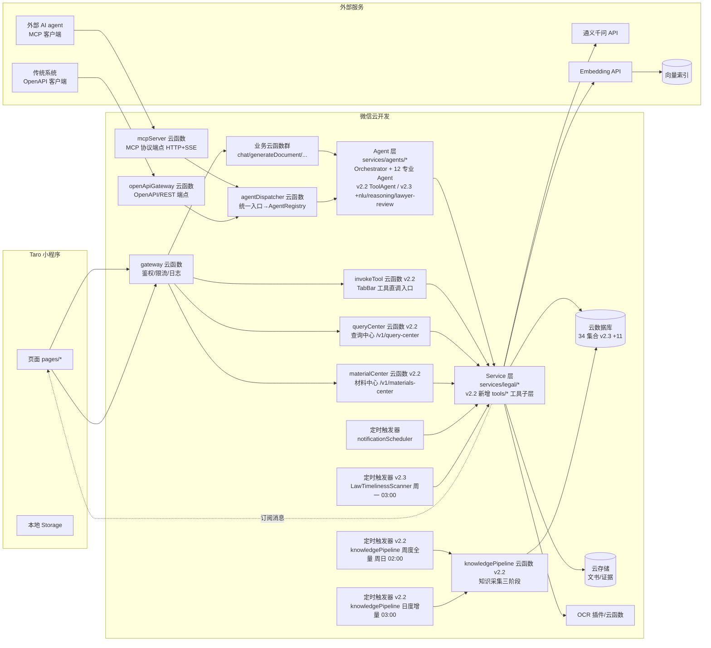
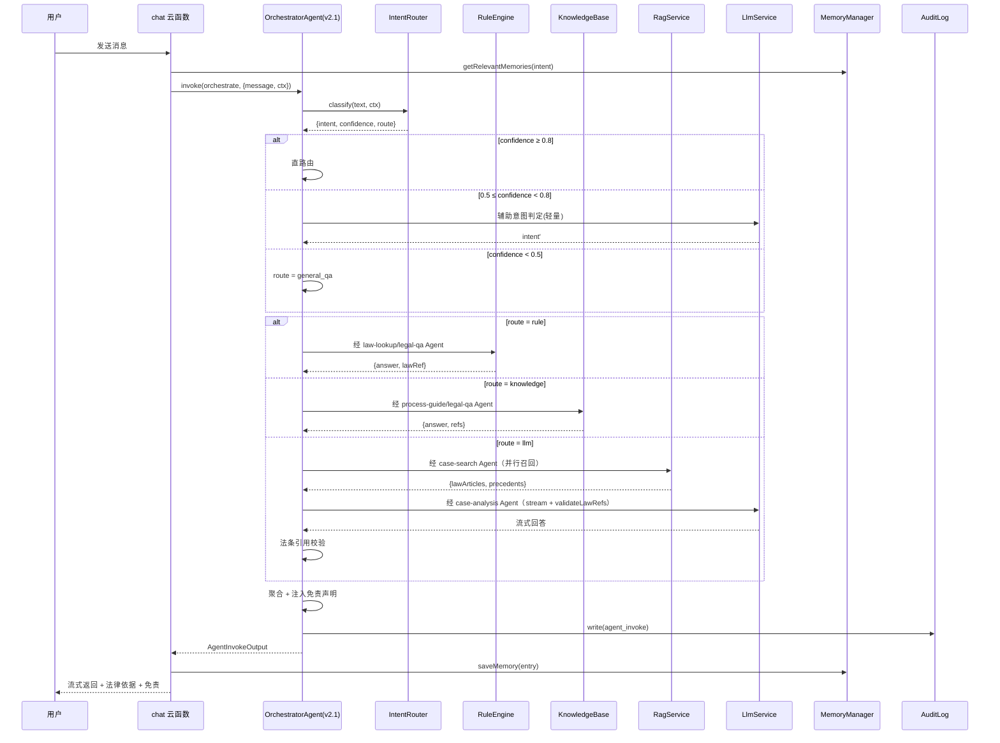
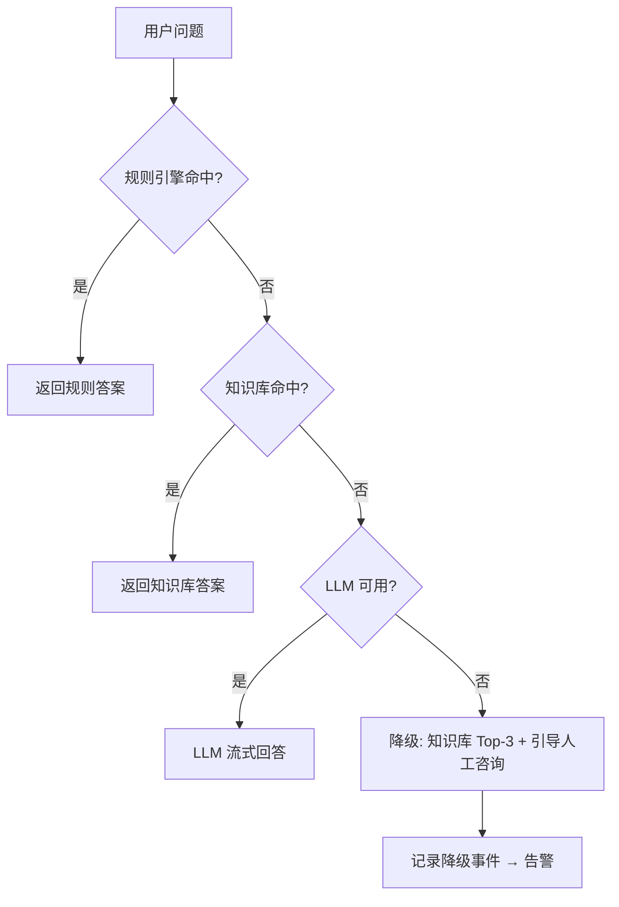

# 02 · 总体架构补充设计

> 版本：v2.3 | 日期：2026-07-22 | 状态：设计扩展（v2.3 新增 nlu/reasoning/lawyer-review 3 Agent + IRAC 推理 + 律师审核闭环；v2.2 新增 7 法律工具 + 知识采集管道 + 双模式 UI）
> 影响范围：03 / 04 / 05 / 06 / 07 / 08 / 09 / 10 / 11 / 12 / 13 / 14 / 15

---

## 一、六层分层架构

v1.0 给出"意图识别 → 路由分发 → 记忆"的业务视图，本节细化为可部署的六层技术架构：

```
┌─────────────────────────────────────────────────────────────┐
│ L1 接入层  Taro 小程序客户端 · 微信订阅消息 · 文件上传          │
├─────────────────────────────────────────────────────────────┤
│ L2 网关层  云函数网关 · 鉴权 · 限流 · 路由 · 日志 · 灰度        │
├─────────────────────────────────────────────────────────────┤
│ L3 服务层  Application Services（编排，对应云函数）            │
│   chat / generateDocument / searchCase / process / case ...  │
├─────────────────────────────────────────────────────────────┤
│ L3.5 Agent 编排层  OrchestratorAgent · AgentRegistry          │
│   12 个专业 Agent（law-lookup/.../tool + nlu/reasoning/      │
│   lawyer-review，v2.3 新增 3 Agent）                          │
│   包装 L4 能力层，统一 LegalAgent 接口                        │
│   v2.2 新增 ToolAgent + ToolRegistry + 7 LegalTool 工具子层  │
│   v2.3 新增 IRAC 推理 + 律师审核闭环 + 法条时效扫描           │
│   对外：mcpServer / openApiGateway / agentDispatcher 云函数  │
├─────────────────────────────────────────────────────────────┤
│ L4 能力层  Domain Services（services/legal/，可复用）          │
│   IntentRouter · RuleEngine · KnowledgeBase · RagService     │
│   LlmService · DocumentGenerator · MemoryManager            │
│   NotificationService · CaseTracker · OcrService · Export   │
├─────────────────────────────────────────────────────────────┤
│ L5 数据层  云数据库 · 云存储 · 本地 Storage · 向量索引 · 缓存   │
├─────────────────────────────────────────────────────────────┤
│ L6 基础设施 微信云开发底座 · 定时触发器 · 监控 · 日志服务       │
└─────────────────────────────────────────────────────────────┘
```

| 层 | 职责 | 部署形态 |
|----|------|----------|
| L1 接入层 | UI 渲染、用户交互、本地缓存、订阅授权 | Taro 小程序包 |
| L2 网关层 | 鉴权（openid + 会话）、限流配额、灰度分流、结构化日志、统一错误封装 | 云函数 `gateway`（或每个 API 入口前置中间件） |
| L3 服务层 | 单一业务用例编排，调用 L4 能力组合产出 | 云函数（每用例一个） |
| L3.5 Agent 编排层（v2.1 / v2.2 / v2.3 扩展） | Agent 化包装与编排：12 个专业 Agent 包装 L4 能力层（v2.2 新增 ToolAgent / v2.3 新增 nlu/reasoning/lawyer-review）；OrchestratorAgent 按意图编排子 agent；v2.2 新增 ToolRegistry + 7 LegalTool 工具子层；v2.3 新增 IRAC 推理编排 + 律师审核闭环 + 敏感操作钩子；对外经 MCP/OpenAPI 暴露 | `services/agents/` 包 + 3 个云函数（mcpServer/openApiGateway/agentDispatcher）+ v2.2 新增 4 个云函数（invokeTool/queryCenter/materialCenter/knowledgePipeline），详见 11/12/14/15/16/17 |
| L4 能力层 | 领域能力，纯逻辑 + 数据访问，前后端/云函数共享 | `services/legal/` 包 |
| L5 数据层 | 持久化与检索 | 云数据库集合 / 云存储 / 向量索引 / Redis（如启用）/ Storage |
| L6 基础设施 | 运行时、调度、监控 | 微信云开发 |

**依赖原则**：上层依赖下层，禁止反向；L4 不感知 L1/L2/L3/L3.5 的存在（纯领域逻辑，可单测）；L3.5 包装 L4，不重写领域逻辑；L3 经 L3.5 编排 L4（v2.1 起 chat 云函数内部从直接调 L4 演进为经 OrchestratorAgent 调 Agent），不跨用例互调。

## 二、微信云开发部署拓扑



**说明**：
- 客户端不直连 LLM/外部 API，一律经云函数代理（密钥不落端、可限流可审计）。
- 向量索引选型：MVP 阶段采用"云数据库 + 字段存 embedding + 应用侧余弦计算"（数据量 < 5 万条可接受）；规模增长后迁移至专用向量服务（详见 07）。
- OCR 优先用微信官方 OCR 插件（身份证/银行卡/通用印刷体），复杂证据材料走腾讯云 OCR 云函数。
- **v2.1 新增**：外部 AI agent 经 mcpServer（HTTP+SSE）接入，传统系统经 openApiGateway（REST）接入，两者均转发至 agentDispatcher 统一入口，由 dispatcher 完成鉴权/PII 边界/限流后调用 Agent 层。Agent 层是 L4 能力层的包装（详见 11/12）。
- **v2.2 新增**：① L1 接入层新增 TabBar 双模式（工具 / AI对话 / 案件 / 我的），用户可在工具 Tab 直接调 invokeTool 云函数；② L3 服务层新增 3 个云函数：invokeTool（TabBar 工具直调入口）/ queryCenter（查询中心，含 official_query_entry 数据）/ materialCenter（材料中心，含 legal_material 数据）；③ L3.5 Agent 编排层新增 ToolAgent + ToolRegistry + 7 LegalTool 工具子层（详见 11/14）；④ L6 基础设施新增 knowledgePipeline 云函数 + 2 定时触发器（周度全量周日 02:00 + 日度增量每日 03:00），负责知识采集三阶段（详见 15）；⑤ 数据集合 18 → 23（新增 official_query_entry / legal_material / knowledge_source / wechat_account / crawl_job，详见 05/15）。
- **v2.3 新增**：① L3.5 新增 nlu/reasoning/lawyer-review 3 个 Agent（12 Agent / 27 capability，详见 11）；② L4 新增 IRAC 推理 5 算法（IracReasoner/FactSimilarityService/LawApplicationDeterminer/CaseComparator + reasoning_chain 持久化，详见 16/07 第九节）；③ L4 新增律师审核闭环 5 服务（LawyerReviewService/AnswerQualityScorer/AnswerTracer/ComplianceMonitor/LawyerAnnotationService，详见 17）；④ L4 新增 ClauseRecommender（第 8 LegalTool）+ CitationGraphBuilder（详见 14）；⑤ L6 新增 LawTimelinessScanner 定时触发器（周一 03:00，详见 15 第十三节）；⑥ L4 新增 DataExportService/SensitiveOpVerifier/ComplianceMonitor 安全合规增强（详见 03 12.5-12.7）；⑦ 数据集合 23 → 34（+11：NLU 2/推理 1/文书版本 1/安全 3/律师审核 4，详见 05 3.24-3.34）。

## 三、三层混合处理流（详细时序）



**关键约束**：
- 规则引擎命中即返回，不向下走（成本最优）。
- 知识库命中且置信度高时直接返回；否则降级到 LLM。
- LLM 输出必须经法条引用校验：未命中 `law_article` 的法条号标记为"未核实"并降级展示。
- 免责声明由 OrchestratorAgent 统一注入，不依赖 LLM 自觉；网关出口二次校验缺失则注入兜底（见 13 第 7.1 节）。
- **v2.1 演进**：chat 云函数内部从"直接调 L4 能力层"演进为"经 OrchestratorAgent 调度 8 个专业 Agent"，编排细节（单/并行/串行）见 11 第五、六节；关键 agent 全失败时 Orchestrator 降级到单体直调 RuleEngine/KnowledgeBase（见 4.4）。

## 四、限流、降级与熔断

### 4.1 限流（在 L2 网关层）

| 维度 | 默认配额 | 超限行为 |
|------|----------|----------|
| 单用户·chat | 20 次/分钟 | 返回 `4291`（见 06 错误码） |
| 单用户·LLM 调用 | 50 次/天 | 降级到知识库回答 + 提示 |
| 全局·chat 云函数 | 500 QPS | 触发排队/拒绝 |
| 全局·LLM 上游 | 由通义千问配额决定 | 熔断降级 |

实现：云函数内存计数器 + 云数据库计数（按 userId + 分钟 bucket）。

### 4.2 降级链（LLM 不可用时）



### 4.3 熔断

- LLM 调用错误率 > 30%（滑动 1 分钟窗口）触发熔断，60 秒后半开探测。
- 熔断期间所有 `route=llm` 自动走降级链。
- 熔断状态写入云数据库 `system_status` 集合（或内存 + 短缓存），网关层读取。

### 4.4 Agent 层降级（v2.1）

v2.1 引入 Agent 编排层后，新增针对单 agent 与编排器的分级降级：

| 故障 | 降级策略 | 错误码 | 审计 |
|------|---------|--------|------|
| 子 agent 超时 | 用 `fallbackAgentId`（如 law-lookup → legal-qa） | `7003` | `agent_degradation` |
| 关键 agent 全失败 | OrchestratorAgent 降级到单体路径（直接调 RuleEngine/KnowledgeBase，绕过 agent 层） | `5001` | `agent_degradation` + `degradation` |
| OrchestratorAgent 自身故障 | chat 云函数 fallback 到 v2.0 单体编排（保留兼容路径） | `5001` | `degradation` |
| 外部 agent 不可达 | 返回 `7003` + 建议本地能力替代 | `7003` | `agent_degradation` |
| Agent 输出缺 disclaimer | 网关出口注入兜底免责 + 告警 | `0`（不阻断） | `agent_degradation` reason=missing_disclaimer |

- 单 agent 错误率 > 30%（5 分钟）触发该 agent 调用降级（非全局熔断），复用 4.3 熔断框架，状态存 `system_status`。
- 降级事件统一写 `audit_log(event=agent_degradation)`，字段 `agentId / fallbackAgentId / reason`，触发告警（13 第 9.1 节）。
- v2.0 单体降级链（4.2 节）保留，作为 OrchestratorAgent 自身故障时的最终兜底。

## 五、多级缓存

| 层级 | 键 | TTL | 失效策略 |
|------|-----|-----|----------|
| L1 客户端 Storage | 问题哈希 → 答案摘要 | 1 小时 | 用户手动清缓存 |
| L2 云函数内存 | 热门 FAQ | 5 分钟 | 进程级，新实例自动失效 |
| L3 云数据库 `llm_cache` | prompt 哈希 → LLM 响应 | 7 天 | 法条更新时按影响范围批量失效 |
| L4 知识库查询缓存 | query 哈希 → KB 结果 | 1 小时 | 知识库写入时失效 |

**法条更新失效**：法条更新管道（见 04 `lawUpdatePipeline`）写入 `law_article` 时，按 `affectedCacheKeys` 触发 `llm_cache` 批量删除。

## 六、灰度发布

- **维度**：按 openid 哈希取模（如尾号 0–9 中 0–1 为灰度桶，10% 流量）。
- **开关**：云数据库 `feature_flag` 集合（`flagKey / enabled / rolloutPercent / whitelist`）。
- **应用点**：意图识别新算法、新 LLM Prompt 版本、新文书模板版本。
- **回滚**：开关秒级回退；云函数版本化（保留上一版本，一键切回）。

## 七、多环境

| 环境 | 云开发环境 ID 约定 | 用途 | 数据 |
|------|-------------------|------|------|
| dev | `legal-dev` | 开发自测 | mock + 少量真实 |
| staging | `legal-staging` | 联调、QA、UAT | 脱敏真实数据子集 |
| prod | `legal-prod` | 生产 | 真实数据 |

- 环境配置通过 `config/env.{env}.ts` 注入，禁止硬编码。
- LLM API Key、向量服务凭证存云开发环境变量，不入仓库。
- 数据迁移：通过云函数 `admin/migrate` 脚本，带 dry-run。

## 八、可观测性

### 8.1 日志（结构化）

统一 JSON 行格式，字段：

```json
{
  "ts": "2026-07-19T10:00:00.000Z",
  "level": "info",
  "traceId": "uuid",
  "userId": "openid-hash",
  "func": "chat",
  "intent": "legal_qa",
  "route": "rule",
  "durationMs": 120,
  "llmCalled": false,
  "cacheHit": "L2",
  "msg": "rule hit"
}
```

v2.1 跨 agent 调用相关日志追加字段：

```json
{
  "ts": "...",
  "level": "info",
  "traceId": "uuid",
  "callerAgentId": "external:tianyan-enterprise",
  "targetAgentId": "law-lookup",
  "capability": "law.lookup",
  "externalAgentKey": "tianyan-enterprise",
  "result": "success",
  "durationMs": 120,
  "cacheHit": "L3",
  "verified": true
}
```

- `traceId` 由网关生成，贯穿一次请求所有云函数调用与跨 agent 调用。
- PII 不得入日志（见 03）。
- 日志写入微信云开发日志服务，按 `level=error` 告警。
- v2.1 高频 `agent_invoke` 另写精简快查集合 `agent_invocation_log`（TTL 30 天，见 05 第 3.16 节）；`audit_log` 保留 180 天全量。

### 8.2 监控指标

| 指标 | 类型 | 告警阈值 |
|------|------|----------|
| chat 云函数 P95 延迟 | 业务 | > 3s |
| LLM 调用错误率 | 业务 | > 10% |
| LLM 降级触发次数 | 业务 | 5 分钟 > 50 |
| 意图识别 fallback 率 | 业务 | 1 小时 > 20% |
| 云函数内存超限 | 系统 | > 0 次 |
| 订阅消息送达失败率 | 业务 | > 10% |
| 单 agent 错误率（v2.1） | 业务 | > 10% / 5min |
| 单 agent P95 延迟（v2.1） | 业务 | L-Read > 2s / L-Write-Limited > 60s |
| agent 限流触发次数（v2.1） | 业务 | 单 agent > 100 / 小时 |
| PII 边界违规次数（v2.1） | 安全 | > 0 |
| 免责缺失注入次数（v2.1） | 合规 | > 0 |

### 8.3 链路追踪

- `traceId` 注入每条日志与 `dialog_record.context`。
- 一次对话可通过 `traceId` 串联：网关 → chat → RAG → LLM → 审计。

## 九、容量与成本模型（估算）

假设：DAU 1000，人均 3 次对话。

| 资源 | 估算 | 月成本量级 |
|------|------|-----------|
| chat 云函数调用 | 3000 次/天 ≈ 9 万/月 | 低（云开发免费额度内大部分覆盖） |
| LLM 调用 | 三层过滤后约 1.2 次/人/天 ≈ 1200 次/天 = 3.6 万/月 | 中（通义千问按 token 计价） |
| Embedding 调用 | 案例库 + 增量查询，约 1000 次/天 | 低 |
| 云数据库读写 | 5–10 万/天 | 低 |
| 云存储 | 文书 + 证据，约 50MB/用户/月 | 低 |
| 向量索引 | 案例库 1–5 万条，应用侧计算 | 低（无外部向量库月费） |

**优化杠杆**：
- LLM 缓存命中率目标 ≥ 25%（`llm_cache`）。
- 简单法条问题路由到规则引擎比例目标 ≥ 30%。
- 流式输出减少用户感知延迟但不减少 token 成本，需配合 Prompt 长度控制（上下文裁剪）。

## 十、与 v1.0/v2.0/v2.1/v2.2 的差异声明

- **v1.0 → v2.0**：
  - v1.0"知识库兜底"细化为四级降级链（规则→知识库→LLM→人工引导）。
  - v1.0 未提网关层；本集新增 L2 网关层承载鉴权/限流/灰度/日志。
  - v1.0"本地 Storage + 云数据库"细化为五级存储与缓存策略。
  - v1.0 风险表"LLM API 不可用"由静态缓解措施升级为熔断 + 降级链 + 告警闭环。
- **v2.0 → v2.1**：
  - 六层架构新增 **L3.5 Agent 编排层**：8 个专业 Agent 包装 L4 能力层，OrchestratorAgent 按意图编排子 agent（详见 11）。
  - 部署拓扑新增 3 个云函数：`mcpServer`（MCP 协议端点 HTTP+SSE）、`openApiGateway`（OpenAPI/REST 端点）、`agentDispatcher`（统一入口）；新增外部 AI agent 与传统系统接入路径。
  - 降级链扩展 4.4 节"Agent 层降级"：子 agent 超时降级到 fallbackAgentId；关键 agent 全失败降级到单体路径；OrchestratorAgent 故障降级到 v2.0 单体编排。
  - 可观测性新增 4 项 agent 指标（错误率/P95 延迟/限流次数/PII 边界违规）+ 1 项合规指标（免责缺失）；日志新增 `callerAgentId/targetAgentId/capability` 字段。
  - 数据库集合数从 13 扩展到 18（新增 5 个 agent 集合，见 05）。
- **v2.1 → v2.2**：
  - 六层架构 L3.5 Agent 数 8 → 9（新增 `tool` / ToolAgent），新增 ToolRegistry + 7 LegalTool 工具子层（详见 11/14）；L1 接入层新增 TabBar 双模式（工具 / AI对话 / 案件 / 我的）。
  - 部署拓扑新增 4 个云函数：`invokeTool`（TabBar 工具直调入口）/ `queryCenter`（查询中心）/ `materialCenter`（材料中心）/ `knowledgePipeline`（知识采集三阶段）；新增 2 个定时触发器（周度全量 + 日度增量）。
  - 数据库集合数从 18 扩展到 23（新增 5 个采集相关集合：official_query_entry / legal_material / knowledge_source / wechat_account / crawl_job，详见 05/15）。
  - 本文为部署拓扑权威源，与 14（工具实现）、15（采集架构）、04（模块设计）、05（数据模型）形成闭环。
- **v2.2 → v2.3**：
  - 六层架构 L3.5 Agent 数 9 → 12（新增 `nlu` / `reasoning` / `lawyer-review` 3 Agent，27 capability，详见 11）；L4 能力层新增 IRAC 推理 5 算法 + 律师审核闭环 5 服务 + ClauseRecommender/CitationGraphBuilder/LawTimelinessScanner/DataExportService/SensitiveOpVerifier/ComplianceMonitor（详见 16/17/14/15/03）。
  - 部署拓扑 Mermaid 新增 1 个定时触发器 `CRON4`（LawTimelinessScanner 周一 03:00）；AGT 节点 9 → 12 专业 Agent；DB 节点 23 → 34 集合。
  - 数据库集合数从 23 扩展到 34（+11：NLU/推理/文书版本/安全合规/律师审核，详见 05 3.24-3.34）。
  - 新增 v2.3 说明段（第二节），列出 7 项架构增量；本文仍为部署拓扑权威源，与 16（推理架构）、17（审核评估）、03（安全合规增强）形成闭环。
