# 04 · 系统模块划分与依赖

> 版本：v2.3 | 日期：2026-07-22 | 状态：设计扩展（v2.3 新增 1.11 NLU 域 + 1.12 法律推理域 + 1.13 文书增强域 + 1.14 安全合规增强域 + 1.15 律师审核评估域，共 20 模块）
> 影响范围：02 / 03 / 05 / 06 / 07 / 08 / 09 / 10 / 11 / 12 / 13 / 14 / 15 / 16 / 17
> 本文为模块名权威源；其余文档涉及的模块名以此为准。

---

## 一、模块清单与职责矩阵

L4 能力层模块（`services/legal/`），按域分组：

### 1.1 意图与路由域

| 模块 | 文件 | 职责 | 主要协作者 |
|------|------|------|-----------|
| `IntentRouter` | `services/legal/intentRouter.ts` | 意图分类、置信度评分、路由决策、上下文延续 | MemoryManager |
| `RuleEngine` | `services/legal/ruleEngine.ts` | 法条/FAQ 精确匹配，无 LLM | law_article 数据 |

### 1.2 知识与检索域

| 模块 | 文件 | 职责 | 主要协作者 |
|------|------|------|-----------|
| `KnowledgeBase` | `services/legal/knowledgeBase.ts` | 结构化知识（流程/材料清单/模板/案例）查询 | legal_knowledge 数据 |
| `RagService` | `services/legal/ragService.ts` | BM25 + 向量混合召回、RRF 融合、重排、法条引用校验 | Embedding API、向量索引、law_article |
| `LawUpdatePipeline` | `services/legal/lawUpdatePipeline.ts` | 法条更新抓取/校验/入库/缓存失效 | law_article、llm_cache |

### 1.3 生成与 LLM 域

| 模块 | 文件 | 职责 | 主要协作者 |
|------|------|------|-----------|
| `LlmService` | `services/legal/llm.ts` | 通义千问调用、流式、多厂商切换、Prompt 模板、缓存 | llm_cache、LLM API |
| `DocumentGenerator` | `services/legal/documentGenerator.ts` | 文书模板 DSL 解析、变量填充、校验、导出 | document_template、ExportService |
| `ExportService` | `services/legal/exportService.ts` | Word/PDF 生成、云存储回链 | 云存储、docx/pdf 库 |

### 1.4 记忆与案件域

| 模块 | 文件 | 职责 | 主要协作者 |
|------|------|------|-----------|
| `MemoryManager` | `services/legal/memoryManager.ts` | 偏好/案件/对话历史/使用习惯的存取与检索 | user_profile、dialog_record |
| `CaseTracker` | `services/legal/caseTracker.ts` | 案件建档、阶段流转、节点识别、时间线 | case_record |

### 1.5 通知与调度域

| 模块 | 文件 | 职责 | 主要协作者 |
|------|------|------|-----------|
| `NotificationService` | `services/legal/notificationService.ts` | 订阅消息下发、降级页面内提醒、送达补偿 | notification_subscription |
| `Scheduler` | `cloud/functions/notificationScheduler/` | 定时触发器入口，扫描案件节点 → 调用 NotificationService | CaseTracker、NotificationService |

### 1.6 文件与 OCR 域

| 模块 | 文件 | 职责 | 主要协作者 |
|------|------|------|-----------|
| `OcrService` | `services/legal/ocrService.ts` | 证据/合同 OCR、结构化、引用回写 | OCR 插件/腾讯云 OCR、云存储 |
| `UploadService` | `services/legal/uploadService.ts` | 文件上传安全校验（类型/大小/内容安全）、私有读 | 云存储、内容安全 API |

### 1.7 平台基础域

| 模块 | 文件 | 职责 | 主要协作者 |
|------|------|------|-----------|
| `AuthService` | `services/legal/authService.ts` | 会话、openid → userId 映射、匿名→实名升级、权限校验 | user_profile |
| `PiiService` | `services/legal/piiService.ts` | PII 识别、脱敏、还原 | — |
| `AuditLog` | `services/legal/auditLog.ts` | 审计事件写入（异步、防阻塞） | audit_log |
| `StatsCollector` | `services/legal/statsCollector.ts` | 使用统计聚合（按天/用户/意图） | 反馈、dialog_record |
| `FeedbackService` | `services/legal/feedbackService.ts` | 反馈收集、状态流转 | feedback |
| `CacheService` | `services/legal/cacheService.ts` | 多级缓存统一抽象（L2 内存 / L3 云库 llm_cache） | — |
| `ContentSafety` | `services/legal/contentSafety.ts` | 微信内容安全检测封装（文本/图片） | 微信 API |
| `FeatureFlag` | `services/legal/featureFlag.ts` | 灰度开关读取 | feature_flag 集合 |
| `Logger` | `services/legal/logger.ts` | 结构化日志，traceId 贯穿 | 云开发日志服务 |

### 1.8 Agent 编排域（v2.1 扩展，详见 11/12/13）

将上述领域模块包装为统一 `LegalAgent` 接口的专业 Agent，由 `OrchestratorAgent` 编排，并经 MCP/OpenAPI 对外暴露。

| 模块 | 文件 | 职责 | 主要协作者 |
|------|------|------|-----------|
| `LegalAgent`（接口） | `services/agents/types.ts` | 统一 Agent 接口与 Agent Card 类型 | — |
| `AgentRegistry` | `services/agents/registry.ts` | 内部 agent 注册与按 capability/id 发现 | 8 个专业 Agent |
| `OrchestratorAgent` | `services/agents/orchestrator.ts` | 按意图编排子 agent（单/并行/串行）、聚合、注入免责与法条校验 | IntentRouter、AgentRegistry、AuditLog |
| `LawLookupAgent` | `services/agents/lawLookup.ts` | 法条查询（包装 RuleEngine） | RuleEngine、law_article |
| `LegalQaAgent` | `services/agents/legalQa.ts` | 法律问答（包装 RuleEngine + KnowledgeBase） | RuleEngine、KnowledgeBase |
| `CaseSearchAgent` | `services/agents/caseSearch.ts` | 案例检索（包装 RagService 案例部分） | RagService |
| `ProcessGuideAgent` | `services/agents/processGuide.ts` | 流程/材料清单（包装 KnowledgeBase） | KnowledgeBase |
| `DocumentAgent` | `services/agents/document.ts` | 文书生成与导出（包装 DocumentGenerator + ExportService） | DocumentGenerator、ExportService、JobService |
| `CaseAnalysisAgent` | `services/agents/caseAnalysis.ts` | 案件分析（包装 RagService + LlmService） | RagService、LlmService.validateLawRefs |
| `MemoryAgent` | `services/agents/memory.ts` | 记忆读写（包装 MemoryManager，仅内部） | MemoryManager |
| `McpServer` | `cloud/functions/mcpServer/` | MCP 协议端点（tools/resources/prompts，HTTP+SSE） | agentDispatcher |
| `OpenApiGateway` | `cloud/functions/openApiGateway/` | OpenAPI/REST 端点 + `/v1/openapi.json` | agentDispatcher |
| `AgentDispatcher` | `cloud/functions/agentDispatcher/` | 网关层统一入口：鉴权、PII 边界、限流、转发至 AgentRegistry | AgentRegistry、AuthService、PiiService、ContentSafety、AuditLog |
| `ExternalAgentClient` | `services/agents/externalClient.ts` | 内部调用外部可信 agent（预留） | external_agent_registry |
| `JobService` | `services/agents/jobService.ts` | 异步长任务管理（jobId、状态、进度、回调） | agent_job 集合 |

**Agent ↔ capability 映射**（权威源，见 11）：

| agentId | capability | exposure |
|---------|-----------|----------|
| law-lookup | `law.lookup` | L-Read |
| legal-qa | `legal.qa` | L-Read |
| case-search | `case.search` | L-Read |
| process-guide | `process.guide` / `material.checklist` | L-Read |
| document | `document.generate` / `document.export` | L-Write-Limited |
| case-analysis | `case.analyze` | L-Write-Limited |
| memory | `memory.read` / `memory.write` | L-Internal |
| orchestrator | `orchestrate` | L-Internal |
| tool（v2.2） | `tool.period_calculator` / `tool.document_review` / `tool.compensation_query` / `tool.license_ocr` / `tool.law_validity` / `tool.cause_classification` / `tool.sentencing_guide` | L-Read |

### 1.9 工具域（v2.2 新增，详见 14）

将 7 个独立法律工具实现为统一 `LegalTool` 接口，经 `ToolAgent`（第 9 个专业 Agent）暴露给 OrchestratorAgent 编排，也可被用户经 TabBar 工具 Tab 直接调用（经 invokeTool 云函数）。

| 模块 | 文件 | 职责 | 主要协作者 |
|------|------|------|-----------|
| `LegalTool`（接口） | `services/legal/tools/types.ts` | 统一工具接口（toolId/inputSchema/outputSchema/piiLevel/invoke） | — |
| `ToolRegistry` | `services/legal/tools/registry.ts` | 工具注册与按 toolId 发现 | 7 个工具实现 |
| `PeriodCalculator` | `services/legal/tools/periodCalculator.ts` | 法定期限推算（起算日+期间类型+长度+单位+节假日扣除） | legal_knowledge、holidays 静态数据 |
| `DocumentReviewer` | `services/legal/tools/documentReviewer.ts` | 文书反向校验（必填项/法条引用/格式/当事人信息） | document_template、law_article |
| `CompensationQuery` | `services/legal/tools/compensationQuery.ts` | 赔偿标准查询（案由+地区+伤残等级+收入→金额明细） | legal_knowledge、law_article |
| `LicenseOcr` | `services/legal/tools/licenseOcr.ts` | 证照 OCR（扩展现有 OcrService，结构化证照字段+校验） | OcrService、证照模板 |
| `LawValidityQuery` | `services/legal/tools/lawValidityQuery.ts` | 法条效力查询（现行有效+颁布机关+修订历史+法律位阶） | law_article（扩展字段） |
| `CauseClassifier` | `services/legal/tools/causeClassifier.ts` | 案由分类（案情描述→案由代码+类别+适用程序+关联法条） | legal_knowledge、LlmService 辅助 |
| `SentencingGuide` | `services/legal/tools/sentencingGuide.ts` | 量刑指导（罪名+情节要素→量刑幅度+基准刑+调节比例） | legal_knowledge、law_article |
| `ToolAgent` | `services/agents/toolAgent.ts` | 第 9 个专业 Agent，按 toolId 分发到 LegalTool 实现，包装为统一 Agent 接口 | ToolRegistry、7 个工具 |

**工具调用两条路径**：
1. **用户直接调用**：TabBar 工具 Tab → 工具详情页 → invokeTool 云函数 → ToolRegistry.dispatch(toolId) → LegalTool.invoke
2. **AI 编排调用**：用户对话 → IntentRouter 识别 tool_invoke 意图 → OrchestratorAgent → ToolAgent → ToolRegistry → LegalTool.invoke

### 1.10 采集域（v2.2 新增，详见 15）

三阶段知识采集架构（URL 收集 → 详情提取 → 分类存储），支持多省份法规网、裁判文书网、官方公众号目录采集，周度增量更新 + 反爬策略 + contentHash 去重。

| 模块 | 文件 | 职责 | 主要协作者 |
|------|------|------|-----------|
| `KnowledgePipeline` | `services/legal/knowledgePipeline.ts` | 采集主入口与编排（三阶段串联） | 6 个子模块 |
| `UrlCollector` | `services/legal/knowledgePipeline/urlCollector.ts` | 从 knowledge_source 配置发现 URL，写入 crawl_job（status=pending） | knowledge_source、crawl_job |
| `DetailExtractor` | `services/legal/knowledgePipeline/detailExtractor.ts` | 抓取详情页（Cheerio/Playwright），解析正文，输出结构化 JSON | AntiCrawl |
| `StorageClassifier` | `services/legal/knowledgePipeline/storageClassifier.ts` | 按 type 分类入库，contentHash 去重，填充 province/source/legalHierarchy | law_article、case_precedent、legal_material、crawl_job |
| `AntiCrawl` | `services/legal/knowledgePipeline/antiCrawl.ts` | 随机延迟+指数退避+UA 轮换+限速器（令牌桶） | — |
| `IncrementalUpdater` | `services/legal/knowledgePipeline/incrementalUpdater.ts` | 周度定时触发，比对 contentHash 差异，仅更新变更项 | UrlCollector、DetailExtractor、StorageClassifier |
| `WechatArticleCrawler` | `services/legal/knowledgePipeline/wechatArticleCrawler.ts` | 公众号文章采集（经 wechat_account 配置，调第三方合规 API） | wechat_account、第三方采集 API |
| `knowledgePipeline` 云函数 | `cloud/functions/knowledgePipeline/` | 触发/查询采集任务（admin），承接定时触发器 | KnowledgePipeline |

### 1.11 NLU 域（v2.3 新增，详见 07 第八节 + 11 nlu Agent）

自然语言理解增强：实体抽取（NER 四层架构）+ 多轮主动澄清（状态机）+ 复合意图拆分（依赖图拓扑序），包装为 nlu Agent 由 OrchestratorAgent 调度。

| 模块 | 文件 | 职责 | 主要协作者 |
|------|------|------|-----------|
| `EntityExtractor` | `services/legal/nlu/entityExtractor.ts` | 四层实体抽取（正则→词典→LLM NER→上下文消解），输出 entities[] 持久化 entity_extraction 集合 | PiiService、LlmService、legal_term、entity_extraction |
| `ClarificationManager` | `services/legal/nlu/clarificationManager.ts` | 多轮主动澄清状态机（asking/answered/timeout/give_up），缺失槽位检测 + 追问生成 + 选项卡 | IntentRouter、LlmService、clarification_session |
| `CompoundIntentSplitter` | `services/legal/nlu/compoundIntentSplitter.ts` | 连词+标点切分子句，独立意图识别，依赖图构建 + 拓扑排序 | IntentRouter、EntityExtractor |

### 1.12 法律推理域（v2.3 新增，详见 16 + 11 reasoning Agent）

IRAC 结构化法律推理：争议点识别 → 法条规则抽取 → 事实映射（法条适用判定）→ 综合结论，支持案情相似度计算与案例对比，包装为 reasoning Agent（异步长任务）。

| 模块 | 文件 | 职责 | 主要协作者 |
|------|------|------|-----------|
| `IracReasoner` | `services/legal/reasoning/iracReasoner.ts` | IRAC 四步推理编排（Issue→Rule→Application→Conclusion），写 reasoning_chain | RagService、LlmService、LawApplicationDeterminer、reasoning_chain |
| `FactSimilarityService` | `services/legal/reasoning/factSimilarityService.ts` | 案情事实相似度（factEmbedding cosine × 0.6 + factAttributes Jaccard × 0.4），阈值 0.75/0.5 | Embedding API、case_precedent |
| `CaseComparator` | `services/legal/reasoning/caseComparator.ts` | 案例对比（相似度 + 共同事实 + 差异点 + 判决对比），输出 comparison[] | FactSimilarityService、case_precedent |
| `LawApplicationDeterminer` | `services/legal/reasoning/lawApplicationDeterminer.ts` | 法条适用判定（构成要件抽取 → 事实匹配 → applicable/partial/false） | law_article、LlmService |

### 1.13 文书增强域（v2.3 新增，详见 14 第 8 工具 + 05 3.29/3.30）

文书生成增强：条款库复用 + 条款推荐（第 8 LegalTool）+ 版本树管理 + 多方当事人变量分组填充。

| 模块 | 文件 | 职责 | 主要协作者 |
|------|------|------|-----------|
| `ClauseLibraryService` | `services/legal/document/clauseLibraryService.ts` | 管理 clause_library 集合，按 docType/category 检索可复用条款 | clause_library |
| `ClauseRecommender` | `services/legal/document/clauseRecommender.ts` | 第 8 LegalTool：按 docType+filledVars BM25 召回 + LLM rerank top 5 条款 | ClauseLibraryService、LlmService、ToolRegistry |
| `DocumentVersionManager` | `services/legal/document/documentVersionManager.ts` | 文书版本树（parentVersionId）+ Diff 计算（added/removed/modified） | document_version、document_record |
| `MultiPartyVarFiller` | `services/legal/document/multiPartyVarFiller.ts` | 多方当事人变量分组录入（原告/被告/第三人各自变量组），支持 UI 分组 | DocumentGenerator、document_template |

### 1.14 安全合规增强域（v2.3 新增，详见 03 + 05 3.31/3.32）

数据安全与隐私保护增强：数据可携带权导出 + 敏感操作二次校验 + 合规风险监控闭环。

| 模块 | 文件 | 职责 | 主要协作者 |
|------|------|------|-----------|
| `DataExportService` | `services/legal/security/dataExportService.ts` | 数据可携带权导出（聚合 user_profile/case/dialog/doc/feedback → 脱敏 → 打包 JSON+PDF → 云存储回链 7 天） | PiiService、CloudStorage、data_export_request、AuditLog |
| `SensitiveOpVerifier` | `services/legal/security/sensitiveOpVerifier.ts` | 敏感操作二次校验（文书删除/导出/案件归档前，微信生物识别 / 短信验证码二选一），失败返回 8012 | 微信生物识别 API、短信网关 |
| `ComplianceMonitor` | `services/legal/security/complianceMonitor.ts` | AI 回答合规风险三路评分（ContentSafety + 律师标记 + 法条引用失败率）→ pass/warn/block，block 拦截并审计 | ContentSafety、lawyer_review、LlmService.validateLawRefs、compliance_alert |

### 1.15 律师审核评估域（v2.3 新增，详见 17 + 11 lawyer-review Agent）

律师审核与评估闭环：审核工作流 + 回答质量评分 + AI 回答溯源 + 合规风险闭环 + 律师标注回流，包装为 lawyer-review Agent（L-Internal，异步）。

| 模块 | 文件 | 职责 | 主要协作者 |
|------|------|------|-----------|
| `LawyerReviewService` | `services/legal/review/lawyerReviewService.ts` | 律师审核工作流（pending→claimed→reviewing→submitted→reflowed），抽样策略 + 领取 + 标注 | lawyer_review、agent_job |
| `AnswerQualityScorer` | `services/legal/review/answerQualityScorer.ts` | 回答质量评分（自动：法条校验通过率+推理链完整度+内容安全；律师：四维 1-5 聚合） | LlmService、reasoning_chain、ContentSafety、lawyer_review |
| `AnswerTracer` | `services/legal/review/answerTracer.ts` | AI 回答溯源（msgId → citedLaws/citedCases/promptVersion/modelVersion/reasoningChainId/ragSources） | answer_traceability、reasoning_chain |
| `LawyerAnnotationService` | `services/legal/review/lawyerAnnotationService.ts` | 律师标注回流（lawyer_review.submitted → 分类写入 intent_eval_set/reasoning_chain/law_article/feedback） | lawyer_review、intent_eval_set、feedback |

## 二、模块依赖图

```mermaid
flowchart TD
    IR[IntentRouter] --> MM[MemoryManager]
    RE[RuleEngine] --> DB[(law_article)]
    KB[KnowledgeBase] --> DB2[(legal_knowledge)]
    RAG[RagService] --> EMB[Embedding API]
    RAG --> VEC[(向量索引)]
    RAG --> DB
    LLM[LlmService] --> CACHE[(llm_cache)]
    DG[DocumentGenerator] --> TMPL[(document_template)]
    DG --> EXP[ExportService]
    MM --> UP[(user_profile)]
    MM --> DR[(dialog_record)]
    CT[CaseTracker] --> CR[(case_record)]
    NS[NotificationService] --> NSUB[(notification_subscription)]
    NS --> MM
    OCR[OcrService] --> UPL[UploadService]
    AUTH[AuthService] --> UP
    AUD[AuditLog] --> AL[(audit_log)]
    LUP[LawUpdatePipeline] --> DB
    LUP --> CACHE

    %% 服务层调用能力层
    SVC[chat 云函数] --> ORC

    %% v2.1 Agent 编排层（包装上述领域模块）
    ORC[OrchestratorAgent] --> IR
    ORC --> REG[AgentRegistry]
    REG --> A1[LawLookupAgent] --> RE
    REG --> A2[LegalQaAgent] --> RE
    A2 --> KB
    REG --> A3[CaseSearchAgent] --> RAG
    REG --> A4[ProcessGuideAgent] --> KB
    REG --> A5[DocumentAgent] --> DG
    REG --> A6[CaseAnalysisAgent] --> RAG
    A6 --> LLM
    REG --> A7[MemoryAgent] --> MM
    ORC --> AUD

    %% 对外暴露（v2.1）
    EXT[外部 agent/传统系统] --> MCP[McpServer]
    EXT --> OAG[OpenApiGateway]
    MCP --> DSP[AgentDispatcher]
    OAG --> DSP
    DSP --> REG
    DSP --> AUTH
    DSP --> PII[PiiService]
    DSP --> CS[ContentSafety]
    DSP --> AUD

    %% v2.2 工具域（7 工具 + ToolAgent）
    REG --> A8[ToolAgent v2.2]
    A8 --> TREG[ToolRegistry]
    TREG --> T1[PeriodCalculator]
    TREG --> T2[DocumentReviewer]
    TREG --> T3[CompensationQuery]
    TREG --> T4[LicenseOcr] --> OCR
    TREG --> T5[LawValidityQuery] --> DB
    TREG --> T6[CauseClassifier] --> LLM
    TREG --> T7[SentencingGuide]
    T1 --> DB2
    T2 --> TMPL
    T2 --> DB
    T3 --> DB2
    T7 --> DB2
    %% 用户直接调用工具路径（不经 Orchestrator）
    UITOOL[工具 Tab/invokeTool 云函数] --> TREG
    ORC --> A8

    %% v2.2 采集域（KnowledgePipeline 三阶段）
    KP[KnowledgePipeline v2.2] --> UC[UrlCollector]
    KP --> DE[DetailExtractor]
    KP --> SC[StorageClassifier]
    DE --> AC[AntiCrawl]
    UC --> KS[(knowledge_source)]
    UC --> CJ[(crawl_job)]
    DE --> CJ
    SC --> CJ
    SC --> DB
    SC --> CP[(case_precedent)]
    SC --> LM[(legal_material)]
    IU[IncrementalUpdater] --> UC
    IU --> DE
    IU --> SC
    WAC[WechatArticleCrawler] --> WA[(wechat_account)]
    WAC --> CJ
    %% 定时触发器
    TIMER[定时触发器 周二23:28/每日03:00] --> KPCF[knowledgePipeline 云函数]
    KPCF --> KP
    KPCF --> IU
    KPCF --> WAC
```



**依赖规则**：
- 禁止反向依赖（数据层不调能力层；能力层不调服务层）。
- `AuditLog`、`Logger`、`CacheService`、`PiiService`、`ContentSafety`、`FeatureFlag` 为横切模块，任何模块可依赖，但它们不反向依赖业务模块。
- `RagService` 与 `LlmService` 解耦：RAG 产出 context，由服务层注入 LLM，便于单测。

## 三、目录结构约定

```
legal-agent/
├── docs/
│   ├── superpowers/specs/2026-07-19-legal-agent-design.md   # v1.0 架构级
│   └── design/                                              # v2.0 本集
├── config/
│   ├── env.dev.ts
│   ├── env.staging.ts
│   └── env.prod.ts
├── src/
│   ├── pages/                          # L1 接入层（页面）
│   │   ├── home/                       # v2.2 改为重定向至 tools/index
│   │   ├── tools/                      # v2.2 工具 Tab
│   │   │   ├── index                   # 工具首页（7 工具卡片+查询/资料入口）
│   │   │   ├── period-calculator
│   │   │   ├── document-review
│   │   │   ├── compensation-query
│   │   │   ├── license-ocr
│   │   │   ├── law-validity
│   │   │   ├── cause-classification
│   │   │   └── sentencing-guide
│   │   ├── query-center/               # v2.2 查询中心
│   │   │   └── index
│   │   ├── material-center/            # v2.2 资料中心
│   │   │   └── index
│   │   ├── ai-chat/
│   │   ├── document-generator/
│   │   ├── process-guide/
│   │   ├── case-search/                # v2.2 兼作 TabBar 案件 Tab
│   │   ├── mine/                       # v2.2 兼作 TabBar 我的 Tab
│   │   ├── privacy/
│   │   └── case-detail/
│   ├── services/                       # L4 能力层
│   │   ├── legal/
│   │   │   ├── intentRouter.ts
│   │   │   ├── ruleEngine.ts
│   │   │   ├── knowledgeBase.ts
│   │   │   ├── ragService.ts
│   │   │   ├── llm.ts
│   │   │   ├── documentGenerator.ts
│   │   │   ├── exportService.ts
│   │   │   ├── memoryManager.ts
│   │   │   ├── caseTracker.ts
│   │   │   ├── notificationService.ts
│   │   │   ├── ocrService.ts
│   │   │   ├── uploadService.ts
│   │   │   ├── authService.ts
│   │   │   ├── piiService.ts
│   │   │   ├── auditLog.ts
│   │   │   ├── statsCollector.ts
│   │   │   ├── feedbackService.ts
│   │   │   ├── cacheService.ts
│   │   │   ├── contentSafety.ts
│   │   │   ├── featureFlag.ts
│   │   │   ├── logger.ts
│   │   │   ├── tools/                  # v2.2 工具域（1.9 节）
│   │   │   │   ├── types.ts            # LegalTool / ToolContext / ToolResult
│   │   │   │   ├── registry.ts         # ToolRegistry
│   │   │   │   ├── periodCalculator.ts
│   │   │   │   ├── documentReviewer.ts
│   │   │   │   ├── compensationQuery.ts
│   │   │   │   ├── licenseOcr.ts
│   │   │   │   ├── lawValidityQuery.ts
│   │   │   │   ├── causeClassifier.ts
│   │   │   │   └── sentencingGuide.ts
│   │   │   └── knowledgePipeline/      # v2.2 采集域（1.10 节）
│   │   │       ├── index.ts            # KnowledgePipeline 主入口
│   │   │       ├── urlCollector.ts
│   │   │       ├── detailExtractor.ts
│   │   │       ├── storageClassifier.ts
│   │   │       ├── antiCrawl.ts
│   │   │       ├── incrementalUpdater.ts
│   │   │       └── wechatArticleCrawler.ts
│   │   ├── agents/                     # v2.1 Agent 编排层（L3.5）
│   │   │   ├── types.ts                # LegalAgent / AgentCard / Capability
│   │   │   ├── registry.ts             # AgentRegistry
│   │   │   ├── orchestrator.ts         # OrchestratorAgent
│   │   │   ├── lawLookup.ts
│   │   │   ├── legalQa.ts
│   │   │   ├── caseSearch.ts
│   │   │   ├── processGuide.ts
│   │   │   ├── document.ts
│   │   │   ├── caseAnalysis.ts
│   │   │   ├── memory.ts
│   │   │   ├── toolAgent.ts            # v2.2 第 9 个 Agent
│   │   │   ├── externalClient.ts       # 调用外部可信 agent（预留）
│   │   │   └── jobService.ts           # 异步长任务
│   │   └── shared/                     # 通用工具
│   │       └── holidays.ts             # v2.2 节假日静态数据（PeriodCalculator 用）
│   ├── data/                           # 静态知识数据（前端打包/可热更）
│   │   ├── legalIntents.ts             # 意图定义库（07）
│   │   ├── lawArticles.ts              # 常用法条快取
│   │   ├── caseProcesses.ts
│   │   ├── materialChecklists.ts
│   │   └── documentTemplates.ts
│   ├── components/                     # UI 组件（09）
│   ├── types/                          # TS 类型定义（共享）
│   │   ├── intent.ts
│   │   ├── law.ts
│   │   ├── case.ts
│   │   ├── document.ts
│   │   └── api.ts
│   └── utils/
├── cloud/
│   └── functions/                      # L2/L3 云函数
│       ├── gateway/
│       ├── chat/
│       ├── generateDocument/
│       ├── searchCase/
│       ├── getProcess/
│       ├── getMaterialChecklist/
│       ├── subscribeNotification/
│       ├── caseCrud/
│       ├── uploadOcr/
│       ├── submitFeedback/
│       ├── managePreference/
│       ├── notificationScheduler/      # 定时触发器
│       ├── lawUpdate/                  # 定时触发器（法条更新）
│       ├── mcpServer/                  # v2.1 MCP 协议端点（HTTP+SSE）
│       ├── openApiGateway/             # v2.1 OpenAPI/REST 端点
│       ├── agentDispatcher/            # v2.1 网关统一入口 → AgentRegistry
│       ├── invokeTool/                 # v2.2 工具调用统一入口 → ToolRegistry
│       ├── queryCenter/                # v2.2 官方查询网址目录
│       ├── materialCenter/             # v2.2 法规资料中心
│       ├── knowledgePipeline/          # v2.2 采集任务触发/查询（admin）+ 定时触发器
│       └── admin/                      # 运营后台 API
├── scripts/
│   ├── eval/intent-eval.ts             # 意图评测（10）
│   └── migrate/
└── tests/
```

**约定**：
- `services/legal/` 为同构模块，前端与云函数共享同一份源码（通过 alias/构建配置），避免逻辑重复。
- `data/` 内为可打包的静态知识，大型知识（全量法条、案例库）存云数据库，本地仅放高频快取。
- `types/` 为跨端共享类型契约，05 的 schema 与 06 的接口类型在此定义。

## 四、模块接口契约概览（详见 06）

```typescript
// 横切模块示例契约（完整版见 06）
export interface IntentRouter {
  classify(input: string, ctx: DialogContext): Promise<IntentResult>;
}
export interface RuleEngine {
  query(input: string): Promise<RuleResult | null>;
}
export interface RagService {
  retrieve(query: string, intent: IntentType, opts?: RagOpts): Promise<RagResult>;
}
export interface LlmService {
  stream(prompt: string, opts: LlmOpts): AsyncIterable<string>;
  validateLawRefs(text: string): Promise<LawRefCheckResult>;
}
export interface MemoryManager {
  saveMemory(entry: MemoryEntry): Promise<void>;
  getRelevantMemories(intent: IntentType): Promise<MemoryEntry[]>;
  updateCase(caseData: CaseRecord): Promise<void>;
  getCaseTimeline(caseId: string): Promise<TimelineNode[]>;
  cleanupOldest(n: number): Promise<void>;
}
```

## 五、模块设计原则

1. **同构共享** — `services/legal/` 不依赖 `wx`/`Taro`/`cloud` 运行时 API，通过依赖注入的 `repository` 接口访问数据，确保前端/云函数复用。
2. **单一职责** — 每个模块一个文件，一个文件一个主类/函数集。
3. **可测性** — 模块对外暴露纯接口，数据访问通过 repository 注入，便于 mock。
4. **错误隔离** — `AuditLog`/`StatsCollector`/`Logger` 失败不阻塞主流程（catch + 静默上报）。
5. **横切下沉** — PII 脱敏、内容安全、日志、缓存、灰度统一从横切模块接入，业务模块不自行实现。

## 六、与 v1.0/v2.0/v2.1/v2.2/v2.3 的差异声明

- **v1.0**：列出 5 大核心模块（IntentRouter/RuleEngine/KnowledgeBase/LLM/MemoryManager）+ 通知服务。
- **v2.0**：扩展为 22 个领域模块，新增 RAG、文档生成、导出、案件跟踪、OCR、上传、鉴权、PII、审计、统计、反馈、缓存、内容安全、灰度、日志、法条更新管道。
- **v2.1**：在 v2.0 之上新增 Agent 编排域（1.8 节）：将 22 个领域模块包装为 8 个专业 Agent + OrchestratorAgent + AgentRegistry + 对外暴露三件套（McpServer/OpenApiGateway/AgentDispatcher）+ ExternalAgentClient + JobService，支持内部多 agent 编排与外部 agent 受控调用，详见 11/12/13。
- **v2.2**：在 v2.1 之上新增 1.9 工具域（7 工具 + ToolAgent，第 9 个专业 Agent）与 1.10 采集域（KnowledgePipeline 6 子模块）。工具域以统一 `LegalTool` 接口封装 7 个独立法律工具，经 ToolAgent 暴露给 OrchestratorAgent 编排，也可经 invokeTool 云函数被用户直接调用；采集域实现三阶段知识采集架构（URL 收集 → 详情提取 → 分类存储），支撑多省份 + 公众号 + 周度增量 + 反爬，详见 14/15。Agent 总数 8 → 9，领域模块总数 22 → 31（22 + 7 工具 + 1 ToolRegistry + 1 KnowledgePipeline 主入口），云函数新增 4 个（invokeTool/queryCenter/materialCenter/knowledgePipeline），详见 02/06/14/15。
- **v2.3（本集）**：在 v2.2 之上新增 1.11 NLU 域（3 模块：EntityExtractor/ClarificationManager/CompoundIntentSplitter）+ 1.12 法律推理域（4 模块：IracReasoner/FactSimilarityService/CaseComparator/LawApplicationDeterminer）+ 1.13 文书增强域（4 模块：ClauseLibraryService/ClauseRecommender/DocumentVersionManager/MultiPartyVarFiller）+ 1.14 安全合规增强域（3 模块：DataExportService/SensitiveOpVerifier/ComplianceMonitor）+ 1.15 律师审核评估域（4 模块：LawyerReviewService/AnswerQualityScorer/AnswerTracer/LawyerAnnotationService），共 20 模块。NLU 域包装为 nlu Agent（第 10）、推理域包装为 reasoning Agent（第 11，异步）、律师审核域包装为 lawyer-review Agent（第 12，L-Internal 异步）。Agent 总数 9 → 12，领域模块总数 31 → 51（31 + 20 v2.3 模块），详见 07 第八节/16/17。
