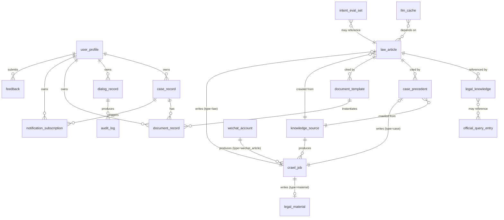
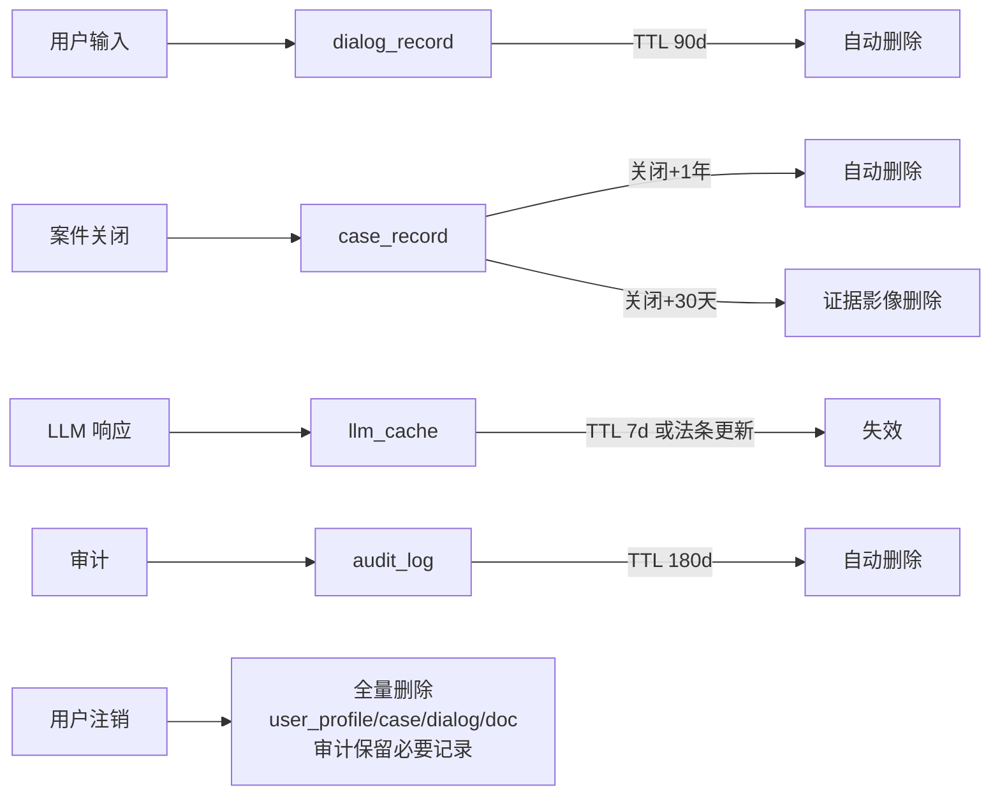

# 05 · 数据模型详细设计

> 版本：v2.3 | 日期：2026-07-22 | 状态：设计扩展（v2.3 新增 11 个集合 24-34：NLU/推理/文书/安全/律师审核；扩展 law_article 字段）
> 影响范围：03 / 04 / 06 / 07 / 08 / 09 / 10 / 11 / 12 / 13 / 14 / 15 / 16 / 17
> 本文为集合与字段权威源；06 接口字段、07 算法 I/O、14 工具数据依赖、15 采集集合、16 推理链、17 律师审核以此为准。

---

## 一、设计约定

- 数据库：微信云开发云数据库（类 MongoDB 文档库）。
- 主键：`_id` 自动生成（字符串 ObjectId）。
- 时间字段：ISO 8601 字符串（UTC），命名 `createdAt` / `updatedAt` / `expireAt`。
- 软删除：高敏集合用 `deletedAt` 标记；普通集合按需 TTL。
- 用户标识：`userId` = openid（实际写入前可经 `AuthService` 映射为内部 uid，本集简化为 openid）。
- 加密字段：在字段注释标注 `🔒` 表示应用层加密后入库（见 03）。
- 脱敏字段：标注 `🛡️` 表示存脱敏值（不可逆）。
- 索引：列出关键索引；单字段索引以字段名命名，组合索引以 `idx_字段1_字段2` 命名。

## 二、集合总览

| # | 集合 | 用途 | 分级 | 主要消费者 |
|---|------|------|------|-----------|
| 1 | `law_article` | 法律条文 | L1 | RuleEngine, RagService |
| 2 | `legal_knowledge` | 结构化知识（流程/材料/术语/FAQ） | L1 | KnowledgeBase |
| 3 | `case_precedent` | 公开案例 | L1 | RagService, searchCase |
| 4 | `document_template` | 文书模板 | L1 | DocumentGenerator |
| 5 | `user_profile` | 用户档案与偏好 | L3 | MemoryManager, AuthService |
| 6 | `case_record` | 用户案件档案 | L3–L4 | CaseTracker, NotificationService |
| 7 | `dialog_record` | 对话会话与消息 | L3 | chat, MemoryManager |
| 8 | `document_record` | 生成的文书 | L3 | DocumentGenerator |
| 9 | `notification_subscription` | 订阅授权与下发记录 | L3 | NotificationService |
| 10 | `audit_log` | 审计日志 | L2（含脱敏） | AuditLog |
| 11 | `intent_eval_set` | 意图评测集 | L2 | 测试/算法（07/10） |
| 12 | `feedback` | 用户反馈 | L3 | FeedbackService |
| 13 | `llm_cache` | LLM 响应缓存 | L2 | LlmService |
| 14 | `agent_registry` | 内部 Agent 注册（v2.1） | L2 | AgentRegistry |
| 15 | `external_agent_credential` | 外部 agent 凭证与授权（v2.1） | L3 | AgentDispatcher、治理 |
| 16 | `agent_invocation_log` | 跨 agent 调用快查日志（v2.1） | L2 | AuditLog、运营 |
| 17 | `agent_job` | 异步长任务（v2.1） | L3 | JobService、DocumentAgent |
| 18 | `external_agent_registry` | 可信外部 agent 目录（v2.1，预留） | L2 | ExternalAgentClient |
| 19 | `official_query_entry` | 官方查询网址目录（v2.2，174+ 条） | L1 | queryCenter 云函数、查询中心页 |
| 20 | `legal_material` | 法规资料（v2.2，13 类分类，按位阶组织） | L1 | materialCenter 云函数、资料中心页 |
| 21 | `knowledge_source` | 采集源配置（v2.2，多省份法规网/公众号/裁判文书网规则） | L2 | KnowledgePipeline |
| 22 | `wechat_account` | 公众号账号目录（v2.2，453+ 个） | L2 | WechatArticleCrawler |
| 23 | `crawl_job` | 采集任务记录（v2.2，URL/status/contentHash/stats） | L2 | KnowledgePipeline、运营 |
| 24 | `entity_extraction` | 实体抽取结果（v2.3，NER 四层架构产物） | L3 | nlu Agent、跨轮消解 |
| 25 | `clarification_session` | 多轮澄清会话状态机（v2.3，asking/answered/timeout/give_up） | L3 | ClarificationManager |
| 26 | `law_citation_graph` | 法条引用图谱（v2.3，articleId → citingCaseIds/citingDocIds） | L1 | LawTimelinessScanner、CaseComparator |
| 27 | `law_amendment_alert` | 法条修正预警（v2.3，pending/reviewed/resolved） | L2 | LawTimelinessScanner、运营 |
| 28 | `reasoning_chain` | IRAC 推理链（v2.3，issues/rules/applications/conclusion） | L3 | reasoning Agent、AnswerTracer |
| 29 | `clause_library` | 可复用条款库（v2.3，docType/category/source） | L1 | ClauseRecommender |
| 30 | `document_version` | 文书版本树（v2.3，parentVersionId/diffFromParent） | L3 | DocumentVersionManager |
| 31 | `data_export_request` | 数据可携带权导出请求（v2.3，pending/processing/ready/expired） | L3 | DataExportService |
| 32 | `compliance_alert` | 合规风险预警（v2.3，pass/warn/block） | L2 | ComplianceMonitor、律师复核 |
| 33 | `lawyer_review` | 律师审核任务（v2.3，pending/claimed/reviewing/submitted/reflowed） | L3 | LawyerReviewService |
| 34 | `answer_traceability` | AI 回答溯源（v2.3，msgId → citedLaws/cases/reasoningChainId） | L3 | AnswerTracer |

系统集合（运维）：`feature_flag`、`admin_user`、`system_status`、`stats_daily`。

## 三、集合 Schema

### 3.1 `law_article` — 法律条文

```jsonc
{
  "_id": "auto",
  "lawName": "中华人民共和国民法典",        // 法律名称
  "lawShortName": "民法典",                  // 简称
  "book": "第三编 合同",                     // 编/章/节（可空）
  "chapter": "第一章 一般规定",
  "articleNo": "第一百四十三条",             // 法条号（中文）
  "articleNoInt": 143,                       // 法条号（数字，用于排序/检索）
  "title": "民事法律行为的效力",              // 可空
  "content": "具备下列条件的民事法律行为有效……",
  "category": "civil",                       // civil|criminal|commercial|administrative|procedural
  "effectiveDate": "2021-01-01",
  "status": "effective",                     // effective|repealed|amended
  "source": "中国法律法规数据库",
  "sourceUrl": "https://flk.npc.gov.cn/...",
  "tags": ["效力", "意思表示"],
  "keywords": ["民事法律行为", "有效"],       // BM25 索引用
  "embedding": [0.0123, -0.045, ...],        // 向量（维度随 Embedding 模型）
  "version": 2,                              // 内容版本（更新管道递增）
  "province": "全国",                        // v2.2 新增：全国|北京|上海|...|多省份逗号分隔
  "sourceTitle": "中华人民共和国民法典",      // v2.2 新增：来源页标题
  "crawlJobId": "cj_xxx",                    // v2.2 新增：关联 crawl_job._id
  "contentHash": "sha256...",                // v2.2 新增：内容哈希，去重用
  "promulgatingBody": "全国人民代表大会",    // v2.2 新增：颁布机关
  "legalHierarchy": "law",                   // v2.2 新增：constitution|law|administrative_regulation|local_regulation|judicial_interpretation|departmental_rule
  "amendedBy": ["1999年修正","2009年修正"],  // v2.2 新增：修订历史
  "amends": null,                            // v2.2 新增：被该法条修改的法条引用（可空）
  "createdAt": "2026-07-19T00:00:00Z",
  "updatedAt": "2026-07-19T00:00:00Z"
}
```

**索引**：
- `idx_category_articleNoInt`：`(category, articleNoInt)` — 按领域浏览法条
- `idx_lawName_articleNoInt`：`(lawName, articleNoInt)` — 同法按条号
- `idx_keywords`：多键索引 `keywords` — BM25 关键词召回
- `idx_status`：`status` — 过滤有效法条
- `idx_embedding`：应用侧余弦（无原生向量索引；MVP 期分桶预过滤，见 07）
- `idx_province_category`（v2.2）：`(province, category)` — 多省份法条筛选
- `idx_legalHierarchy`（v2.2）：`legalHierarchy` — 按法律位阶过滤（LawValidityQuery 用）
- `idx_contentHash`（v2.2）：`contentHash` — 采集去重

### 3.2 `legal_knowledge` — 结构化知识

```jsonc
{
  "_id": "auto",
  "type": "case_process | material_list | term | faq | template_ref",
  "category": "civil",                       // 民事|刑事|商事|行政
  "subCategory": "离婚",                     // 案由/主题
  "title": "离婚诉讼立案流程",
  "content": "1. 准备起诉状……",              // 结构化文本/Markdown
  "structured": {                            // type 不同结构不同
    "steps": [
      {"order":1,"name":"准备材料","durationDays":"3-7","detail":"..."}
    ],
    "materials": ["身份证","结婚证","起诉状"],
    "timeline": [
      {"node":"立案","deadlineOffsetDays":7,"remindable":true}
    ]
  },
  "lawRefs": ["民法典第一千零七十九条"],      // 引用法条
  "tags": ["离婚","立案"],
  "version": 1,
  "createdAt": "...",
  "updatedAt": "..."
}
```

**索引**：`idx_type_category`、`idx_subCategory`、`idx_tags`。

### 3.3 `case_precedent` — 公开案例

```jsonc
{
  "_id": "auto",
  "caseTitle": "张某某与李某某离婚纠纷一审民事判决书",
  "caseNo": "(2023)京0105民初12345号",
  "court": "北京市朝阳区人民法院",
  "courtLevel": "基层法院",                  // 基层|中级|高级|最高
  "region": "北京",
  "category": "civil",
  "causeOfAction": "离婚纠纷",
  "trialType": "一审",                       // 一审|二审|再审|执行
  "judgmentDate": "2023-06-15",
  "judgmentType": "判决",                    // 判决|裁定|调解
  "outcome": "准予离婚",                     // 胜诉/败诉/部分支持（结构化）
  "outcomeLabel": "plaintiff_win",           // plaintiff_win|defendant_win|partial|other
  "factsSummary": "……",
  "reasoning": "……",
  "lawRefs": ["民法典第一千零七十九条"],
  "amount": 0,                               // 标的额（万元），0 表示不适用
  "tags": ["离婚","抚养权"],
  "keywords": ["离婚","感情破裂","抚养权"],
  "embedding": [0.01, ...],
  "source": "中国裁判文书网",
  "sourceUrl": "https://wenshu.court.gov.cn/...",
  "province": "北京",                        // v2.2 新增：省份（与 region 字段语义对齐，province 用于采集维度筛选）
  "sourceTitle": "张某某与李某某离婚纠纷一审民事判决书",  // v2.2 新增：来源页标题
  "crawlJobId": "cj_xxx",                    // v2.2 新增：关联 crawl_job._id
  "contentHash": "sha256...",                // v2.2 新增：内容哈希，去重用
  "causeCode": "M002",                       // v2.2 新增：案由代码（关联 legal_knowledge.structured.causeCode，CauseClassifier 用）
  "trialLevel": "基层法院",                  // v2.2 新增：基层法院|中级法院|高级法院|最高法院（与 courtLevel 语义对齐，trialLevel 用于采集维度筛选）
  "createdAt": "...",
  "updatedAt": "..."
}
```

**索引**：`idx_category_causeOfAction`、`idx_courtLevel_judgmentDate`、`idx_outcomeLabel`、`idx_keywords`、`idx_embedding`、`idx_province_causeCode`（v2.2）、`idx_trialLevel`（v2.2）、`idx_contentHash`（v2.2）。

### 3.4 `document_template` — 文书模板

```jsonc
{
  "_id": "auto",
  "code": "civil_complaint_divorce",         // 模板编码（程序引用）
  "name": "民事起诉状（离婚纠纷）",
  "docType": "起诉状",                        // 起诉状|答辩状|合同|律师函|申请书|其他
  "category": "civil",
  "applicableScene": "离婚诉讼一审立案",
  "varsSchema": [                            // 变量定义（07 DSL 用）
    {"key":"plaintiffName","type":"string","required":true,"piiLevel":3,"label":"原告姓名"},
    {"key":"defendantName","type":"string","required":true,"piiLevel":3,"label":"被告姓名"},
    {"key":"claim","type":"text","required":true,"label":"诉讼请求"},
    {"key":"facts","type":"text","required":true,"label":"事实与理由"},
    {"key":"courtName","type":"string","required":true,"label":"受理法院"}
  ],
  "template": "民事起诉状\n\n原告：{{plaintiffName}}……\n\n被告：{{defendantName}}……\n\n诉讼请求：\n{{claim}}\n\n事实与理由：\n{{facts}}\n\n此致\n{{courtName}}\n\n起诉人：{{plaintiffName}}\n{{today}}",
  "lawRefs": ["民法典第一千零七十九条"],
  "fields": ["plaintiffName","defendantName","claim","facts","courtName"],
  "version": 3,
  "status": "active",                        // active|draft|deprecated
  "createdAt": "...",
  "updatedAt": "..."
}
```

**索引**：`idx_docType_category`、`idx_code`（唯一）、`idx_status`。

### 3.5 `user_profile` — 用户档案

```jsonc
{
  "_id": "openid",                           // 主键即 openid
  "userId": "openid",
  "name": "张三",                             // 🛡️ 可空，用户主动填
  "nameHash": "sha256...",                   // 校验用
  "phone": "138****1234",                    // 🛡️ 脱敏
  "phoneHash": "sha256...",                  // 反查用
  "identityType": "individual",              // individual|enterprise
  "legalPreferences": {
    "focusAreas": ["民事","劳动"],
    "dislikedTopics": [],
    "languageStyle": "plain"                 // plain|professional
  },
  "personalizationEnabled": true,            // 是否启用个性化记忆
  "privacyAcceptedVersion": "v1.0",
  "privacyAcceptedAt": "2026-07-19T00:00:00Z",
  "createdAt": "...",
  "updatedAt": "...",
  "lastActiveAt": "..."
}
```

**索引**：`idx_phoneHash`（唯一稀疏）、`idx_lastActiveAt`。

### 3.6 `case_record` — 用户案件档案

```jsonc
{
  "_id": "auto",
  "caseId": "case_xxx",                      // 业务 ID
  "userId": "openid",
  "causeOfAction": "劳动争议",
  "category": "civil",
  "stage": "立案中",                          // 立案中|一审|二审|执行|已结案
  "stageHistory": [
    {"stage":"立案中","enteredAt":"...","note":"提交起诉状"}
  ],
  "role": "plaintiff",                       // plaintiff|defendant|other
  "opponentName": "某公司",                   // 🛡️
  "facts": "用户陈述的案件事实……",            // 🔒 L4
  "materials": [
    {"name":"劳动合同","fileId":"cloud://...","uploadedAt":"...","ocrDone":true}
  ],
  "nextDeadlines": [                          // 案件节点（提醒用）
    {"node":"举证期限","date":"2026-08-01","remindable":true,"remindedDays":[]},
    {"node":"开庭","date":"2026-08-15","remindable":true,"remindedDays":[]}
  ],
  "associatedDocIds": ["doc_xxx"],
  "status": "active",                         // active|closed|archived
  "closedAt": null,
  "expireAt": "2027-08-01T00:00:00Z",         // 关闭后 1 年清理
  "createdAt": "...",
  "updatedAt": "..."
}
```

**索引**：`idx_userId_status`、`idx_status_nextDeadlines_date`（多键）、`idx_expireAt`（TTL）。

### 3.7 `dialog_record` — 对话会话

```jsonc
{
  "_id": "auto",
  "sessionId": "sess_xxx",
  "userId": "openid",
  "messages": [
    {
      "msgId":"m1",
      "role":"user",
      "content":"我想起诉离婚",               // 🛡️ L3，原文存
      "contentHash":"sha256...",
      "intent":"process_guide",
      "route":"knowledge",
      "hasPii":true,
      "ts":"2026-07-19T10:00:00Z"
    },
    {
      "msgId":"m2",
      "role":"assistant",
      "content":"离婚诉讼流程如下……",
      "lawRefs":["民法典第一千零七十九条"],
      "disclaimerAttached":true,
      "traceId":"uuid",
      "ts":"2026-07-19T10:00:01Z"
    }
  ],
  "context": {
    "lastIntent":"process_guide",
    "pendingDocument":null,
    "relatedCaseId":"case_xxx",
    "unresolvedCount":0
  },
  "expireAt":"2026-10-17T10:00:00Z",         // createdAt + 90d
  "createdAt":"...",
  "updatedAt":"..."
}
```

**索引**：`idx_userId_updatedAt`、`idx_sessionId`、`idx_expireAt`（TTL）。

### 3.8 `document_record` — 生成的文书

```jsonc
{
  "_id":"auto",
  "docId":"doc_xxx",
  "userId":"openid",
  "caseId":"case_xxx",                       // 可空
  "templateCode":"civil_complaint_divorce",
  "templateVersion":3,
  "varsFilled":{                              // 🔒 L4，含当事人信息
    "plaintiffName":"张三",
    "defendantName":"李四",
    "claim":"...",
    "facts":"...",
    "courtName":"北京市朝阳区人民法院"
  },
  "renderedText":"民事起诉状……",
  "exportFileId":"cloud://...docx",
  "exportFormat":"docx",
  "status":"generated",                       // draft|generated|exported|archived
  "disclaimerAttached":true,
  "expireAt":"...",                           // 关联案件关闭后 30 天
  "createdAt":"...",
  "updatedAt":"..."
}
```

**索引**：`idx_userId_createdAt`、`idx_caseId`、`idx_expireAt`（TTL）。

### 3.9 `notification_subscription` — 订阅与下发

```jsonc
{
  "_id":"auto",
  "userId":"openid",
  "templateId":"case_deadline_remind",        // 微信订阅消息模板 ID
  "scope":"case_xxx",                         // 关联案件/会话
  "authCount":3,                              // 一次性模板剩余次数；长期模板为 -1
  "authType":"one_time",                      // one_time|long_term
  "sentLog":[
    {"ts":"...","caseId":"case_xxx","node":"举证期限","msgId":"...","status":"success"}
  ],
  "lastSentAt":"...",
  "expireAt":"...",                           // 授权 7 天未用失效
  "createdAt":"...",
  "updatedAt":"..."
}
```

**索引**：`idx_userId_templateId`、`idx_scope`、`idx_expireAt`（TTL）。

### 3.10 `audit_log` — 审计日志

```jsonc
{
  "_id":"auto",
  "ts":"2026-07-19T10:00:00Z",
  "traceId":"uuid",
  "userId":"sha256(openid+salt)",             // 🛡️ 不存 openid 明文
  "event":"chat_send",                        // 见 03 第七节枚举
  "func":"chat",
  "ip":"",                                    // 云函数可获取时记录
  "detail":{                                  // 事件相关字段，已脱敏
    "intent":"legal_qa",
    "route":"rule",
    "hasPii":true,
    "lawRefs":["民法典第一百四十三条"]
  },
  "result":"success",                         // success|failure|denied
  "expireAt":"2026-07-19T00:00:00Z+180d",
  "createdAt":"..."
}
```

**索引**：`idx_userId_ts`、`idx_event_ts`、`idx_traceId`、`idx_expireAt`（TTL）。

### 3.11 `intent_eval_set` — 意图评测集

```jsonc
{
  "_id":"auto",
  "text":"我要起诉离婚需要什么材料",
  "expectedIntent":"material_checklist",      // 期望意图
  "expectedRoute":"knowledge",
  "category":"civil",
  "tags":["离婚","立案","材料"],
  "difficulty":"easy",                        // easy|medium|hard
  "source":"manual|feedback|synthetic",
  "annotator":"a1",
  "version":2,
  "createdAt":"..."
}
```

**索引**：`idx_expectedIntent`、`idx_difficulty`、`idx_version`。

### 3.12 `feedback` — 用户反馈

```jsonc
{
  "_id":"auto",
  "userId":"openid",
  "type":"intent_wrong|answer_bad|bug|other",
  "relatedMsgId":"m2",
  "relatedSessionId":"sess_xxx",
  "expectedIntent":"...",                     // type=intent_wrong 时
  "content":"应该是起诉流程而不是材料清单",     // 🛡️
  "contact":"138****1234",                    // 可空 🛡️
  "status":"open",                            // open|processing|resolved|wontfix
  "assignee":"ops1",
  "resolution":"",
  "createdAt":"...",
  "updatedAt":"..."
}
```

**索引**：`idx_status_createdAt`、`idx_userId`、`idx_type`。

### 3.13 `llm_cache` — LLM 响应缓存

```jsonc
{
  "_id":"auto",
  "promptHash":"sha256(prompt+model+version)",
  "model":"qwen-max",
  "promptVersion":2,                          // Prompt 模板版本
  "intent":"legal_qa",
  "response":"...",                           // 完整 LLM 响应
  "lawRefs":["民法典第一百四十三条"],
  "tokenIn":512,
  "tokenOut":1024,
  "hitCount":7,
  "affectedLawArticles":["law_article_id_1"], // 法条更新失效用
  "expireAt":"2026-07-26T00:00:00Z",          // createdAt + 7d
  "createdAt":"..."
}
```

**索引**：`idx_promptHash`（唯一）、`idx_affectedLawArticles`（多键）、`idx_intent`、`idx_expireAt`（TTL）。

### 3.14 `agent_registry` — 内部 Agent 注册（v2.1）

```jsonc
{
  "_id":"auto",
  "agentId":"law-lookup",                     // 唯一，见 11
  "name":"法条查询 Agent",
  "description":"...",
  "version":"1.0.0",
  "capabilities":["law.lookup"],              // 见 11 capability 枚举
  "inputSchema":{ /* JSON Schema */ },
  "outputSchema":{ /* JSON Schema，强制含 disclaimer/lawRefs/traceId */ },
  "piiLevel":"L2",
  "exposure":"L-Read",                        // L-Read|L-Write-Limited|L-Internal
  "async":false,
  "timeout":5000,
  "fallbackAgentId":"legal-qa",
  "cardUrl":"/v1/agents/law-lookup/card",
  "status":"active",                          // active|deprecated
  "createdAt":"...",
  "updatedAt":"..."
}
```

**索引**：`idx_agentId`（唯一）、`idx_capabilities`（多键）、`idx_exposure`。

### 3.15 `external_agent_credential` — 外部 agent 凭证（v2.1）

```jsonc
{
  "_id":"auto",
  "agentKey":"tianyan-enterprise",            // 内部引用标识
  "displayName":"天眼查企业查询",
  "ownerName":"某科技有限公司",
  "ownerContact":"ops@example.com",
  "apiKeyPrefix":"lak_live_ab12cd",           // 仅前 6 位明文
  "apiKeyHash":"sha256(apiKey+salt)",         // 校验用
  "scopes":["law.lookup","case.search"],      // 授权 capability
  "exposureLevel":"L-Read",                   // L-Read|L-Write-Limited
  "rateLimits":{                              // 覆盖默认配额（见 13）
    "readPerHour":2000,
    "writePerHour":100,
    "concurrency":20
  },
  "status":"active",                          // pending|active|suspended|revoked
  "approvedBy":"admin1",
  "validFrom":"2026-07-19T00:00:00Z",
  "validUntil":"2027-07-19T00:00:00Z",
  "lastRotatedAt":"...",
  "createdAt":"...",
  "updatedAt":"..."
}
```

**索引**：`idx_agentKey`（唯一）、`idx_apiKeyHash`（唯一）、`idx_status`、`idx_validUntil`（过期扫描）。

### 3.16 `agent_invocation_log` — 跨 agent 调用快查（v2.1）

```jsonc
{
  "_id":"auto",
  "ts":"2026-07-19T10:00:00Z",
  "traceId":"uuid",
  "callerAgentId":"external:tianyan-enterprise",   // 外部调用前缀 external:
  "targetAgentId":"law-lookup",
  "capability":"law.lookup",
  "externalAgentKey":"tianyan-enterprise",          // 内部调用为 null
  "result":"success",                               // success|failure|denied|degraded
  "durationMs":120,
  "cacheHit":"L3",                                  // L2|L3|null
  "errorCode":null,
  "verified":true,                                  // 法条是否经校验
  "expireAt":"2026-08-18T10:00:00Z"                 // createdAt + 30d
}
```

**索引**：`idx_callerAgentId_ts`、`idx_externalAgentKey_ts`、`idx_targetAgentId_ts`、`idx_traceId`、`idx_expireAt`（TTL）。

> `audit_log` 仍保留全量 180 天（含 PII 脱敏后的 detail）；本集合为精简快查，30 天 TTL，供运营后台按 agentKey 维度查调用趋势。

### 3.17 `agent_job` — 异步长任务（v2.1）

```jsonc
{
  "_id":"auto",
  "jobId":"job_xxx",
  "capability":"document.generate",          // 触发该 job 的 capability
  "agentId":"document",
  "callerAgentId":"external:tianyan-enterprise",
  "externalAgentKey":"tianyan-enterprise",   // 内部调用为 null
  "callerUserId":"openid",                   // 终端用户（若有）
  "params":{ /* 原 input.params，🔒 L4 字段加密 */ },
  "status":"pending",                        // pending|running|succeeded|failed
  "progress":0.0,                            // 0..1
  "stage":"rendering",
  "result":null,                             // 成功后写 docId/renderedText 等
  "resultFileId":"cloud://...",              // 文书等大结果存云存储
  "errorCode":null,
  "errorMessage":null,
  "webhookUrl":null,                         // 完成回调（外部 agent 提供）
  "expireAt":"2026-07-22T10:00:00Z",         // createdAt + 3d
  "createdAt":"...",
  "updatedAt":"..."
}
```

**索引**：`idx_jobId`（唯一）、`idx_callerAgentId_status`、`idx_externalAgentKey_status`、`idx_status_updatedAt`（轮询）、`idx_expireAt`（TTL）。

### 3.18 `external_agent_registry` — 可信外部 agent 目录（v2.1，预留）

```jsonc
{
  "_id":"auto",
  "agentKey":"tianyan-enterprise",
  "endpoint":"https://api.tianyan.example/mcp",
  "protocol":"mcp",                          // mcp|openapi|a2a
  "capabilities":["enterprise.lookup"],
  "authType":"api_key",
  "authSecretRef":"env:TIANYAN_KEY",         // 凭证存云开发环境变量
  "ownerAdminId":"admin1",
  "status":"active",
  "approvedAt":"...",
  "createdAt":"...",
  "updatedAt":"..."
}
```

**索引**：`idx_agentKey`（唯一）、`idx_capabilities`（多键）、`idx_status`。

### 3.19 `official_query_entry` — 官方查询网址目录（v2.2）

```jsonc
{
  "_id": "auto",
  "name": "国家企业信用信息公示系统",
  "category": "enterprise",                     // enterprise|credit|law|case|license|qualification|other
  "url": "https://www.gsxt.gov.cn/",
  "region": "全国",                              // 全国|北京|上海|...
  "owner": "市场监管总局",                       // 主办单位
  "description": "查询企业登记信息、行政处罚、经营异常名录等",
  "tags": ["企业查询", "信用查询"],
  "icon": "🏢",                                  // 显示图标（emoji 或图标名）
  "sortOrder": 1,                                // 排序权重（小在前）
  "external": true,                              // 固定 true，标识外链（query-center 仅展示外链）
  "status": "active",                            // active|hidden|deprecated
  "createdAt": "...",
  "updatedAt": "..."
}
```

**索引**：`idx_category_region`、`idx_sortOrder`、`idx_status`。

> 全部为外链，跳转前在 UI 标注"跳转至外部网站，本应用不对其内容负责"（见 03）。

### 3.20 `legal_material` — 法规资料（v2.2）

```jsonc
{
  "_id": "auto",
  "name": "中华人民共和国民法典（全文）",
  "category": "law_full_text",                   // 13 类：law_full_text|regulation|judicial_interpretation|local_regulation|departmental_rule|legal_duty|legal_template|legal_guide|case_compilation|legal_periodical|legal_dictionary|legal_paper|other
  "legalHierarchy": "law",                       // 与 law_article.legalHierarchy 枚举一致
  "region": "全国",
  "promulgatingBody": "全国人民代表大会",
  "effectiveDate": "2021-01-01",
  "fileId": "cloud://...",                       // 云存储文件 ID（PDF/Word/Excel）
  "fileFormat": "pdf",                           // pdf|docx|xlsx|md|html
  "fileSize": 1024000,                           // 字节
  "pageCount": 280,                              // 可空
  "summary": "民法典全文，共 7 编 1260 条",
  "tags": ["民法典", "民事"],
  "downloadUrl": null,                           // 可空，部分资料为云存储 fileId，部分为外链
  "external": false,                             // true=外链下载，false=云存储下载
  "sortOrder": 1,
  "status": "active",
  "createdAt": "...",
  "updatedAt": "..."
}
```

**索引**：`idx_category_legalHierarchy`、`idx_region_status`、`idx_sortOrder`。

### 3.21 `knowledge_source` — 采集源配置（v2.2）

```jsonc
{
  "_id": "auto",
  "sourceKey": "flk_npc_gov_cn",                 // 内部引用标识
  "name": "中国法律法规数据库",
  "type": "law",                                 // law|case|material|wechat
  "region": "全国",
  "baseUrl": "https://flk.npc.gov.cn/",
  "listPageRule": {                              // URL 收集规则（UrlCollector 用）
    "urlPattern": "https://flk.npc.gov.cn/api/?...&page={page}",
    "pageStart": 1,
    "pageEnd": 100,
    "itemSelector": ".result li a",
    "hrefExtractor": "attr:href",
    "linkPrefix": "https://flk.npc.gov.cn/"      // 相对链接补全前缀
  },
  "detailPageRule": {                            // 详情提取规则（DetailExtractor 用）
    "titleSelector": "h1",
    "contentSelector": ".content",
    "effectiveDateSelector": ".effective-date",
    "promulgatingBodySelector": ".promulgating-body",
    "stripTags": ["script", "style", ".ad"]
  },
  "classification": {                            // 入库分类（StorageClassifier 用）
    "targetCollection": "law_article",           // law_article|case_precedent|legal_material|wechat_article
    "defaultProvince": "全国",
    "defaultLegalHierarchy": "law",
    "fieldMapping": {                            // 详情字段 → 目标集合字段映射
      "title": "title",
      "content": "content",
      "effectiveDate": "effectiveDate"
    }
  },
  "rateLimit": {
    "requestsPerSecond": 1,
    "delayMin": 2000,
    "delayMax": 8000,
    "maxRetries": 3
  },
  "schedule": "weekly",                          // daily|weekly|monthly|manual
  "cron": "28 23 * * 2",                         // 周二 23:28（schedule=weekly 时生效）
  "status": "active",                            // active|paused|disabled
  "lastRunAt": null,
  "lastRunStats": { "success": 0, "failed": 0, "duplicate": 0, "new": 0 },
  "stats": { "totalCrawled": 0, "totalFailed": 0, "lastBatchCount": 0 },
  "ownerAdminId": "admin1",
  "createdAt": "...",
  "updatedAt": "..."
}
```

**索引**：`idx_sourceKey`（唯一）、`idx_type_status`、`idx_schedule_status`、`idx_region`。

### 3.22 `wechat_account` — 公众号账号目录（v2.2）

```jsonc
{
  "_id": "auto",
  "accountKey": "gh_xxx",                        // 公众号 gh_ 标识
  "name": "最高人民法院",
  "category": "judicial",                        // judicial|legislative|administrative|academic|law_firm|media|other
  "region": "全国",
  "biz": "MzA3MDM3MjE5Nw==",                     // 公众号 biz（用于第三方采集 API）
  "ownerOrg": "最高人民法院",
  "crawlerType": "third_party_api",              // third_party_api|manual
  "crawlerConfig": {
    "apiProvider": "xinbang",                    // xinbang|qingbo|other（W4 评估选型）
    "apiKeyRef": "env:XINBANG_KEY"
  },
  "lastArticlePublishedAt": null,                // 公众号最新文章发布时间
  "articleCount": 0,                             // 已采集文章数
  "schedule": "daily",
  "cron": "0 3 * * *",                           // 每日 03:00
  "status": "active",
  "createdAt": "...",
  "updatedAt": "..."
}
```

**索引**：`idx_accountKey`（唯一）、`idx_status`、`idx_category`、`idx_schedule_status`。

### 3.23 `crawl_job` — 采集任务记录（v2.2）

```jsonc
{
  "_id": "auto",
  "sourceId": "ks_xxx",                          // 关联 knowledge_source._id
  "wechatAccountId": null,                       // type=wechat_article 时关联 wechat_account._id
  "url": "https://flk.npc.gov.cn/detail2.html?xxx",
  "urlHash": "sha256(url)",                      // URL 哈希，单源内 URL 去重
  "type": "law",                                 // law|case|material|wechat_article（与 source.type 一致）
  "status": "pending",                           // pending|running|done|failed|skipped|duplicate
  "contentHash": "sha256...",                    // 详情内容哈希（抓取后填），跨批次去重
  "targetCollection": "law_article",
  "targetId": null,                              // 入库后写回目标集合 _id
  "attempts": 0,                                 // 已尝试次数
  "maxAttempts": 3,
  "lastError": null,                             // 最近错误信息（status=failed 时填）
  "httpStatus": null,                            // 详情页 HTTP 状态码
  "startedAt": null,
  "finishedAt": null,
  "durationMs": null,
  "jobType": "full",                             // full|incremental
  "runBatch": "2026-07-21T23:28:00Z",            // 批次时间戳，同批任务共享
  "crawlerVersion": "1.0.0",                     // 采集器版本（解析规则变更追溯）
  "createdAt": "...",
  "updatedAt": "..."
}
```

**索引**：
- `idx_sourceId_status`：`(sourceId, status)` — 按源查待处理/失败任务
- `idx_status_runBatch`：`(status, runBatch)` — 按批次扫描任务
- `idx_contentHash`：`contentHash` — 跨批次内容去重（与目标集合 contentHash 联动）
- `idx_urlHash`：`(sourceId, urlHash)`（唯一）— 单源内 URL 去重
- `idx_jobType_runBatch`：`(jobType, runBatch)` — 区分全量/增量批次

### 3.24 `entity_extraction` — 实体抽取结果（v2.3）

```jsonc
{
  "_id": "auto",
  "msgId": "msg_xxx",                          // 关联 dialog_record.messages[].msgId
  "userId": "openid_xxx",
  "entities": [
    {"type": "person|org|contract|case_cause|evidence|legal_term|date|amount|idcard|phone|law_ref",
     "value": "张三", "span": [10, 12], "confidence": 0.95, "source": "regex|dict|llm|coref"}
  ],
  "modelVersion": "qwen-ner-v1",               // LLM NER 模型版本
  "promptVersion": "ner_prompt_v1",
  "extractedAt": "2026-07-22T10:00:00Z",
  "createdAt": "..."
}
```

**索引**：`idx_msgId`（唯一）、`idx_userId_extractedAt`（按用户查历史实体，跨轮消解用）。

### 3.25 `clarification_session` — 多轮澄清会话（v2.3）

```jsonc
{
  "_id": "auto",
  "sessionId": "cs_xxx",
  "userId": "openid_xxx",
  "msgId": "msg_xxx",                          // 触发澄清的用户消息
  "intent": "case_reasoning",                  // 触发澄清的意图
  "requiredSlots": ["causeOfAction", "facts", "partyRole"],  // 必填槽位
  "filledSlots": {"causeOfAction": "租赁合同纠纷"},  // 已填槽位
  "state": "asking",                           // asking|answered|timeout|give_up
  "turns": 1,                                  // 已追问轮数（上限 3）
  "offTopicCount": 0,                          // 答非所问次数（上限 2）
  "createdAt": "...",
  "updatedAt": "...",
  "expireAt": "createdAt + 24h"                // 会话过期清理
}
```

**索引**：`idx_userId_state`（查活跃会话）、`idx_sessionId`（唯一）、`idx_expireAt`（TTL 过期）。

### 3.26 `law_citation_graph` — 法条引用图谱（v2.3）

```jsonc
{
  "_id": "auto",
  "articleId": "law_article._id",              // 被引用的法条
  "citingCaseIds": ["case_precedent._id", ...],  // 引用该法条的案例
  "citingDocIds": ["document_record._id", ...],   // 引用该法条的文书
  "citedCount": 42,                            // 总引用次数
  "lastCitedAt": "2026-07-20T...",
  "updatedAt": "..."
}
```

**索引**：`idx_articleId`（唯一）、`idx_citedCount`（按热度排序）。
**构建**：CitationGraphBuilder 模块（见 14 第十二节），案例/文书入库时异步 upsert + 每日全量重建。

### 3.27 `law_amendment_alert` — 法条修正预警（v2.3）

```jsonc
{
  "_id": "auto",
  "alertId": "laa_xxx",
  "articleId": "law_article._id",
  "oldStatus": "effective",                    // effective|repealed|amended
  "newStatus": "amended",
  "detectedAt": "2026-07-22T03:00:00Z",        // LawTimelinessScanner 检测时间
  "affectedCaseIds": ["case_precedent._id", ...],  // 引用该法条的受影响案例
  "affectedDocIds": ["document_record._id", ...],   // 引用该法条的受影响文书
  "state": "pending",                          // pending|reviewed|resolved
  "resolvedBy": null,                          // admin_user.openid
  "resolvedAt": null,
  "resolution": null,                          // 处理说明
  "createdAt": "..."
}
```

**索引**：`idx_state_detectedAt`（按状态+时间扫描待处理预警）、`idx_articleId`。

### 3.28 `reasoning_chain` — IRAC 推理链（v2.3）

```jsonc
{
  "_id": "auto",
  "chainId": "rc_xxx",
  "msgId": "msg_xxx",                          // 关联对话消息
  "userId": "openid_xxx",
  "issues": [{"issueText": "...", "issueType": "...", "relatedLaws": ["articleId", ...]}],
  "rules": [{"articleId": "...", "articleText": "...", "conditions": [...], "legalConsequences": [...]}],
  "applications": [{"ruleId": "...", "factMatch": "applicable|partial|false", "matchedFacts": [...], "unmatchedFacts": [...]}],
  "conclusion": {"summary": "...", "confidence": 0.82, "riskLevel": "low|medium|high", "disclaimer": "...", "lawRefs": [...]},
  "modelVersion": "qwen-v1",
  "promptVersion": "irac_prompt_v1",
  "createdAt": "..."
}
```

**索引**：`idx_msgId`（唯一）、`idx_userId_createdAt`、`idx_chainId`（唯一）。
**用途**：回答溯源（17 律师审核引用）+ 推理链可视化（09 ReasoningChainView）。详见 16 第六七节。

### 3.29 `clause_library` — 可复用条款库（v2.3）

```jsonc
{
  "_id": "auto",
  "clauseId": "cl_xxx",
  "title": "违约责任条款",
  "content": "甲方未按约定期限付款的，应按未付款金额的日万分之五向乙方支付违约金...",
  "docType": "合同",                            // 起诉状|答辩状|合同|律师函|申请书|其他（与 document_template.docType 一致）
  "category": "违约责任",                        // 条款分类
  "applicableConditions": "适用于买卖/租赁/服务合同",
  "source": "standard",                        // standard（标准条款）|custom（用户自定义）
  "version": 1,
  "createdAt": "...",
  "updatedAt": "..."
}
```

**索引**：`idx_docType_category`（按文书类型+分类检索）、`idx_source`、`idx_clauseId`（唯一）。

### 3.30 `document_version` — 文书版本树（v2.3）

```jsonc
{
  "_id": "auto",
  "versionId": "dv_xxx",
  "docId": "document_record._id",              // 关联文书
  "parentVersionId": null,                     // 父版本（null=根版本），支持版本树
  "content": "渲染后文书文本",                   // 该版本完整内容
  "vars": {"plaintiffName": "张三", ...},        // 该版本变量快照
  "diffFromParent": {"added": [...], "removed": [...], "modified": [...]},  // 与父版本 Diff
  "versionNo": 2,                              // 版本号
  "createdBy": "openid_xxx",
  "createdAt": "..."
}
```

**索引**：`idx_docId_versionNo`（按文书查版本历史）、`idx_parentVersionId`（遍历版本树）、`idx_versionId`（唯一）。

### 3.31 `data_export_request` — 数据可携带权导出请求（v2.3）

```jsonc
{
  "_id": "auto",
  "requestId": "de_xxx",
  "userId": "openid_xxx",
  "scope": ["user_profile", "case_record", "dialog_record", "document_record", "feedback"],  // 导出范围
  "status": "pending",                         // pending|processing|ready|expired|failed
  "fileId": null,                              // 云存储 fileId（status=ready 时填）
  "expireAt": null,                            // 下载链接有效期（ready 后 7 天）
  "requestedAt": "...",
  "completedAt": null,
  "failureReason": null
}
```

**索引**：`idx_userId_requestedAt`、`idx_status`、`idx_requestId`（唯一）。
**合规依据**：《个人信息保护法》第 45 条数据可携带权。

### 3.32 `compliance_alert` — 合规风险预警（v2.3）

```jsonc
{
  "_id": "auto",
  "alertId": "ca_xxx",
  "msgId": "msg_xxx",                          // 触发预警的 AI 回答
  "userId": "openid_xxx",
  "riskLevel": "warn",                         // pass|warn|block
  "triggers": ["content_safety", "law_ref_failure", "lawyer_low_score"],  // 触发源
  "reviewedBy": null,                          // admin_user.openid 或 lawyerId
  "reviewedAt": null,
  "action": "none",                            // none|warn_user|block|retrain
  "createdAt": "..."
}
```

**索引**：`idx_riskLevel_createdAt`（按风险等级扫描）、`idx_msgId`、`idx_alertId`（唯一）。

### 3.33 `lawyer_review` — 律师审核任务（v2.3）

```jsonc
{
  "_id": "auto",
  "reviewId": "lr_xxx",
  "msgId": "msg_xxx",                          // 被审核的 AI 回答
  "userId": "openid_xxx",
  "status": "pending",                         // pending|claimed|reviewing|submitted|reflowed
  "claimedBy": null,                           // lawyerId
  "claimedAt": null,
  "accuracyScore": null,                       // 1-5 准确度
  "complianceScore": null,                     // 1-5 合规度
  "completenessScore": null,                   // 1-5 完整性
  "usabilityScore": null,                      // 1-5 实用性
  "issues": [],                                // 律师标注的问题列表
  "correctedAnswer": null,                     // 律师修正答案
  "lawRefCorrections": [],                     // 法条引用修正
  "submittedAt": null,
  "reflowedTo": [],                            // 标注回流目标集合
  "createdAt": "..."
}
```

**索引**：`idx_status_createdAt`（律师领取待审列表）、`idx_msgId`、`idx_claimedBy`、`idx_reviewId`（唯一）。

### 3.34 `answer_traceability` — AI 回答溯源（v2.3）

```jsonc
{
  "_id": "auto",
  "msgId": "msg_xxx",                          // 关联对话消息（唯一）
  "citedLaws": ["articleId", ...],             // 引用法条
  "citedCases": ["caseId", ...],               // 引用案例
  "promptVersion": "legal_qa_v2",
  "modelVersion": "qwen-v1",
  "reasoningChainId": "rc_xxx",                // 关联 reasoning_chain（case_reasoning 意图时）
  "ragSources": [{"type": "law|case", "id": "...", "score": 0.85}],
  "lawyerReviewId": null,                      // 关联 lawyer_review（送审后填）
  "createdAt": "..."
}
```

**索引**：`idx_msgId`（唯一）、`idx_reasoningChainId`、`idx_lawyerReviewId`。

## 四、系统集合（运维）

### 4.1 `feature_flag`

```jsonc
{"_id":"auto","flagKey":"intent_v2","enabled":false,"rolloutPercent":10,"whitelist":["openid_x"],"description":"意图识别 v2 算法","updatedAt":"..."}
```

### 4.2 `admin_user`

```jsonc
{"_id":"openid","role":"ops|audit|admin","name":"运营A","scope":["law_article"],"createdAt":"..."}
```

### 4.3 `system_status`

```jsonc
{"_id":"llm_circuit","state":"closed|open|half_open","openedAt":"...","errorRate":0.0,"updatedAt":"..."}
```

### 4.4 `stats_daily`

```jsonc
{"_id":"2026-07-19","dau":1023,"chats":3102,"llmCalls":1198,"cacheHitRate":0.27,"degradationCount":12,"createdAt":"..."}
```

## 五、集合关系 ER 图



## 六、本地 Storage 键设计

| 键 | 用途 | TTL | 格式 |
|----|------|-----|------|
| `legal:uid` | userId 缓存 | 永久 | string |
| `legal:session` | 当前会话 ID | 7 天 | string |
| `legal:prefs` | 偏好本地镜像（离线可用） | 永久 | json |
| `legal:cache:faq:<hash>` | L1 答案缓存 | 1 小时 | json |
| `legal:dialog:pending` | 离线时未发送消息队列 | 永久至发送 | json[] |
| `legal:case:<caseId>:offline` | 案件离线快照 | 7 天 | json |
| `legal:privacy:accepted` | 隐私协议同意版本 | 永久 | string |
| `legal:disclaimer:ack` | AI 对话免责确认 | 永久 | bool |

**约定**：所有键以 `legal:` 前缀命名，便于清理；PII 不入 Storage（仅脱敏值或 id）。

## 七、数据生命周期总览



## 八、与 v1.0/v2.0/v2.1/v2.2/v2.3 的差异声明

- **v1.0**：给出 3 张表（`legal_knowledge`/`user_profile`/`dialog_record`）的示例 JSON。
- **v2.0**：扩展为 13 个业务集合 + 4 个系统集合，逐字段标注类型/分级/索引/TTL，新增 ER 图与生命周期，覆盖 G15/G16 全部 P0 缺口，并为 03 安全合规、06 接口、07 算法、08 流程提供字段依据。
- **v2.1**：新增 5 个 agent 相关集合（14-18），支撑多 agent 协作后端能力（内部编排 + 对外 MCP/OpenAPI 暴露 + 外部 agent 受控调用）。
- **v2.2**：新增 5 个采集/工具集合（19-23）：`official_query_entry`/`legal_material`/`knowledge_source`/`wechat_account`/`crawl_job`，支撑查询中心、资料中心与三阶段采集架构（详见 15）；扩展 `law_article` 字段（province/sourceTitle/crawlJobId/contentHash/promulgatingBody/legalHierarchy/amendedBy/amends）与 `case_precedent` 字段（province/sourceTitle/crawlJobId/contentHash/causeCode/trialLevel），支撑 LawValidityQuery/CauseClassifier 工具与多省份采集维度筛选（详见 14）；ER 图追加采集相关关系。集合总数 18 → 23。
- **v2.3（本集）**：新增 11 个集合（24-34）：NLU（`entity_extraction`/`clarification_session`）、知识时效（`law_citation_graph`/`law_amendment_alert`）、法律推理（`reasoning_chain`）、文书增强（`clause_library`/`document_version`）、安全合规（`data_export_request`/`compliance_alert`）、律师审核（`lawyer_review`/`answer_traceability`），支撑 7 大方向升级（详见 07 第八节 NLU / 15 第四节时效扫描 / 16 IRAC 推理 / 14 第 8 工具 ClauseRecommender / 03 数据可携带权 / 17 律师审核闭环）。集合总数 23 → 34。
