# 08 · 核心业务流程

> 版本：v2.3 | 日期：2026-07-22 | 状态：设计扩展（v2.3 新增复合意图拆分/律师审核/数据导出 3 流程）
> 影响范围：02 / 04 / 06 / 07 / 09 / 11 / 14 / 15 / 16 / 17
> 本文流程节点名与 04 模块、06 接口、07 算法、11 Agent、14 工具、15 采集管道保持一致。

---

## 一、法律咨询主流程（chat）

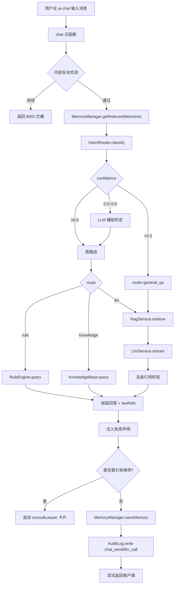

**节点说明**：
- 内容安全：`ContentSafety.checkText` 命中违法词返回 `6002`。
- 直路由：规则/知识库命中即返回；未命中走 LLM。
- 法条引用校验：仅 `route=llm` 时触发，未核实引用在 UI 标黄。
- 引导律师触发条件见 03 第八节。

## 二、文书生成流程（generateDocument）

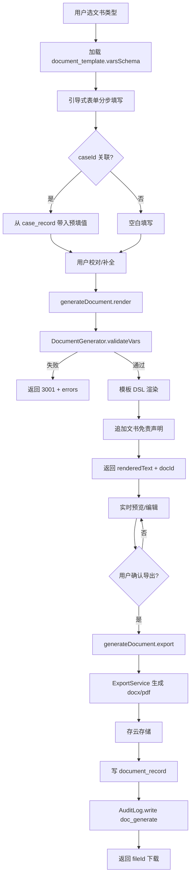

## 三、流程指导流程（getProcess）

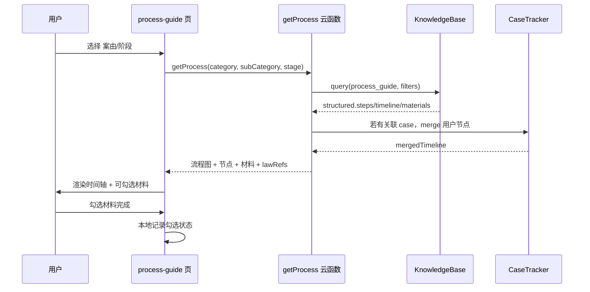

## 四、案例检索流程（searchCase）

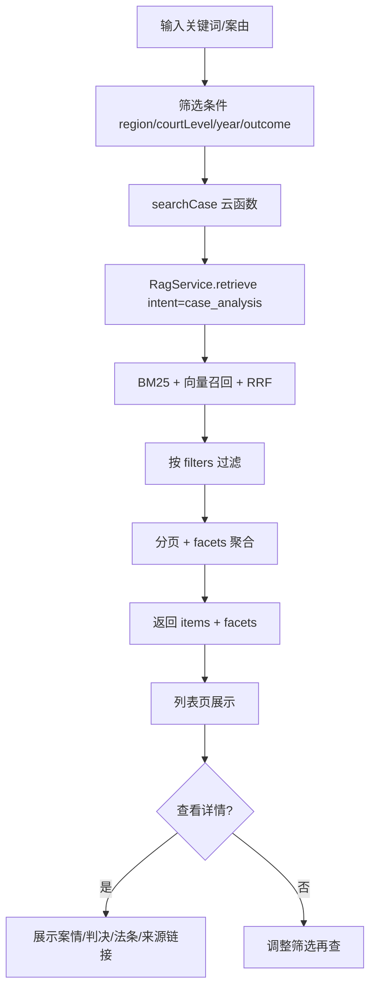

## 五、主动提醒推送流程（notificationScheduler）

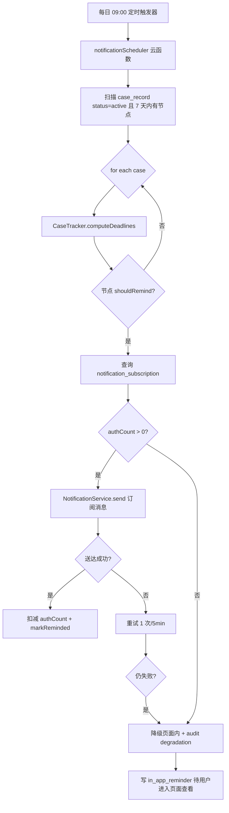

## 六、工具调用主流程（invokeTool，v2.2）

v2.2 工具调用支持双路径入口：A 路径（TabBar 工具 Tab 直调）、B 路径（AI 对话经 OrchestratorAgent 编排）。

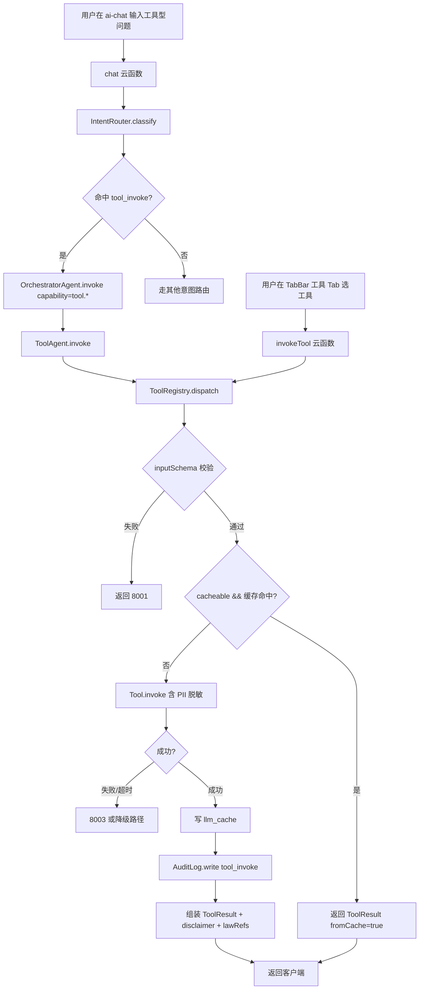

**节点说明**：
- **A 路径（TabBar 直调）**：用户在工具 Tab 选择具体工具（如期间计算器），客户端携带 `toolId` + 入参直接调 `invokeTool` 云函数，不经 OrchestratorAgent；适合"用户已知要做什么"的高频场景。
- **B 路径（AI 对话编排）**：用户在 `ai-chat` 输入"计算 2026-07-21 起 15 天法定期间"等工具型问题，`IntentRouter` 命中 `tool_invoke` 意图（见 07 第 1.1 节），由 OrchestratorAgent 经 ToolAgent 调度 ToolRegistry；适合"用户描述问题，系统推断工具"的智能场景。
- **inputSchema 校验**：失败抛 `8001`（见 14 第 2.4 节）。
- **缓存命中**：`cacheable=true` 的工具（LawValidityQuery / PeriodCalculator / CompensationQuery / SentencingGuide）走 `llm_cache` 集合，TTL 见 14 各工具元数据。
- **PII 脱敏**：`piiLevel=L3` 的工具（LicenseOcr / DocumentReviewer）输入经 `PiiService.detectAndMask` 后再写日志与审计。
- **降级**：工具失败不阻断主流程，B 路径降级为转 `legal_qa` Agent 给出文字回答；A 路径降级为返回 `8003` + 错误卡片 + 引导 AI 对话。
- **审计**：每次调用写 `audit_log(event=tool_invoke / tool_invoke_failed)`，detail 含 `{ toolId, inputHash, success, duration, fromCache, degraded, errorCode }`，输入原文不入审计。
- **免责强制**：`ToolResult.disclaimer` 字段强制必填（见 14 第 2.3 节），UI 在工具结果卡片底部固定展示，不可由用户关闭（见 03 "工具免责"节）。

## 七、知识采集主流程（knowledgePipeline，v2.2）

v2.2 新增知识采集管道，目标 5 万+ 篇法律知识库。三阶段架构详见 15。

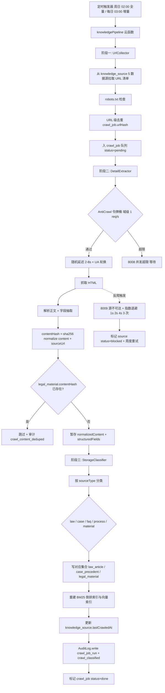

**节点说明**：
- **触发器**：周度全量（每周日 02:00，分批 ≤ 1000 URL/批）+ 日度增量（每日 03:00，仅采集 `wechat_account` 与 `knowledge_source.lastCrawledAt > now-7d` 的源）+ 手动触发（`/knowledgePipeline:run`，需 admin 权限）。
- **阶段一 UrlCollector**：从 5 类数据源（最高检 / 最高法 / 省高院 / 司法部官网 + 法律法规库 + 公众号 + 维基百科法律条目 + 第三方法律资讯）发现 URL，强制 robots.txt 检查，URL 级去重键 = `sha256(url)`。
- **阶段二 DetailExtractor**：经 AntiCrawl 令牌桶（每域 1 req/s）+ 随机延迟 2-8s + UA 轮换（10 个）抓取 HTML；解析正文 + 抽取结构化字段（标题 / 发布日 / 颁布机关 / 正文 / 法条引用等）；计算 `contentHash = sha256(normalize(content) + sourceUrl)` 做内容级去重。
- **阶段三 StorageClassifier**：按 `sourceType` 分类入库（law_article / case_precedent / legal_material），重建 BM25 倒排索引与向量索引，更新 `knowledge_source.lastCrawledAt`。
- **降级**：反爬触发时指数退避（1s → 2s → 4s 最多 3 次），仍失败则标记 `source.status=blocked` + `crawl_job.status=failed` + 写 `audit_log(crawl_source_blocked)`，下个周度重试。并发超限返回 `8008`，源不可达返回 `8009`。
- **审计**：4 个事件 `crawl_job_run` / `crawl_source_blocked` / `crawl_content_deduped` / `crawl_classified`，详情含 `{ source, urlHash, duration, status, reason }`。
- **公众号专项**：WechatArticleCrawler 子模块处理公众号文章，正文存储 30 天后归档只留摘要 + 外链，避免版权纠纷（见 03 "采集合规"节 8.4）。
- **合规约束**：所有采集源须经法务白名单审核；UA 真实可识别含联系方式；外链在 UI 显著标注免责声明（见 03 "外链免责"节）。

## 八、登录授权与隐私同意流程

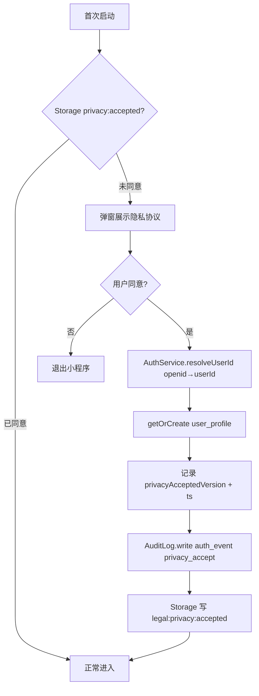

## 九、案件建档流程（caseCrud.create）

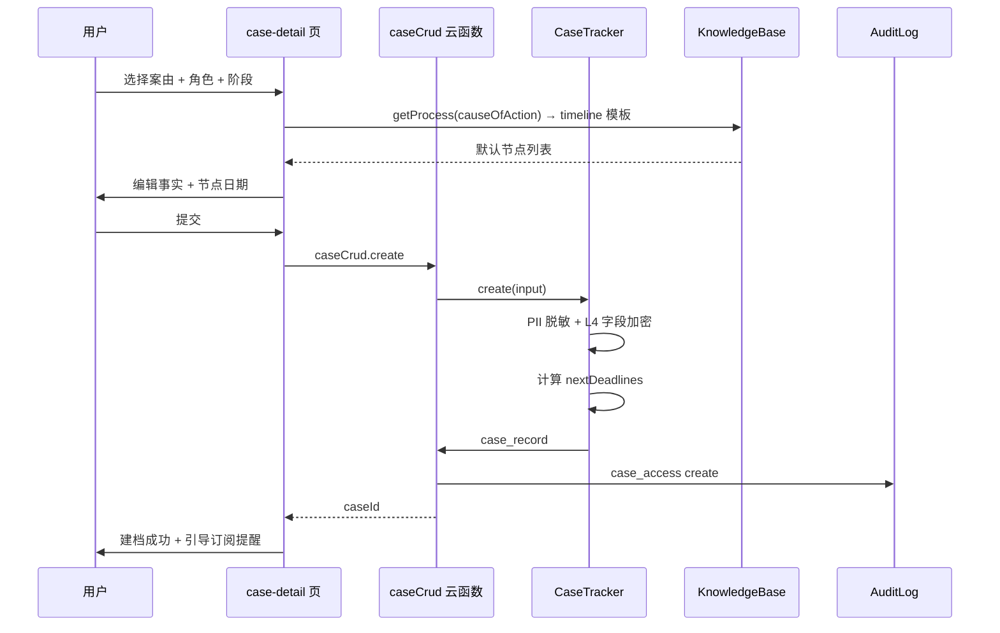

## 十、文件上传 OCR 流程（uploadOcr）

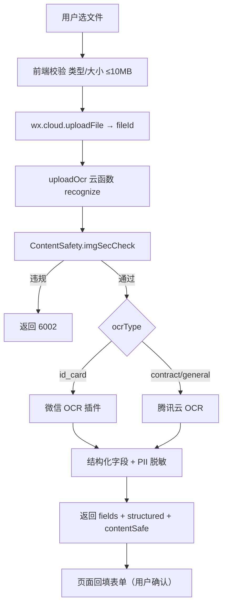

## 十一、LLM 降级流程（熔断触发）

```mermaid
flowchart TD
    A[chat 走 route=llm] --> B[LlmService 调用]
    B --> C{熔断状态?}
    C -- open --> D[跳过 LLM 直接降级]
    C -- closed/half_open --> E[调用通义千问]
    E --> F{成功?}
    F -- 是 --> G[记录成功 + 重置熔断]
    F -- 否 --> H[错误计数]
    H --> I{1 分钟错误率 > 30%?}
    I -- 是 --> J[置 open + 告警]
    I -- 否 --> K[返回 5002]
    J --> D
    D --> L[RagService 取 Top-3 相关]
    L --> M[组装"暂无法 AI 解答，以下是相关法律信息" + 引导律师]
    M --> N[AuditLog.write degradation]
    N --> O[返回客户端降级回答]
```

## 十二、免责声明注入流程

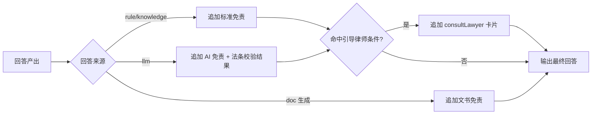

## 十三、状态机：案件阶段流转

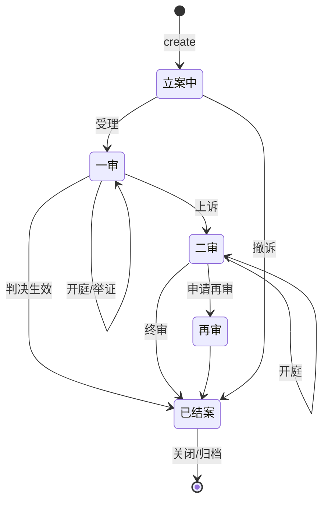

每次阶段变更：`case_record.stageHistory` 追加 `{stage, enteredAt, note}`，触发 `notification_subscription` 模板更新（如举证期限、开庭日重新计算）。

## 十四、状态机：LLM 熔断

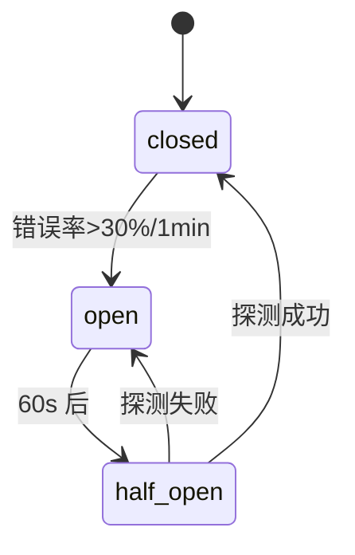

## 十五、状态机：订阅消息授权

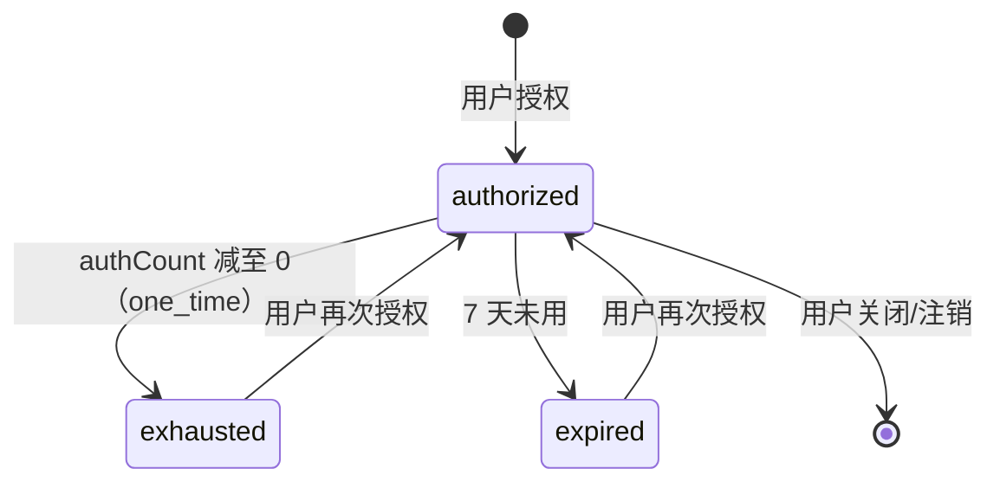

## 十六、跨流程共享约束

1. **traceId 贯穿**：所有流程由网关生成 `traceId`，写入每条 `audit_log` 与 `dialog_record.context`。
2. **PII 出口必脱敏**：任何流程在向 LLM、日志、订阅消息、客户端回显输出前，必经 `PiiService`。
3. **审计必写**：每个流程的关键节点（chat_send/llm_call/doc_generate/case_access/admin_op/auth_event/data_delete/degradation/tool_invoke/tool_invoke_failed/crawl_job_run/crawl_source_blocked/crawl_content_deduped/crawl_classified）写 `audit_log`。
4. **免责必附**：所有 AI 产出经免责注入节点，不依赖 LLM 自觉。
5. **越权必校验**：`caseCrud.get/update/close`、`document_record` 访问均经 `AuthService.checkOwner`。
6. **工具强制免责（v2.2）**：所有 `ToolResult` 必须含 `disclaimer` 字段，UI 固定展示，不可由用户关闭（见 03"工具免责"节）。
7. **采集强制反爬限速（v2.2）**：所有知识采集流程必经 AntiCrawl 令牌桶（每域 ≤ 1 req/s）+ robots.txt 检查 + 真实可识别 UA（见 03"采集合规"节、15 第七节）。

## 十七、复合意图拆分流程（compoundIntentSplit，v2.3）

v2.3 新增。复杂法律问题常含多子意图（如"我和房东签了合同但他不退押金还能告他违约吗"含"合同效力"+"违约救济"两子意图），由 `CompoundIntentSplitter`（07 第 8.3 节）拆分后按依赖图拓扑序编排，结果经 `ConversationTree`（09）展示。

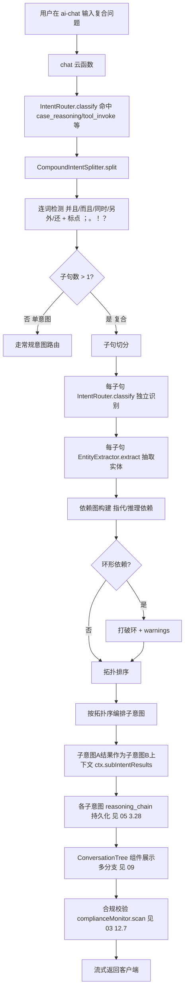

**节点说明**：
- **连词检测**：`CONJUNCTIONS = ['并且','而且','同时','另外','还','以及','此外']`，`DELIMITERS = ['；','。','！','？']`（见 07 8.3）。
- **依赖图**：子句 B 引用子句 A 的实体（指代"他/它"）或子句 B 为 `case_reasoning` 且子句 A 为 `legal_qa`/`tool_invoke` 时，标记 `dependsOn: A`（推理依赖前置查询结果）。
- **拓扑编排**：子意图 A 的结果作为子意图 B 的上下文（`ctx.subIntentResults[A]`），避免重复抽取。
- **降级**：拆分失败时回退为单意图 `IntentRouter.classify(text)`；子意图均为 `general_qa` 时降级为单意图。
- **展示**：`ConversationTree`（09）以树形结构展示各子意图的推理链与结论，支持折叠/展开。

## 十八、律师审核流程（lawyerReview，v2.3）

v2.3 新增。AI 回答经抽样策略进入律师审核队列，律师领取并标注后回流评测集，形成专业把关闭环。权威源见 17 第二节。

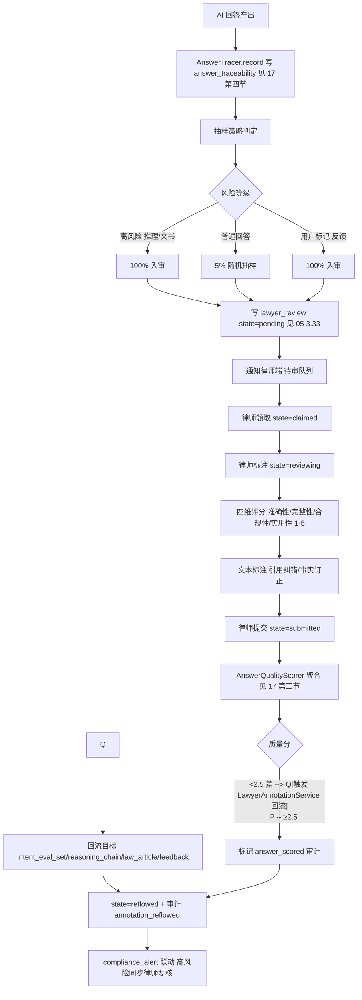

**节点说明**：
- **抽样策略**（权威源 17 第二节）：高风险回答（`case_reasoning` 意图 / `document_generate` 文书）100% 入审；普通回答 5% 随机抽样；用户主动标记反馈 100% 入审。
- **状态机**（权威源 17 第二节，跨 05/09/13 一致）：`pending → claimed（律师领取）→ reviewing（标注中）→ submitted（提交）→ reflowed（回流完成）`。
- **四维评分**：准确性 / 完整性 / 合规性 / 实用性，各 1-5 分；阈值 ≥4 优 / 2.5-4 中 / <2.5 差。
- **回流目标**（权威源 17 第六节）：`intent_eval_set`（推理评测样本）/ `reasoning_chain`（推理链纠错）/ `law_article`（法条订正）/ `feedback`（反馈归档）。
- **审计**：`lawyer_review_submit`（律师提交）/ `answer_scored`（质量评分）/ `annotation_reflowed`（标注回流），见 03 第七节。
- **合规联动**：质量分 <2.5 或律师标记合规问题时，同步写 `compliance_alert`（05 3.32）触发 `ComplianceMonitor` 闭环（03 12.7）。

## 十九、数据导出流程（dataExport，v2.3）

v2.3 新增。用户行使数据可携带权（《个人信息保护法》第 45 条），请求导出个人全量数据。权威源见 03 第 12.5 节，集合 `data_export_request` 见 05 3.31。

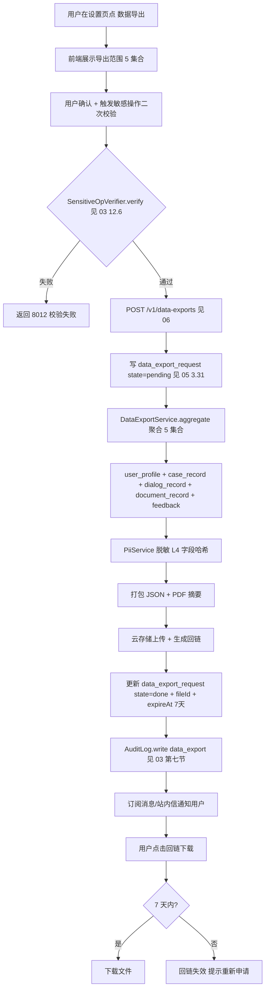

**节点说明**：
- **导出范围**（5 集合，权威源 03 12.5）：`user_profile`（用户档案）/ `case_record`（案件）/ `dialog_record`（对话）/ `document_record`（文书）/ `feedback`（反馈）。
- **敏感操作二次校验**（权威源 03 12.6）：导出属敏感操作，须经 `SensitiveOpVerifier.verify`（微信生物识别 / 短信验证码二选一），失败返回 `8012`。
- **脱敏**：L4 级字段（身份证号 / 银行卡号 / 生物特征）经 `PiiService` 哈希处理，导出文件不含明文敏感信息。
- **有效期**：云存储回链 7 天有效，超期自动失效，用户需重新申请。
- **审计**：`data_export` 事件（detail 含 `userId, requestId, scope, fileId`），见 03 第七节。
- **合规依据**：《个人信息保护法》第 45 条数据可携带权，用户有权请求转移其个人信息。

## 二十、与 v1.0/v2.0/v2.1/v2.2/v2.3 的差异声明

- **v1.0 → v2.0**：v1.0 仅以文字描述流程；v2.0 给出 10 个核心流程的 Mermaid 图（含 3 个状态机）与节点级说明，覆盖 G21 全部 P0 缺口，并明确跨流程的 traceId/PII/审计/免责/越权五大约束。
- **v2.0 → v2.1**：流程层无新增（v2.1 聚焦 Agent 编排与对外协议，复用 v2.0 流程）。
- **v2.1 → v2.2**：新增第六节"工具调用主流程"（双路径：TabBar 工具 Tab 直调 invokeTool 云函数；AI 对话经 IntentRouter 命中 tool_invoke → OrchestratorAgent → ToolAgent → ToolRegistry → Tool.invoke）、第七节"知识采集主流程"（三阶段：UrlCollector 发现 / DetailExtractor 抽取去重 / StorageClassifier 分类入库），原章节顺延至八至十七，跨流程共享约束补 1 条"工具调用强制免责（ToolResult.disclaimer）+ 采集强制反爬限速"。
- **v2.2 → v2.3**：新增 3 个 Mermaid 流程图 — 第十七节"复合意图拆分流程"（CompoundIntentSplitter 连词检测 → 子句切分 → 依赖图 → 拓扑序编排 → ConversationTree 展示，引用 07 8.3 / 09）、第十八节"律师审核流程"（抽样策略 100%/5%/100% → lawyer_review 状态机 pending→claimed→reviewing→submitted→reflowed → 四维评分 → 标注回流，引用 17）、第十九节"数据导出流程"（SensitiveOpVerifier 二次校验 → DataExportService 聚合 5 集合 → 脱敏 → 云存储回链 7 天 → 审计 data_export，引用 03 12.5），原差异声明顺延至二十。流程层引用 v2.3 新增的 nlu/reasoning/lawyer-review 3 Agent（11）、case_reasoning 意图（07）、reasoning_chain 集合（05 3.28）、8012/8019 错误码（06）。
