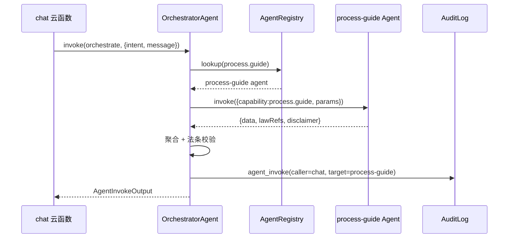
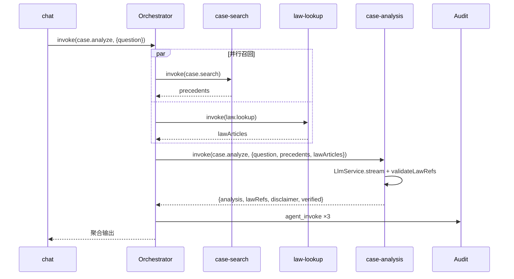

# 11 · 多 Agent 协作架构

> 版本：v2.3 | 日期：2026-07-22 | 状态：设计扩展（v2.3 新增 nlu/reasoning/lawyer-review 3 个 Agent + 9 个 capability，含 ToolAgent 新增 tool.clause_recommender）
> 影响范围：02 / 03 / 04 / 05 / 06 / 07 / 09 / 10 / 12 / 13 / 14 / 15 / 16 / 17
> 本文为 agentId、capability 枚举、Agent 接口权威源。

---

## 一、设计目标

1. **内部 agent 化** — 将现有 `services/legal/` 22 个扁平 Service 重组为统一 `LegalAgent` 接口的专业 Agent，支持编排器以 agent 维度调度。
2. **Orchestrator-Worker 编排** — 主 OrchestratorAgent 按意图调度专业子 Agent，支持单 agent / 并行 / 串行依赖三种编排模式。
3. **协议无关核心** — Agent 接口与传输协议解耦，MCP / OpenAPI / 未来 A2A 共用同一套 Agent 实现。
4. **可被外部调用** — 通过 12 定义的 MCP/OpenAPI 暴露，外部 agent 可按 13 治理规则分层调用。
5. **可反向协作** — 预留外部 agent 目录，内部 agent 经授权可调用可信外部 agent（如企业信息查询）。

## 二、Agent 化重组方案

### 2.1 重组原则

- **能力不变** — 现有 22 模块的领域逻辑（RuleEngine/RagService/LlmService 等）**不重写**；Agent 是它们的"包装层"，注入横切关注点（PII/审计/限流/免责/法条校验）。
- **粒度适中** — 按业务能力而非模块一一对应；多个相关模块可被一个 Agent 包装。
- **内外有别** — 区分 `internalOnly`（仅编排器可调）、`externalReadOnly`（对外只读）、`externalWriteLimited`（对外受限写）。

### 2.2 Agent 清单

| agentId | 包装现有模块 | capability 枚举 | 暴露层级 | 异步 |
|---------|-------------|----------------|---------|------|
| `law-lookup` | RuleEngine + law_article | `law.lookup` | L-Read | 否 |
| `legal-qa` | RuleEngine + KnowledgeBase(FAQ/术语) | `legal.qa` | L-Read | 否 |
| `case-search` | RagService(案例召回) | `case.search` | L-Read | 否 |
| `process-guide` | KnowledgeBase(流程/材料) | `process.guide` / `material.checklist` | L-Read | 否 |
| `document` | DocumentGenerator + ExportService | `document.generate` / `document.export` | L-Write-Limited | 是 |
| `case-analysis` | RagService + LlmService(分析) | `case.analyze` | L-Write-Limited | 是 |
| `memory` | MemoryManager | `memory.read` / `memory.write` | L-Internal | 否 |
| `orchestrator` | IntentRouter + 编排逻辑 | `orchestrate` | L-Internal | 否 |
| `tool`（v2.2） | ToolRegistry + 8 LegalTool（PeriodCalculator / DocumentReviewer / CompensationQuery / LicenseOcr / LawValidityQuery / CauseClassifier / SentencingGuide / ClauseRecommender v2.3） | `tool.period_calculator` / `tool.document_review` / `tool.compensation_query` / `tool.license_ocr` / `tool.law_validity` / `tool.cause_classification` / `tool.sentencing_guide` / `tool.clause_recommender`（v2.3） | L-Read | 否 |
| `nlu`（v2.3） | EntityExtractor + ClarificationManager + CompoundIntentSplitter | `nlu.extract` / `nlu.clarify` | L-Internal | 否 |
| `reasoning`（v2.3） | IracReasoner + FactSimilarityService + CaseComparator + LawApplicationDeterminer | `case.reason` / `case.compare` / `law.apply_check` | L-Write-Limited | 是 |
| `lawyer-review`（v2.3） | LawyerReviewService + AnswerQualityScorer + AnswerTracer + ComplianceMonitor + LawyerAnnotationService | `review.lawyer` / `review.score` / `review.compliance` | L-Internal | 是 |

**capability 枚举**（权威源，12/13/06 复用）：

```
law.lookup | legal.qa | case.search | process.guide | material.checklist
| document.generate | document.export | case.analyze
| memory.read | memory.write | orchestrate
| tool.period_calculator | tool.document_review | tool.compensation_query
| tool.license_ocr | tool.law_validity | tool.cause_classification
| tool.sentencing_guide
| tool.clause_recommender                                          // v2.3 第 8 LegalTool ClauseRecommender（ToolAgent）
| nlu.extract | nlu.clarify                                          // v2.3 nlu Agent
| case.reason | case.compare | law.apply_check                       // v2.3 reasoning Agent
| review.lawyer | review.score | review.compliance                   // v2.3 lawyer-review Agent（L-Internal 不对外）
```

### 2.3 与现有 22 模块映射矩阵

| Agent | 直接依赖模块 | 横切模块（注入） |
|-------|------------|-----------------|
| law-lookup | RuleEngine, KnowledgeBase | PiiService, AuditLog, CacheService, Logger |
| legal-qa | RuleEngine, KnowledgeBase | PiiService, ContentSafety, AuditLog, Logger |
| case-search | RagService | PiiService, AuditLog, CacheService, Logger |
| process-guide | KnowledgeBase | AuditLog, Logger |
| document | DocumentGenerator, ExportService | PiiService, ContentSafety, AuditLog, JobService |
| case-analysis | RagService, LlmService | PiiService, ContentSafety, AuditLog, LlmService.validateLawRefs |
| memory | MemoryManager | PiiService, AuditLog |
| orchestrator | IntentRouter, AgentRegistry | AuditLog, FeatureFlag, Logger |
| tool（v2.2） | ToolRegistry, 7 LegalTool（PeriodCalculator / DocumentReviewer / CompensationQuery / LicenseOcr / LawValidityQuery / CauseClassifier / SentencingGuide） | PiiService, AuditLog, CacheService, Logger |
| nlu（v2.3） | EntityExtractor, ClarificationManager, CompoundIntentSplitter | PiiService, AuditLog, Logger |
| reasoning（v2.3） | IracReasoner, FactSimilarityService, CaseComparator, LawApplicationDeterminer | PiiService, ContentSafety, AuditLog, JobService, LlmService.validateLawRefs |
| lawyer-review（v2.3） | LawyerReviewService, AnswerQualityScorer, AnswerTracer, ComplianceMonitor, LawyerAnnotationService | PiiService, AuditLog, JobService |

## 三、LegalAgent 统一接口

```typescript
// src/services/agents/types.ts
export interface LegalAgent {
  readonly agentId: string;
  readonly card: AgentCard;
  invoke(input: AgentInvokeInput, ctx: AgentContext): Promise<AgentInvokeOutput>;
}

export interface AgentCard {
  agentId: string;
  name: string;                       // 人类可读名
  description: string;
  version: string;                    // 语义化版本
  capabilities: Capability[];         // 声明能力
  inputSchema: JSONSchema;            // 输入 JSON Schema
  outputSchema: JSONSchema;           // 输出 JSON Schema（强制含 disclaimer/lawRefs/traceId）
  piiLevel: 'L1' | 'L2' | 'L3' | 'L4';   // 输入可接受的最高 PII 级别
  exposure: 'L-Read' | 'L-Write-Limited' | 'L-Internal';
  async: boolean;                     // 是否异步长任务
  timeout: number;                    // 默认超时 ms
  fallbackAgentId?: string;           // 故障时降级目标
}

export type Capability =
  | 'law.lookup' | 'legal.qa' | 'case.search'
  | 'process.guide' | 'material.checklist'
  | 'document.generate' | 'document.export' | 'case.analyze'
  | 'memory.read' | 'memory.write' | 'orchestrate'
  | 'tool.period_calculator' | 'tool.document_review' | 'tool.compensation_query'
  | 'tool.license_ocr' | 'tool.law_validity' | 'tool.cause_classification'
  | 'tool.sentencing_guide'
  // v2.3 新增
  | 'nlu.extract' | 'nlu.clarify'
  | 'case.reason' | 'case.compare' | 'law.apply_check'
  | 'review.lawyer' | 'review.score' | 'review.compliance';

export interface AgentInvokeInput {
  capability: Capability;             // 调用的具体能力
  params: Record<string, unknown>;    // 能力参数（按 inputSchema）
  piiLevel?: 'L1'|'L2'|'L3'|'L4';     // 调用方声明输入 PII 级别
}

export interface AgentContext {
  traceId: string;
  callerAgentId: string;              // 调用方 agentId；外部调用为 'external:<agentKey>'
  callerUserId?: string;              // 终端用户（若有）
  externalAgentKey?: string;          // 外部 agent 凭证标识
  deadline: number;                   // 截止时间戳
  lang: 'zh';
}

export interface AgentInvokeOutput {
  ok: boolean;
  data?: unknown;                     // 按 outputSchema
  lawRefs: LawRef[];                  // 强制：涉法条必返
  disclaimer: string;                 // 强制：必返，外部不可剥离
  verified: boolean;                  // 法条是否经校验
  jobId?: string;                     // 异步任务时返回
  usage: { durationMs: number; tokensIn?: number; tokensOut?: number; cacheHit?: string };
  errorCode?: number;                 // 失败时
  errorMessage?: string;
}
```

**强制约束**：
- `outputSchema` 必须含 `disclaimer`、`lawRefs`、`traceId` 三个字段；MCP/OpenAPI 网关在出口处二次校验，缺失则注入兜底免责并告警。
- `piiLevel` 在 Agent 边界校验：外部 agent 调用 `piiLevel >= L4` 直接拒绝（`7004`）。

## 四、Agent Card 示例（law-lookup）

```jsonc
{
  "agentId": "law-lookup",
  "name": "法条查询 Agent",
  "description": "按法律名+条号或关键词精确查询法条全文，引用经库内核实",
  "version": "1.0.0",
  "capabilities": ["law.lookup"],
  "inputSchema": {
    "type": "object",
    "properties": {
      "lawName": { "type": "string", "description": "法律名，如'民法典'" },
      "articleNo": { "type": "string", "description": "条号，如'第一百四十三条'或'143'" },
      "query": { "type": "string", "description": "关键词查询（与 lawName+articleNo 二选一）" },
      "category": { "type": "string", "enum": ["civil","criminal","commercial","administrative","procedural"] }
    }
  },
  "outputSchema": {
    "type": "object",
    "properties": {
      "articles": { "type": "array", "items": { "type": "object" } },
      "lawRefs": { "type": "array" },
      "disclaimer": { "type": "string" },
      "traceId": { "type": "string" }
    },
    "required": ["lawRefs", "disclaimer", "traceId"]
  },
  "piiLevel": "L2",
  "exposure": "L-Read",
  "async": false,
  "timeout": 5000,
  "fallbackAgentId": "legal-qa"
}
```

## 五、Orchestrator-Worker 编排

### 5.1 编排器职责

`OrchestratorAgent` 接管现有 `chat` 云函数的编排职责：

1. 调用 `IntentRouter.classify` 判定意图；
2. 按意图 → 编排计划（单 agent / 并行 / 串行）；
3. 通过 `AgentRegistry.lookup` 获取目标 agent；
4. 调用 agent.invoke，聚合结果；
5. 注入免责 + 法条校验（若 agent 未自校验）；
6. 写审计 `agent_invoke`。

### 5.2 意图 → 编排计划映射

| IntentType | 编排计划 | 模式 |
|-----------|---------|------|
| `legal_qa` | law-lookup → legal-qa（命中即返） | 串行短路 |
| `document_generate` | law-lookup ∥ process-guide → document | 并行取上下文 + 串行生成（异步） |
| `process_guide` | process-guide | 单 agent |
| `case_analysis` | case-search ∥ law-lookup → case-analysis | 并行召回 + 串行分析（异步） |
| `case_reasoning`（v2.3） | nlu → case-search ∥ law-lookup → reasoning | 前置 NLU + 并行召回 + 串行 IRAC 推理（异步） |
| `material_checklist` | process-guide(material.checklist) | 单 agent |
| `general_qa` | legal-qa → case-analysis（fallback） | 串行 |

### 5.3 编排时序图

**单 agent**（process_guide）：



**并行 + 串行**（case_analysis）：



### 5.4 编排伪代码

```typescript
async function orchestrate(input: AgentInvokeInput, ctx: AgentContext): Promise<AgentInvokeOutput> {
  const intent = await intentRouter.classify(input.params.message as string, /*ctx*/);
  const plan = PLAN_BY_INTENT[intent.intent];

  // v2.3：敏感操作二次校验（写操作前置）
  if (isSensitiveCapability(intent)) {
    const verified = await sensitiveOpVerifier.verify(ctx.callerUserId, intent);
    if (!verified) throw new AgentError(8012, '敏感操作二次校验失败');
  }

  // v2.3：NLU 增强（case_reasoning / 复合意图前置 NLU）
  let nluContext = {};
  if (intent.intent === 'case_reasoning' || isCompoundIntent(input.params.message)) {
    const nluOut = await registry.lookup('nlu.extract').invoke(
      { capability: 'nlu.extract', params: { text: input.params.message } }, ctx);
    nluContext = { entities: nluOut.data };
    // 复合意图拆分：递归 orchestrate 各子意图（见 07 第 8.3 节）
    if (nluOut.data?.subIntents?.length > 1) {
      return await orchestrateCompound(nluOut.data.subIntents, ctx);
    }
    // 多轮主动澄清：缺失必填槽时返回 ClarificationCard
    if (nluOut.data?.clarification) {
      return { ok: true, data: { clarification: nluOut.data.clarification }, lawRefs: [], disclaimer: '', verified: false };
    }
  }

  // 并行阶段
  const parallelResults = await Promise.all(
    (plan.parallel || []).map(cap => {
      const agent = registry.lookup(cap);
      return agent.invoke({ capability: cap, params: { ...deriveParams(cap, input), ...nluContext } }, ctx);
    })
  );

  // 串行阶段（带短路）
  let aggregated = mergeParallel(parallelResults);
  for (const cap of plan.serial || []) {
    const agent = registry.lookup(cap);
    const out = await agent.invoke({ capability: cap, params: { ...input.params, ...aggregated, ...nluContext } }, ctx);
    if (plan.shortCircuit && out.ok && isDefinitive(out)) { aggregated = out; break; }
    aggregated = merge(aggregated, out);
  }

  // 强制校验：免责与法条
  if (!aggregated.lawRefs?.length && involvesLaw(intent)) {
    aggregated.lawRefs = await llm.validateLawRefs(aggregated.data as string);
  }
  aggregated.disclaimer = aggregated.disclaimer || DEFAULT_DISCLAIMER;

  // v2.3：回答溯源写入 + 合规风险扫描
  await answerTracer.record(ctx.traceId, aggregated);
  const compliance = await complianceMonitor.scan(aggregated);
  if (compliance.riskLevel === 'block') {
    audit.write('compliance_blocked', { traceId: ctx.traceId, msgId: ctx.msgId });
    return { ok: false, errorCode: 8013, errorMessage: '回答合规风险拦截', lawRefs: [], disclaimer: DEFAULT_DISCLAIMER, verified: false };
  }

  audit.write('agent_invoke', { caller: ctx.callerAgentId, targets: plan.allAgents(), result: aggregated.ok ? 'success' : 'failure' });
  return aggregated;
}
```

## 六、AgentRegistry 注册与发现

### 6.1 内部 Registry

```typescript
// src/services/agents/registry.ts
export interface AgentRegistry {
  register(agent: LegalAgent): void;
  lookup(capability: Capability): LegalAgent;        // 按能力查
  get(agentId: string): LegalAgent;                  // 按 id 查
  listCards(filter?: { exposure?: string }): AgentCard[];
}
```

- 进程级单例，云函数冷启动时注册全部 8 个内部 agent。
- `lookup(capability)` 返回该能力的**主** agent（一个 capability 仅一个主 agent，避免歧义）。
- 卡片列表 `listCards` 暴露给 MCP `tools/list` 与 OpenAPI `/v1/agents`。

### 6.2 外部 Agent 目录

`external_agent_registry` 集合（见 05）登记可信外部 agent，字段：

```jsonc
{
  "agentKey": "tianyan-enterprise",          // 内部调用方引用标识
  "endpoint": "https://api.tianyan.example/mcp",
  "protocol": "mcp",                          // mcp|openapi|a2a
  "capabilities": ["enterprise.lookup"],
  "authType": "api_key",
  "authSecretRef": "env:TIANYAN_KEY",
  "ownerAdminId": "admin1",
  "status": "active",
  "approvedAt": "...",
  "createdAt": "..."
}
```

- 内部 agent 经 `ExternalAgentClient.invoke(agentKey, ...)` 调用外部 agent。
- 调用同样写 `agent_invocation_log` + `audit_log`。
- MVP 阶段仅预留接口与集合，不接入真实外部 agent（属阶段六之后）。

## 七、内部 Agent 间通信协议

| 调用形态 | 实现 | 适用 |
|---------|------|------|
| 同进程直调 | `agent.invoke()` 函数调用 | chat 云函数内 Orchestrator → 子 agent |
| 云函数间调用 | `wx.cloud.callFunction` + Agent 协议封装 | 跨云函数（如 mcpServer → 内部 agent） |
| 异步任务 | 写 `agent_job` + 回调/webhook | document/case-analysis 长任务 |

**同进程直调**为默认，性能最优；MCP/OpenAPI 网关云函数通过 `wx.cloud.callFunction` 调用 `agentDispatcher` 云函数（统一入口），由 dispatcher 在内部进程完成 agent 调度。

## 八、降级策略

| 故障 | 降级 |
|------|------|
| 子 agent 超时 | 用 `fallbackAgentId`（如 law-lookup → legal-qa） |
| 关键 agent 全失败 | Orchestrator 降级到单体路径（直接调 RuleEngine/KnowledgeBase，绕过 agent 层） |
| Orchestrator 自身故障 | chat 云函数 fallback 到 v2.0 单体编排（保留兼容） |
| 外部 agent 不可达 | 返回 `7003` + 建议本地能力替代 |

降级事件写 `audit_log(event=degradation)`，触发告警。

## 九、与 v1.0/v2.0/v2.1/v2.2/v2.3 的关系

- **v1.0 → v2.0**：v1.0 仅以文字描述意图识别与编排；v2.0 给出 22 个领域模块、13 个集合、9 个云函数 API。
- **v2.0 → v2.1**：不推翻 v2.0 的 22 个领域模块、13 个集合、云函数 API；Agent 层是其上的包装与编排。`chat` 云函数内部从"直接调 Service"演进为"经 OrchestratorAgent 调 Agent"；对外新增 mcpServer/openApiGateway 两个云函数。本文档集从 v2.0 升级为 v2.1。v2.0 路线图阶段一至五不变，新增阶段六（多 agent 协作与开放，见 10）。
- **v2.1 → v2.2**：Agent 总数 8 → 9（新增 `tool` / ToolAgent），capability 总数 11 → 18（新增 7 个 `tool.*`），capability 联合类型扩展；新增 ToolRegistry 作为 Agent 体系的"工具子层"，由 ToolAgent 包装 7 个 LegalTool 注入 AgentRegistry。OrchestratorAgent 在 `tool_invoke` 意图下经 ToolAgent 调度具体工具（详见 14）。本文档为 agentId / capability / Agent 接口权威源，与 14（工具实现）、07（工具算法）、06（工具端点）形成闭环。
- **v2.2 → v2.3**：Agent 总数 9 → 12（新增 `nlu` / `reasoning` / `lawyer-review`），capability 总数 18 → 27（新增 9 个：`nlu.extract`/`nlu.clarify`/`case.reason`/`case.compare`/`law.apply_check`/`review.lawyer`/`review.score`/`review.compliance`/`tool.clause_recommender`），capability 联合类型扩展。`tool` Agent 的 ToolRegistry 新增第 8 LegalTool ClauseRecommender（capability `tool.clause_recommender`，见 14 第十一节）。`nlu` Agent 包装 EntityExtractor/ClarificationManager/CompoundIntentSplitter（算法见 07 第八节）；`reasoning` Agent 包装 IracReasoner/FactSimilarityService/CaseComparator/LawApplicationDeterminer（权威源见 16）；`lawyer-review` Agent 包装 LawyerReviewService/AnswerQualityScorer/AnswerTracer/ComplianceMonitor/LawyerAnnotationService（权威源见 17），L-Internal 不对外暴露。意图→编排计划映射追加 `case_reasoning`（nlu → 并行召回 → reasoning IRAC 推理）。OrchestratorAgent 追加 `enforceSensitiveOp` 钩子（5.4 节），对写操作前置敏感操作二次校验（见 03）。

## 十、与 v1.0/v2.0/v2.1/v2.2/v2.3 单体架构的差异声明

v2.0 是单体 agent（22 扁平 Service 由 chat 编排，仅服务自有前端）；v2.1 将其升级为 Orchestrator-Worker 多 agent 架构，定义统一 `LegalAgent` 接口、Agent Card、能力枚举、注册发现、并行/串行编排、降级链，为 12（对外暴露）与 13（治理）提供基础抽象。

v2.2 在 v2.1 多 agent 之上新增工具子层（ToolAgent + 7 LegalTool），将"扁平 Service → Agent"再细化为"扁平 Service → Agent → 工具"，工具经 ToolRegistry 注册与发现，对 OrchestratorAgent 透明。

v2.3 在 v2.2 之上新增 3 个专业 Agent：`nlu`（NLU 增强，意图识别前/后调度实体抽取/澄清/拆分）、`reasoning`（IRAC 法律推理，case_reasoning 意图触发）、`lawyer-review`（律师审核评估闭环，L-Internal）。三者复用现有 Orchestrator-Worker 编排框架，`reasoning` 为异步长任务，`nlu`/`lawyer-review` 视场景异步。编排计划新增 `case_reasoning` 路径（nlu → 并行召回 → reasoning），并引入敏感操作二次校验钩子。
