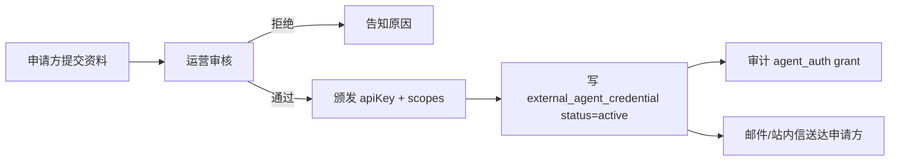
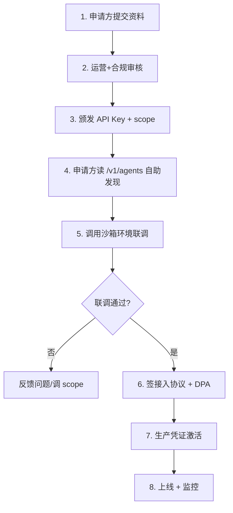

# 13 · Agent 安全与治理

> 版本：v2.3 | 日期：2026-07-22 | 状态：设计扩展（v2.3 新增 5 审计事件引用 + 数据可携带权合规条款；v2.2 沿用 v2.1 治理框架；tool_invoke/tool_invoke_failed/crawl_job_run/crawl_source_blocked 4 审计事件已在 03 第 7 节定义，本文不重复）
> 影响范围：02 / 03 / 05 / 06 / 11 / 12 / 16 / 17
> 本文为外部 agent 身份、分层授权、限流配额、审计字段权威源。
> 法规依据：《个人信息保护法》《数据安全法》《生成式人工智能服务管理暂行办法》、微信小程序运营规范。

---

## 一、设计目标

1. **可控接入** — 外部 agent 必须经申请-审批获取凭证，不可匿名调用。
2. **分层授权** — 按 L-Read / L-Write-Limited / L-Internal 分层，最小授权。
3. **可审计** — 每次跨 agent 调用留痕，可追溯 caller/target/capability/result。
4. **PII 边界** — 外部 agent 不可处理 L4 PII；内部 agent 间 PII 加密传输。
5. **强制合规透传** — 免责声明、法条校验结果在 agent 边界强制透传，外部不可剥离。
6. **可持续治理** — 凭证轮换、配额调整、吊销、SLA 监控有闭环。

## 二、外部 agent 身份与凭证

### 2.1 身份模型

| 字段 | 说明 |
|------|------|
| `agentKey` | 外部 agent 唯一标识，内部调用方引用此 key（如 `tianyan-enterprise`） |
| `displayName` | 申请方提供的人类可读名 |
| `ownerName` / `ownerContact` | 申请方主体与联系人 |
| `apiKey` | 颁发的密钥，形如 `lak_live_<32>`；仅存哈希 + 前 6 位明文用于识别 |
| `apiKeyHash` | `sha256(apiKey + salt)`，校验用 |
| `scopes` | 授权的 capability 列表，如 `["law.lookup","case.search"]` |
| `exposureLevel` | `L-Read` / `L-Write-Limited` |
| `rateLimits` | 配额覆盖（见第四节） |
| `status` | `pending` / `active` / `suspended` / `revoked` |
| `approvedBy` | 审批管理员 |
| `validFrom` / `validUntil` | 有效期 |
| `createdAt` / `updatedAt` | — |

存 `external_agent_credential` 集合（见 05）。

### 2.2 申请-审批流程



- 申请信息：主体证明、用途说明、调用预估量、技术联系人。
- 审核：运营 + 合规双签；L-Write-Limited 需管理员加签。
- 凭证仅展示一次，遗失需吊销重发。

### 2.3 轮换与吊销

- **轮换**：建议 90 天一次；管理员可强制轮换，旧 key 24 小时宽限后失效。
- **吊销**：违规、泄露、申请方主动申请 → `status=revoked`，立即失效；调用返回 `-32001`。
- **过期**：`validUntil` 到期自动 `suspended`，需续期。

## 三、分层授权模型

### 3.1 暴露层级

| 层级 | 可调 capability | 鉴权 | 默认配额 |
|------|----------------|------|---------|
| L-Read | law.lookup / legal.qa / case.search / process.guide / material.checklist / document.export | API Key + scope | 1000/小时 |
| L-Write-Limited | document.generate / case.analyze | API Key + scope + 内容安全 | 50/小时 |
| L-Internal | memory.read / memory.write / orchestrate | 不对外 | — |

### 3.2 scope 校验

调用进入 `agentDispatcher` 后：

```typescript
function authorize(ctx: AgentContext, capability: Capability): void {
  const cred = credentialStore.get(ctx.externalAgentKey!);
  if (!cred || cred.status !== 'active') throw new AgentError(-32001, '未授权');
  if (isExpired(cred)) throw new AgentError(-32001, '凭证已过期');
  if (!cred.scopes.includes(capability)) throw new AgentError(7002, `capability ${capability} 未授权`);
  if (cred.exposureLevel === 'L-Read' && isWriteCapability(capability))
    throw new AgentError(7002, '当前凭证无写权限');
}
```

### 3.3 越权防护

- 外部 agent 调用 `agentId` 为 `external:<agentKey>`，编排器据此拒绝其调用 L-Internal capability。
- `case.search` 等查询不返回他人案件数据（案例库为公开 L1，案件档案为 L3 私有，外部仅可查公开案例）。
- `document.export` 校验 `docId` 归属：仅可下载由该 agentKey 触发生成的文书。

## 四、限流配额矩阵

### 4.1 默认配额

| 维度 | L-Read | L-Write-Limited | 并发 |
|------|--------|-----------------|------|
| 单外部 agent / 小时 | 1000 | 50 | 10 |
| 单外部 agent / 天 | 10000 | 500 | — |
| 全局 / 秒 | 200 | 50 | — |

### 4.2 自定义配额

- `external_agent_credential.rateLimits` 可覆盖默认值，由审批时设定。
- 大客户可申请提配额，记入凭证与审计。

### 4.3 实现

- 复用 02 限流框架（云数据库计数 + 滑动窗口）。
- 计数 key：`ratelimit:<agentKey>:<hour|day>:<bucket>`。
- 超限返回 `-32002`（MCP）/ HTTP 429（OpenAPI），响应头 `Retry-After`。

### 4.4 熔断

- 单 agent 错误率 > 30%（5 分钟）触发该 agent 调用降级（非全局熔断）。
- 复用 02 熔断框架，状态存 `system_status`。

## 五、跨 Agent 审计

### 5.1 审计事件

复用 `audit_log` 集合（05），新增事件：

| event | 触发 | 关键字段 |
|-------|------|---------|
| `agent_invoke` | 任何跨 agent 调用 | traceId, callerAgentId, targetAgentId, capability, result, durationMs |
| `agent_auth` | 凭证颁发/轮换/吊销 | agentKey, action, adminId |
| `agent_authz_deny` | 越权拒绝 | agentKey, capability, reason |
| `agent_pii_violation` | PII 边界违规 | agentKey, piiLevel, capability |
| `agent_rate_limit` | 限流触发 | agentKey, bucket |
| `agent_degradation` | agent 降级 | agentId, fallbackAgentId, reason |
| `data_export`（v2.3） | 用户触发数据导出（数据可携带权） | userId, exportScope, resultUrl, expireAt |
| `compliance_blocked`（v2.3） | 合规风险拦截（ComplianceMonitor block 级） | msgId, riskScore, reason, lawyerReviewId? |
| `lawyer_review_submit`（v2.3） | 律师提交审核标注 | reviewId, lawyerId, scores, riskFlag |
| `answer_scored`（v2.3） | 回答质量评分完成（自动/律师） | msgId, autoScore?, lawyerScore?, dimension |
| `annotation_reflowed`（v2.3） | 律师标注回流到评测集 | reviewId, targetSet, dedupKey |

> v2.3 新增 5 事件的字段定义与触发条件以 **03 第七节** 为权威源（闭环见 17 第九节），此处列出便于治理层按 agentKey/userId 维度监控导出、合规拦截、律师审核、评分、回流五类行为。

### 5.2 `agent_invocation_log`（快查集合）

`audit_log` 保留 180 天全量；为高频查询另设 `agent_invocation_log`（精简字段，TTL 30 天）：

```jsonc
{
  "ts": "...",
  "traceId": "uuid",
  "callerAgentId": "external:tianyan-enterprise",
  "targetAgentId": "law-lookup",
  "capability": "law.lookup",
  "externalAgentKey": "tianyan-enterprise",
  "result": "success",
  "durationMs": 120,
  "cacheHit": "L3",
  "errorCode": null,
  "expireAt": "createdAt + 30d"
}
```

供运营后台按 agentKey 维度查调用趋势、错误率、配额使用。

## 六、PII 跨 Agent 边界

### 6.1 输入边界

| 调用方 → 目标 | 允许输入 PII 级别 |
|---------------|------------------|
| 外部 agent → 任何内部 agent | ≤ L2（L3/L4 拒绝，返回 `7004`） |
| 内部 agent → 内部 agent（同进程） | ≤ 目标 agent `piiLevel` |
| 内部 agent → 外部 agent | ≤ L2（且经 PiiService 脱敏） |

### 6.2 检测与拦截

`agentDispatcher` 在调用前对 `input.params` 跑 `PiiService.detectAndMask`：

```typescript
function enforcePiiBoundary(input: AgentInvokeInput, ctx: AgentContext): AgentInvokeInput {
  if (ctx.callerAgentId.startsWith('external:')) {
    const detected = piiService.detect(input.params);
    if (detected.maxLevel >= 'L4') throw new AgentError(7004, '输入包含敏感个人信息，外部 agent 不可处理');
    if (detected.maxLevel === 'L3' && targetAgentExposure(input.capability) === 'L-Read')
      throw new AgentError(7004, '只读能力不接受 L3 个人信息');
    input.params = detected.masked;       // L3 脱敏后透传
  }
  return input;
}
```

### 6.3 输出边界

- 任何对外响应在出口处再过 `PiiService.detectAndMask`，确保无 L3/L4 明文外泄。
- 案例库返回的当事人姓名已是脱敏（`张某某`），不构成 PII 风险。

## 七、强制合规透传

### 7.1 免责声明

- 每个 `AgentInvokeOutput.disclaimer` 必须非空。
- `mcpServer` / `openApiGateway` 出口处校验：

```typescript
function enforceDisclaimer(out: AgentInvokeOutput): AgentInvokeOutput {
  if (!out.disclaimer) {
    logger.warn('missing disclaimer, injecting default', { agentId: ctx.targetAgentId });
    out.disclaimer = DEFAULT_DISCLAIMER;
    audit.write('agent_degradation', { reason: 'missing_disclaimer' });
  }
  return out;
}
```

- OpenAPI 响应头追加 `X-Legal-Disclaimer: present`，便于调用方程序化校验。

### 7.2 法条引用校验

- `case-analysis` / `legal-qa` / `document.generate` 输出经 `LlmService.validateLawRefs`。
- 未核实法条在 `lawRefs[].verified=false`，UI/调用方须展示"⚠️ 未核实"。
- 校验失败不阻塞返回，但记 `agent_invoke` 的 `verified=false` 与审计。

### 7.3 内容安全

- 外部 agent 输入在 dispatcher 入口过 `ContentSafety.checkText`，违规返回 `7005`（MCP）/ HTTP 422 `6002`（OpenAPI，与 v2.0 一致）。
- LLM 生成输出同样过内容安全，复用 03 第九节机制。

### 7.4 数据可携带权（v2.3）

- **法规依据**：《个人信息保护法》第 45 条 — 个人有权向个人信息处理者请求转移其个人信息。
- **实现**：由 `DataExportService` 完成聚合→脱敏→打包→云存储回链，权威定义见 **03 第 12.5 节**；对外端点 `POST /v1/data-exports` 见 06 第 5.2 节。
- **治理约束**：
  - 导出为敏感操作，须经 `SensitiveOpVerifier` 二次校验（微信生物识别 / 短信验证码），失败返回 `8012`（见 03 12.6）。
  - 导出完成写审计 `data_export`（关键字段见 5.1），回链 7 天后自动失效。
  - **外部 agent 不可代用户发起导出**：`/v1/data-exports` 按 `userId` 鉴权（非 apiKey），`agentDispatcher` 拒绝 `external:*` caller 调用此 capability（归 L-Internal 不可对外）。
  - 导出范围限定用户本人数据（`user_profile`/`chat_session`/`message`/`case_record`/`document` 5 集合，见 05），他人数据由 RBAC 横向越权防护拦截（`4031`）。

## 八、外部 agent 接入流程与 SLA

### 8.1 接入流程



### 8.2 SLA

| 项 | 目标 |
|----|------|
| L-Read 可用性 | 99.5% / 月 |
| L-Write-Limited 可用性 | 99.0% / 月 |
| L-Read P95 延迟 | < 1s |
| L-Write-Limited P95 延迟 | < 30s（异步任务完成时间） |
| 故障响应 | 工作日 2 小时内响应 |

SLA 不达时按接入协议约定处理；高优先级客户可申请专属配额与通道。

## 九、运营治理闭环

### 9.1 监控指标（复用 02 可观测）

| 指标 | 告警阈值 |
|------|---------|
| 单 agent 错误率 | > 10% / 5min |
| 单 agent P95 延迟 | L-Read > 2s / L-Write > 60s |
| 限流触发次数 | 单 agent > 100 / 小时 |
| PII 边界违规次数 | > 0 |
| 凭证即将过期 | 7 天内 |
| 免责缺失注入次数 | > 0 |

### 9.2 定期治理

- 周报：按 agentKey 维度的调用量、错误率、配额使用、TOP 调用方。
- 月度：凭证审阅，吊销低活跃/违规 agent。
- 季度：scope 最小化复核，关闭未用 capability。

## 十、与 03 安全合规的衔接

| 03 章节 | 13 扩展点 |
|---------|----------|
| 数据分级 | 新增"跨 agent 传输规则"（第六节） |
| 加密策略 | 外部 agent 调用强制 TLS；apiKey 仅存哈希 |
| PII 脱敏 | 新增跨 agent 边界检测（6.2） |
| RBAC | 新增 `external_agent` 角色与 scope 模型（第三节） |
| 审计日志 | 新增 `agent_invoke` / `agent_auth` 等事件（第五节） |
| 免责自动化 | 新增 agent 边界强制透传（7.1） |
| 生成式 AI 合规 | 外部 agent 调用同样适用内容安全与法条校验 |

03 为平台级合规基线，13 为 agent 生态治理专项；二者叠加生效，无矛盾。

## 十一、与 11/12 的边界

- **11**：agent 是什么、如何编排（内部）。
- **12**：agent 如何对外暴露（协议）。
- **13**：谁可调、调多少、留什么痕、违什么规（治理）。
- 三篇权威源分工见 12 第九节。

## 十二、差异声明

**v2.2 → v2.3**：
- 影响范围追加 `16 / 17`（v2.3 新增推理 Agent 与律师审核 Agent 受治理框架约束）。
- 5.1 审计事件表追加 5 个 v2.3 事件（`data_export` / `compliance_blocked` / `lawyer_review_submit` / `answer_scored` / `annotation_reflowed`），定义见 03 第七节，闭环见 17 第九节。
- 新增 7.4 数据可携带权合规条款（引用 03 12.5 + 《个人信息保护法》第 45 条），落地导出敏感操作二次校验（8012）、`data_export` 审计、7 天回链过期、外部 agent 不可代发起等治理约束。
- 审计事件：13 表内为 agent 治理相关事件（v2.1 6 个 + v2.3 5 个 = 11 个；v2.2 4 个采集/工具事件按 03 第七节定义，本文不重复）；**系统审计事件总数见 03 第七节权威源**（v2.0 8 + v2.1 6 + v2.2 4 + v2.3 5 = 23），跨 03/11/13/17 一致。
