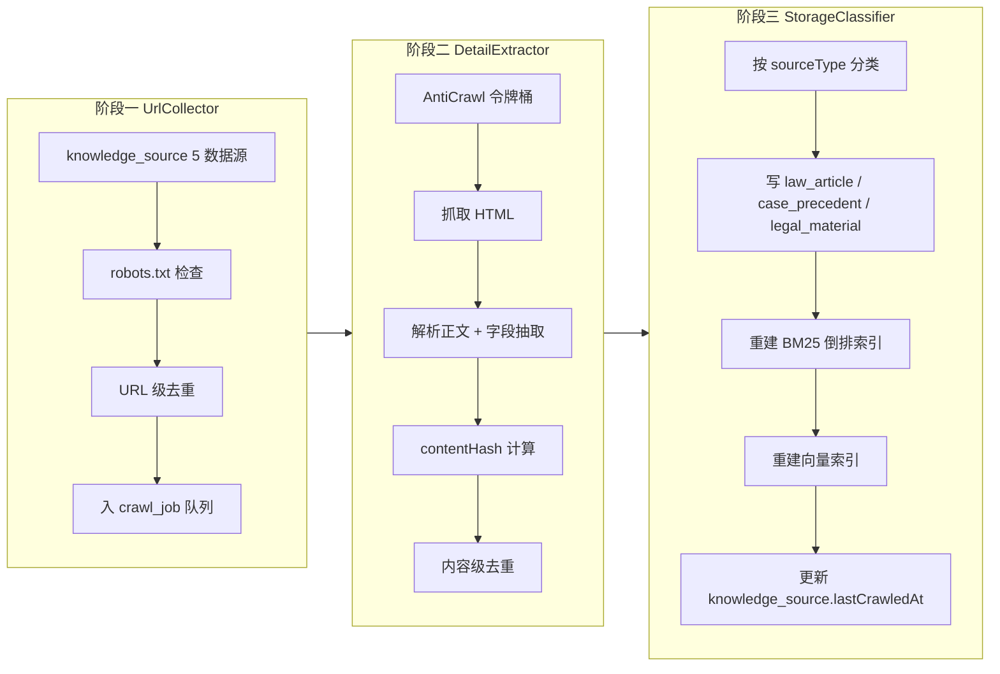

# 15 · 知识采集与同步管道

> 版本：v2.3 | 日期：2026-07-22 | 状态：设计扩展（v2.3 新增第十三节法条时效扫描 LawTimelinessScanner）
> 影响范围：02 / 03 / 05 / 06 / 08 / 10 / 16
> 本文为知识采集三阶段架构、6 子模块、5 新集合、反爬策略、调度策略权威源；集合字段以 05 为准，云函数接口以 06 为准，部署位置以 02 为准，流程节点以 08 第七节为准，合规要求以 03 为准。

---

## 一、设计目标与定位

### 1.1 目标

v2.2 在 v2.1 多 agent 协作后端之上，新增独立的知识采集管道，目标建立 5 万+ 篇法律知识库，覆盖法条 / 案例 / 流程 / FAQ / 材料等多类型知识，为 RagService / KnowledgeBase / 7 LegalTool 提供高质量数据底座。

### 1.2 设计原则

- **三阶段解耦**：URL 发现（UrlCollector）/ 内容抽取（DetailExtractor）/ 分类入库（StorageClassifier）三阶段独立可单测、独立可降级。
- **多源采集**：覆盖官方权威源（最高检 / 最高法 / 省高院 / 司法部）+ 法律法规库 + 公众号 + 维基百科法律条目 + 第三方法律资讯，共 5 类数据源。
- **反爬合规**：强制 robots.txt 尊重 + 令牌桶限速 + 真实可识别 UA + 随机延迟 + 指数退避，避免对源站造成压力。
- **周度增量**：周度全量 + 日度增量 + 手动触发三种调度模式，平衡新鲜度与成本。
- **去重严格**：URL 级（crawl_job.urlHash）+ 内容级（legal_material.contentHash）双层去重，避免重复入库。
- **审计可追溯**：4 个采集事件全量入审计日志，支持事后定责与监管核查。

### 1.3 与 v2.1 的关系

v2.1 知识库为静态导入（人工录入法条 / 案例）；v2.2 新增本管道实现自动化采集，原静态导入路径保留作为兜底与人工补录通道。本文档为采集架构权威源，05（5 个新集合 schema）/ 06（knowledgePipeline 云函数接口）/ 02（部署拓扑定时触发器）/ 03（采集合规节）/ 08（第七节流程图）均引用本文。

## 二、整体架构



## 三、6 子模块清单

| 子模块 | 职责 | 输入 | 输出 |
|--------|------|------|------|
| UrlCollector | 从 5 数据源发现 URL + 入队 + 去重 | knowledge_source 配置 | crawl_job 队列 |
| DetailExtractor | HTML 抓取 + 正文解析 + 字段抽取 + contentHash | crawl_job 单条 | normalizedContent + structuredFields |
| StorageClassifier | 分类 + 入库 + 索引重建 | normalizedContent + structuredFields | law_article / case_precedent / legal_material 记录 |
| AntiCrawl | 令牌桶限速 + UA 轮换 + 延迟 + 退避 | 域名 + 请求 | 节流后请求 |
| IncrementalUpdater | 增量调度（仅 lastCrawledAt > now-7d 的源） | knowledge_source.lastCrawledAt | 待采集 URL 子集 |
| WechatArticleCrawler | 公众号文章采集专项（URL 模式 / 正文提取 / 版权处理） | wechat_account 配置 | legal_material 记录（sourceType=wechat） |

## 四、数据源清单

### 4.1 5 类数据源

| 类型 | 代表源 | sourceType | 入库集合 |
|------|--------|-----------|---------|
| 司法机关官网 | 最高检 / 最高法 / 省高院 / 司法部 | judicial | legal_material / case_precedent |
| 法律法规库 | 国家法律法规数据库 / 北大法宝 | law | law_article |
| 公众号 | 最高人民法院 / 法律读库 / 法客帝国等 | wechat | legal_material |
| 维基百科法律条目 | zh.wikipedia.org 法律分类 | wiki | legal_material |
| 第三方法律资讯 | 中国裁判文书网 / 无讼 / 聚法案例 | case | case_precedent |

### 4.2 数据源管理

- 所有源经法务白名单审核后写入 `knowledge_source` 集合（见 05）
- 每源配置：`sourceId` / `name` / `url` / `sourceType` / `crawlStrategy`（full / incremental）/ `lastCrawledAt` / `status`（active / blocked / deprecated）/ `crawlIntervalDays`
- 第三方源须签署授权协议或确认robots.txt允许抓取

## 五、5 个新集合 schema

> 字段定义权威源为 05，本节仅列采集相关字段。

### 5.1 knowledge_source（数据源配置）

```typescript
{
  _id: string,
  sourceId: string,                  // 唯一标识
  name: string,
  url: string,                       // 源首页或 RSS
  sourceType: 'judicial' | 'law' | 'wechat' | 'wiki' | 'case',
  crawlStrategy: 'full' | 'incremental',
  crawlIntervalDays: number,         // 默认 7
  lastCrawledAt: Date,
  status: 'active' | 'blocked' | 'deprecated',
  robotsTxtCompliant: boolean,       // 强制校验
  uaIdentifier: string,              // 真实可识别 UA 含联系方式
  rateLimitPerSecond: number,        // 默认 1
  metadata: Record<string, any>      // 源特有配置（如公众号 biz）
}
```

### 5.2 crawl_job（采集任务队列）

```typescript
{
  _id: string,
  sourceId: string,
  url: string,
  urlHash: string,                   // sha256(url)，唯一索引
  status: 'pending' | 'running' | 'done' | 'failed' | 'skipped',
  enqueuedAt: Date,
  startedAt?: Date,
  finishedAt?: Date,
  retryCount: number,                // 默认 0，最多 3
  contentHash?: string,              // 阶段二填充
  errorCode?: '8008' | '8009',
  errorMessage?: string,
  durationMs?: number
}
```

### 5.3 legal_material（法律材料通用集合）

```typescript
{
  _id: string,
  sourceId: string,
  sourceUrl: string,
  sourceType: 'judicial' | 'law' | 'wechat' | 'wiki' | 'case' | 'material',
  title: string,
  publishedAt?: Date,
  promulgatingBody?: string,         // 颁布机关
  content: string,                   // 归一化后正文
  contentHash: string,               // sha256(normalize(content) + sourceUrl)，唯一索引
  structuredFields: Record<string, any>,
  lawRefs?: LawRef[],                // 引用法条
  category?: string,                 // 法律领域
  version: number,                   // 内容变更时 +1
  crawledAt: Date,
  archivedAt?: Date,                 // 公众号文章 30 天后归档
  archiveSummary?: string            // 归档后只留摘要
}
```

### 5.4 wechat_account（公众号账号管理）

```typescript
{
  _id: string,
  accountId: string,                 // 公众号唯一标识（biz 或自定义）
  name: string,                      // 公众号名称
  biz?: string,                      // 微信公众号 biz 参数
  crawlUrl: string,                  // 抓取入口（RSS 或历史文章页）
  crawlIntervalDays: number,         // 默认 1（日度增量）
  lastCrawledAt: Date,
  status: 'active' | 'blocked' | 'deprecated',
  authorized: boolean,               // 是否已获授权
  licenseExpiresAt?: Date            // 授权有效期
}
```

### 5.5 official_query_entry（官方查询入口，供 LawValidityQuery 等工具用）

```typescript
{
  _id: string,
  toolId: 'law_validity' | 'compensation_query' | 'sentencing_guide',
  queryKey: string,                  // 如"民法典第143条"
  officialUrl: string,               // 官方查询 URL
  officialBody: string,              // 颁布机关
  lastVerifiedAt: Date,              // 人工校验日期
  verified: boolean,
  metadata: Record<string, any>
}
```

## 六、三阶段详细设计

### 6.1 阶段一：UrlCollector

**职责**：从 knowledge_source 配置的 5 数据源发现新 URL，经 robots.txt 检查与 URL 级去重后入 crawl_job 队列。

**算法**：

```
1. query = { status: 'active', lastCrawledAt: { $lt: now - crawlIntervalDays * 86400 } }
2. for source in knowledge_source.find(query):
2.1   if not source.robotsTxtCompliant: 跳过 + 审计 crawl_source_blocked
2.2   urls = discoverUrls(source)   // 按 sourceType 分发到具体发现器
2.3   for url in urls:
2.4     urlHash = sha256(url)
2.5     if crawl_job.exists({ urlHash }): 跳过
2.6     insert crawl_job({ sourceId, url, urlHash, status: 'pending', enqueuedAt: now })
2.7   update knowledge_source.lastCrawledAt = now
3. 返回入队数量
```

**URL 发现器分发**：
- judicial / law：解析 sitemap.xml 或列表页分页
- wechat：调用 WechatArticleCrawler 子模块
- wiki：调用维基 API 获取分类成员
- case：解析裁判文书网列表页

### 6.2 阶段二：DetailExtractor

**职责**：从 crawl_job 队列消费 URL，经 AntiCrawl 节流后抓取 HTML，解析正文与结构化字段，计算 contentHash 做内容级去重。

**算法**：

```
1. job = crawl_job.findOneAndUpdate({ status: 'pending' }, { status: 'running', startedAt: now })
2. if not job: 退出
3. source = knowledge_source.findById(job.sourceId)
4. token = await AntiCrawl.acquire(source.url 域名, source.rateLimitPerSecond)   // 令牌桶
5. await sleep(randomDelay(2, 8))   // 随机延迟 2-8s
6. ua = pickUa()   // 10 个 UA 轮换
7. try:
7.1   html = await fetch(job.url, { headers: { 'User-Agent': ua } })
7.2   content = parseHtml(html, source.sourceType)   // 按类型选解析器
7.3   structuredFields = extractFields(content, source.sourceType)
7.4   normalizedContent = normalize(content)   // 去空白 / 统一标点 / 去 HTML 残留
7.5   contentHash = sha256(normalizedContent + job.url)
7.6   if legal_material.exists({ contentHash }):
7.7     update crawl_job({ status: 'skipped', contentHash, finishedAt: now })
7.8     审计 crawl_content_deduped
7.9     return
7.10  暂存 { normalizedContent, structuredFields, contentHash } 到内存（待阶段三）
7.11  调用 StorageClassifier.process(...)
7.12  update crawl_job({ status: 'done', contentHash, finishedAt: now, durationMs })
7.13  审计 crawl_job_run
8. catch e:
8.1   if e.isBlocked or e.isTimeout:
8.2     if job.retryCount < 3:
8.3       指数退避 1s / 2s / 4s
8.4       update crawl_job({ status: 'pending', retryCount: +1 })
8.5     else:
8.6       update crawl_job({ status: 'failed', errorCode: '8009', errorMessage })
8.7       update knowledge_source.status = 'blocked'
8.8       审计 crawl_source_blocked
8.9   else if e.isConcurrencyLimit:
8.10    update crawl_job({ status: 'pending' })   // 8008 等待
```

### 6.3 阶段三：StorageClassifier

**职责**：按 sourceType 将 normalizedContent 与 structuredFields 分类入库到 law_article / case_precedent / legal_material，重建 BM25 倒排索引与向量索引。

**算法**：

```
1. 根据 sourceType 分发：
1.1   sourceType == 'law':
1.2     record = mapToLawArticle(structuredFields)
1.3     upsert law_article(record)   // 按 lawName + articleNoInt 唯一
1.4   sourceType == 'case':
1.5     record = mapToCasePrecedent(structuredFields)
1.6     upsert case_precedent(record)   // 按 caseNo 唯一
1.7   sourceType in ['judicial', 'wechat', 'wiki', 'material']:
1.8     record = mapToLegalMaterial(structuredFields, normalizedContent)
1.9     upsert legal_material(record)   // 按 contentHash 唯一
2. 重建索引（异步）：
2.1   BM25 倒排索引追加 keywords
2.2   向量索引追加 embedding（调用 text-embedding-v2）
3. 更新 knowledge_source.lastCrawledAt = now
4. 审计 crawl_classified { sourceId, sourceType, collection, recordId }
```

## 七、反爬策略（AntiCrawl 子模块）

### 7.1 令牌桶限速

- 每域名独立令牌桶，容量 = rateLimitPerSecond（默认 1）
- 请求前 acquire() 获取令牌，无令牌则等待
- 跨域不共享，避免单域被限影响全局

### 7.2 随机延迟

- 每次请求前 `sleep(randomDelay(2, 8))` 秒
- 避免固定节奏被识别为爬虫

### 7.3 指数退避

- 失败时按 1s → 2s → 4s 退避，最多 3 次重试
- 仍失败标记 source.status=blocked + 周度重试

### 7.4 UA 轮换

- 维护 10 个真实可识别 UA，每个含联系方式（如 `LegalAgentBot/1.0 (contact: legal@example.com)`）
- 每次请求随机选一个
- UA 必须真实可识别，禁止伪装浏览器

### 7.5 robots.txt 强制尊重

- 阶段一 UrlCollector 在入队前强制检查 robots.txt
- Disallow 路径直接跳过 + 审计 crawl_source_blocked
- knowledge_source.robotsTxtCompliant = false 的源整体跳过

## 八、去重策略

### 8.1 URL 级去重

- 键：`crawl_job.urlHash = sha256(url)`
- 唯一索引，重复 URL 直接跳过入队

### 8.2 内容级去重

- 键：`legal_material.contentHash = sha256(normalize(content) + sourceUrl)`
- 唯一索引，重复内容跳过入库 + 审计 crawl_content_deduped

### 8.3 增量更新策略

- contentHash 命中：跳过（内容未变更）
- contentHash 变更：legal_material.version += 1，覆盖 content / structuredFields / crawledAt
- 法条 / 案例变更：触发 LawValidityQuery 缓存失效（toolVersion 字段联动）

## 九、WechatArticleCrawler（公众号文章采集专项）

### 9.1 URL 模式

- 微信公众号文章 URL 模式：`https://mp.weixin.qq.com/s/{token}` 或 `https://mp.weixin.qq.com/s?__biz={biz}&mid={mid}&idx={idx}&sn={sn}`
- wechat_account 集合管理账号清单（biz / 入口 URL / 抓取节奏）

### 9.2 正文提取

- 去除广告 / 评论 / 分享卡片 / 推荐阅读
- 保留标题 / 作者 / 发布日 / 正文 / 图片引用
- 图片转存至云存储，正文中的 img src 替换为 cloudfileId

### 9.3 版权与免责

- 仅采集公开 RSS / 分享链接，不破解微信私有协议
- 正文存储 30 天后归档：删除正文，保留 archiveSummary（≤ 200 字摘要）+ sourceUrl 外链
- UI 展示时显著标注"⚠️ 本文为公众号文章摘要，完整内容请访问原文"
- 用户点击外链前弹窗确认跳转外部站点（见 03 "外链免责"节）

## 十、调度与触发

### 10.1 周度全量

- 触发器：`cron: 0 0 2 * * 0`（每周日 02:00）
- 范围：所有 status=active 的 knowledge_source
- 分批：≤ 1000 URL / 批，批间间隔 60s
- 预计耗时：4-8 小时（取决于源规模）

### 10.2 日度增量

- 触发器：`cron: 0 0 3 * * *`（每日 03:00）
- 范围：wechat_account 全部 + knowledge_source.lastCrawledAt > now-7d 的源
- 预计耗时：30 分钟-2 小时

### 10.3 手动触发

- 端点：`/knowledgePipeline:run`（见 06）
- 权限：admin
- 参数：`{ sourceId?: string, full?: boolean }`
- 用途：新增数据源后立即触发 / 故障重试

## 十一、错误码与降级

### 11.1 错误码

| 错误码 | 含义 | 触发条件 | 处理 |
|--------|------|---------|------|
| 8008 | 采集并发超限 | 同域请求超令牌桶容量 | 等待 + 重试，不阻断整体流程 |
| 8009 | 采集源不可达 | HTTP 4xx/5xx / DNS 失败 / 超时 | 指数退避 3 次后标记 source.status=blocked |

### 11.2 降级策略

- 反爬触发：标记 source.status=blocked + 周度重试 + 审计 crawl_source_blocked
- 公众号文章无法抓取：跳过 + 审计，不影响其他源
- 索引重建失败：保留旧索引 + 告警 + 人工介入
- 单批失败：标记 crawl_job.status=failed + 下个周期重试，不阻断后续批次

## 十二、审计与日志

### 12.1 审计事件

| event | 触发时机 | detail 字段 |
|-------|---------|-----------|
| crawl_job_run | 单个 crawl_job 完成 | `{ source, urlHash, duration, status, contentHash? }` |
| crawl_source_blocked | 源被标记 blocked | `{ sourceId, reason, retryCount }` |
| crawl_content_deduped | 内容级去重命中 | `{ sourceId, urlHash, contentHash }` |
| crawl_classified | 阶段三入库完成 | `{ sourceId, sourceType, collection, recordId }` |

### 12.2 日志策略

- 单 crawl_job 全链路日志：traceId 贯穿（pipeline 内部生成）
- 失败详情入 audit_log.detail，便于事后排查
- 周度全量执行后生成汇总报告（成功率 / 去重率 / 各源状态），存 cloud storage 供运营查看

## 十三、法条时效扫描（LawTimelinessScanner，v2.3）

### 13.1 设计目标

法律时效性是法律 AI 的核心合规要求。已废止或已修订的法条若仍被 AI 引用，将严重误导用户。本节定义 `LawTimelinessScanner` 子模块，定期扫描 `law_article` 集合中法条的现行有效状态，检测 `effective → repealed/amended` 变更，并通过法条引用图谱（`law_citation_graph`，见 05 3.26）定位受影响的案例与文书，生成修正预警（`law_amendment_alert`，见 05 3.27）。

### 13.2 触发机制

| 触发方式 | 配置 | 范围 |
|---------|------|------|
| 定时触发 | `cron: 0 0 3 * * 1`（每周一 03:00） | `law_article` 全量（按 `updatedAt` 增量扫描可选） |
| 手动触发 | 端点 `/knowledgePipeline:scanTimeliness`（见 06），权限 admin | 指定 `articleId` 或全量 |
| 事件触发 | `law_article` 入库/更新时（StorageClassifier 阶段三） | 单条法条即时校验 |

### 13.3 三步算法

```
输入：law_article 游标（全量或增量）
输出：law_amendment_alert 记录 + 影响清单

1. 状态检测（StatusDetector）：
   1.1  for article in law_article.find({ status: { $in: ['effective', 'amended'] } }):
   1.2    entry = official_query_entry.findOne({ toolId: 'law_validity', queryKey: `${article.lawName}第${article.articleNo}条` })
   1.3    if not entry: 标记 article.status = 'needs_review' + warnings，跳到下一条
   1.4    try:
   1.5      officialStatus = fetchOfficialStatus(entry.officialUrl)   // 抓取官方页面解析状态
   1.6      if officialStatus != article.status:
   1.7        oldStatus = article.status
   1.8        article.status = officialStatus   // effective → repealed/amended
   1.9        article.updatedAt = now
   1.10       law_article.update(article)
   1.11       进入步骤 2（交叉引用扫描）
   1.12   catch e (官方网址不可达 / 解析失败):
   1.13     article.status = 'needs_review'
   1.14     law_article.update(article)
   1.15     审计 law_amendment_alert { articleId, oldStatus, newStatus: 'needs_review', reason: 'official_unreachable' }
   1.16     跳到下一条（不进入步骤 2）

2. 交叉引用扫描（CitationGraphScanner）：
   2.1  graph = law_citation_graph.findOne({ articleId: article._id })
   2.2  if not graph: 影响清单为空，跳到步骤 3
   2.3  affectedCaseIds = graph.citingCaseIds   // 引用该法条的案例
   2.4  affectedDocIds = graph.citingDocIds     // 引用该法条的文书
   2.5  affectedCount = graph.citedCount

3. 预警生成（AlertGenerator）：
   3.1  alert = {
   3.2    alertId: 'la_' + article._id + '_' + Date.now(),
   3.3    articleId: article._id,
   3.4    oldStatus: oldStatus,
   3.5    newStatus: officialStatus,
   3.6    detectedAt: now,
   3.7    affectedCaseIds: affectedCaseIds,
   3.8    affectedDocIds: affectedDocIds,
   3.9    state: 'pending',
   3.10   resolvedBy: null,
   3.11   resolvedAt: null
   3.12 }
   3.13 law_amendment_alert.insert(alert)
   3.14 通知管理员（订阅消息 / 企微机器人）
   3.15 审计 law_amendment_alert_triggered { articleId, oldStatus, newStatus, affectedCount }
```

### 13.4 降级策略

| 场景 | 降级措施 |
|------|---------|
| 官方网址不可达（HTTP 4xx/5xx/超时） | 标记 `status: needs_review` + 审计 `law_amendment_alert` reason=`official_unreachable`，不修改原 status |
| 官方页面结构变更（解析失败） | 同上，reason=`parse_failed` |
| `official_query_entry` 无该法条入口 | 跳过状态检测，warnings 提示"该法条无官方查询入口，无法自动校验" |
| `law_citation_graph` 无该法条引用记录 | 影响清单为空，仍生成预警（affectedCaseIds/affectedDocIds 为空数组） |
| 扫描超时（单条 > 10s） | 跳过该条 + 审计，继续下一条 |

### 13.5 预警处理流程

```
law_amendment_alert.state 状态机：
  pending → reviewed（管理员/律师确认变更）→ resolved（已处理受影响案例/文书）

处理动作：
  1. 管理员在后台查看预警详情（法条名/旧状态/新状态/受影响案例数/受影响文书数）
  2. 确认变更后标记 state=reviewed
  3. 对受影响案例/文书：
     a. 案例仍引用已废止法条 → 标记 case_precedent.needsReview=true
     b. 文书仍引用已废止法条 → 通知文书所有者（订阅消息）+ DocumentReviewer 下次审核时 warnings
     c. AI 回答引用已废止法条 → ComplianceMonitor 将该回答标 block（见 03 合规风险监控节）
  4. 处理完成后标记 state=resolved + resolvedBy + resolvedAt
```

### 13.6 数据依赖

| 集合 | 用途 | 定义位置 |
|------|------|---------|
| `law_article` | 扫描对象（status / effectiveDate / promulgatingBody） | 05 3.1 |
| `official_query_entry` | 官方查询网址目录（officialUrl / verified） | 05 3.19 |
| `law_citation_graph` | 法条引用图谱（citingCaseIds / citingDocIds / citedCount） | 05 3.26（v2.3） |
| `law_amendment_alert` | 修正预警记录 | 05 3.27（v2.3） |

### 13.7 模块实现

- 模块名：`LawTimelinessScanner`
- 所属域：1.10 采集域（见 04）
- 部署：云函数 `knowledgePipeline`（定时触发器 + 手动触发端点）
- 调度：与周度全量采集（第十节 10.1）串行执行，先采集后扫描

### 13.8 与 CitationGraphBuilder 的协作

`CitationGraphBuilder`（见 14 第十四节）负责维护 `law_citation_graph` 集合，为本节步骤 2（交叉引用扫描）提供数据基础。二者协作关系：

```
案例/文书入库 → CitationGraphBuilder 更新 law_citation_graph → LawTimelinessScanner 扫描时查询引用关系
```

若 `law_citation_graph` 未及时更新（如 CitationGraphBuilder 尚未执行），LawTimelinessScanner 降级为仅生成状态变更预警（无影响清单），不影响核心功能。

---

## 十四、与 v1.0/v2.0/v2.1/v2.2/v2.3 的差异声明

- **v2.0 → v2.1**：无采集管道（v2.1 知识库为静态导入）。
- **v2.1 → v2.2**：新增本文档，作为采集架构权威源。新增 5 个集合（official_query_entry / legal_material / knowledge_source / wechat_account / crawl_job）、6 子模块、三阶段架构、反爬策略、调度策略；与 05（集合 schema）、06（knowledgePipeline 云函数）、02（部署拓扑定时触发器）、03（采集合规节）、08（第七节流程图）形成闭环。本文档为采集架构权威源，工具 LawValidityQuery / CompensationQuery / SentencingGuide 的数据底座部分由本管道供给。
- **v2.2 → v2.3**：新增第十三节"法条时效扫描（LawTimelinessScanner）"，定义法条现行有效状态定期扫描机制（三步算法：状态检测 → 交叉引用扫描 → 预警生成），依赖 `law_citation_graph`（05 3.26）与 `law_amendment_alert`（05 3.27）两个 v2.3 新增集合；与 14 第十四节 CitationGraphBuilder 协作（引用图谱构建 → 时效扫描查询引用关系）；与 03 合规风险监控节协作（已废止法条引用触发 compliance block）；与 16 法律推理架构协作（IRAC Rule 抽取时校验法条时效）。影响范围追加 16。
