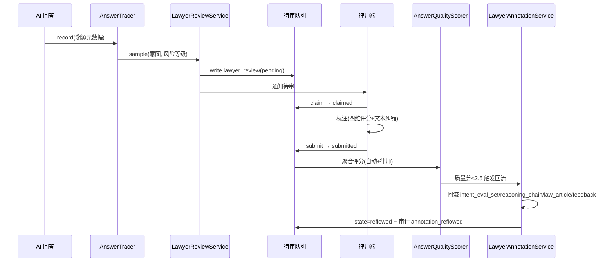

# 17 · 律师审核与评估闭环

> 版本：v2.3 | 日期：2026-07-22 | 状态：新建（v2.3 律师审核与评估闭环权威源）
> 影响范围：03 / 05 / 06 / 09 / 11 / 13
> 本文为律师审核工作流、回答质量评分、AI 回答溯源、合规风险评分、律师标注回流五合一闭环权威源；法规依据与审计事件以 03 为准，集合与字段以 05 为准，接口契约与错误码以 06 为准，UI 线框图以 09 为准，Agent 编排以 11 为准，治理条款以 13 为准。

---

## 一、设计目标

v2.3 在 v2.2 多 agent 协作 + 知识采集 + 法律工具之上，建立**专业律师把关 + 全链路溯源 + 闭环持续改进**的评估机制，覆盖用户提出的方向 7（系统评估机制）。四大目标：

1. **专业把关** — AI 回答经抽样进入律师审核队列，由持证律师人工标注，拦截专业错误与合规风险。
2. **质量量化** — 回答质量四维评分（准确性/完整性/合规性/实用性），自动评分实时 + 律师评分异步聚合，从"主观感受"升级为"可度量指标"。
3. **全链路溯源** — 每条 AI 回答绑定溯源元数据（citedLaws/citedCases/promptVersion/modelVersion/reasoningChainId/ragSources），支持事后审计、律师复核与误判归因。
4. **闭环改进** — 律师标注回流至评测集 / 推理链 / 法条库 / 反馈库，驱动模型微调、Prompt 迭代与知识库订正，形成"产出→审核→评分→回流→改进"闭环。

### 1.1 与其他文档的关系

| 文档 | 关系 |
|------|------|
| 03 | 审计事件权威源（第七节 5 个 v2.3 事件）+ 合规风险监控（12.7 ComplianceMonitor）+ 数据可携带权（12.5） |
| 05 | 集合 schema 权威源（lawyer_review 3.33 / answer_traceability 3.34 / compliance_alert 3.32） |
| 06 | 接口契约权威源（溯源 API + 错误码 8013 合规拦截） |
| 09 | UI 权威源（TracePanel 溯源面板 / 律师审核页 / 数据导出页） |
| 11 | Agent 编排权威源（lawyer-review Agent，第 12 个 Agent，3 capability） |
| 13 | 治理条款权威源（审计事件登记 + 数据可携带权条款） |

## 二、律师审核工作流（LawyerReviewService）

### 2.1 设计目标

将 AI 回答按风险等级抽样入审，律师领取后标注四维评分与文本纠错，提交后回流评测集，形成专业把关闭环。

### 2.2 状态机

```
pending → claimed → reviewing → submitted → reflowed
   ↓         ↓          ↓           ↓
timeout   timeout    give_up     (回流完成)
```

| 状态 | 含义 | 触发 | 后续 |
|------|------|------|------|
| `pending` | 待审，进入队列 | 抽样策略命中，写 lawyer_review | 律师领取 → claimed |
| `claimed` | 律师已领取，待标注 | 律师在审核页点击"领取" | 律师开始标注 → reviewing |
| `reviewing` | 标注中 | 律师进入标注界面 | 律师提交 → submitted |
| `submitted` | 已提交，待回流 | 律师提交评分 + 标注 | AnswerQualityScorer 聚合 → reflowed |
| `reflowed` | 回流完成 | LawyerAnnotationService 回流完毕 | 闭环结束，归档 |

**超时/放弃**：`pending` 超 72h 未领取 → 自动降级重新入队；`claimed`/`reviewing` 超 48h 未提交 → 释放回 `pending` 供其他律师领取；律师主动 `give_up` → 释放回 `pending`。

### 2.3 抽样策略

| 风险等级 | 判定条件 | 抽样率 |
|---------|---------|--------|
| 高风险 | 意图 = `case_reasoning`（法律推理）/ `document_generate`（文书生成） | 100% 入审 |
| 用户标记 | 用户主动点击"反馈"标记回答有问题 | 100% 入审 |
| 普通 | 其他意图回答 | 5% 随机抽样 |

**抽样执行**：`AnswerTracer.record` 写完溯源后，由 `LawyerReviewService.sample` 按上表判定；命中即写 `lawyer_review(state=pending)` 并通知律师端待审队列。

### 2.4 标注字段

律师标注结构（写入 `lawyer_review.annotations`）：

```typescript
{
  scores: {
    accuracy: number,      // 准确性 1-5，法条引用与法律结论正确性
    completeness: number,  // 完整性 1-5，是否遗漏关键争议点/法条/救济途径
    compliance: number,    // 合规性 1-5，是否符合执业规范与免责要求
    usefulness: number     // 实用性 1-5，对用户实际问题的可操作性
  },
  textAnnotations: {
    citationErrors?: Array<{ lawRef, errorType, correction }>,  // 引用纠错
    factCorrections?: Array<{ segment, correction }>,            // 事实订正
    reasoningFlaws?: Array<{ step, flaw, suggestion }>,          // 推理链缺陷
    generalComment?: string                                       // 总体评语
  },
  riskFlag: 'none' | 'low' | 'high',   // 高风险同步触发 compliance_alert
  reviewedBy: string,                   // 律师 userId
  reviewedAt: Date,
  duration: number                       // 审核耗时 ms
}
```

### 2.5 时序图



## 三、回答质量评分（AnswerQualityScorer）

### 3.1 双轨评分

- **自动评分（实时）**：AI 回答产出时同步计算，写入 `answer_traceability.autoScore`，用于实时质量监控与合规风险评分输入。
- **律师评分（异步）**：律师审核提交后聚合，写入 `lawyer_review.scores`，用于闭环改进与律师绩效统计。

### 3.2 自动评分算法

```
输入: answer (AI 回答), trace (溯源元数据)
输出: autoScore (0-5)

1. citationSuccessRate = trace.citedLaws.filter(verified).length / max(trace.citedLaws.length, 1)   // 法条引用成功率
2. reasoningCompleteness = trace.reasoningChainId ? 1.0 : 0.6   // 推理链完整度（有推理链满分）
3. disclaimerCoverage = hasDisclaimer(answer) ? 1.0 : 0.0       // 免责覆盖
4. autoScore = 5 × (0.5 × citationSuccessRate + 0.3 × reasoningCompleteness + 0.2 × disclaimerCoverage)
```

### 3.3 律师评分聚合

```
lawyerScore = (accuracy + completeness + compliance + usefulness) / 4
```

### 3.4 质量等级阈值

| 等级 | 综合分（律师评分为主，无律师评分时用 autoScore） | 处置 |
|------|-----------------------------------------------|------|
| 优 | ≥ 4.0 | 标记 `answer_scored` 审计，纳入正向样本库 |
| 中 | 2.5 - 4.0 | 标记 `answer_scored` 审计，常规归档 |
| 差 | < 2.5 | 触发 `LawyerAnnotationService` 回流（见第六节）+ 同步 `compliance_alert`（若 riskFlag=high） |

## 四、AI 回答溯源（AnswerTracer）

### 4.1 设计目标

每条 AI 回答绑定全链路溯源元数据，支持事后审计、律师复核、误判归因与合规核查。溯源字段写入 `answer_traceability` 集合（05 3.34）。

### 4.2 溯源字段

```typescript
{
  msgId: string,                  // 对话消息 ID（主键）
  userId: string,
  intent: IntentType,
  citedLaws: LawRef[],            // 引用法条（含 verified 状态）
  citedCases: CaseRef[],          // 引用案例
  promptVersion: string,          // Prompt 版本（见 07 第五节 Prompt 工程规范）
  modelVersion: string,           // 模型版本（如 qwen-max-2026q2）
  reasoningChainId?: string,      // 推理链 ID（case_reasoning 意图，引用 reasoning_chain 05 3.28）
  ragSources: Array<{ docId, score, collection }>,  // RAG 召回来源
  autoScore: number,              // 自动评分（见 3.2）
  lawyerReviewId?: string,        // 关联律师审核 ID（入审后填充）
  createdAt: Date
}
```

### 4.3 溯源 API

- 端点：`GET /v1/answers/{msgId}/trace`（见 06）
- 权限：用户查自己消息（`AuthService.checkOwner`）；律师查待审消息（`lawyer` 角色）；管理员全查
- 返回：溯源字段全集
- 用途：律师审核页展示溯源、用户"为什么这么回答"溯源面板、管理员合规核查

### 4.4 UI 展示

`TracePanel`（09）在 AI 回答下方可展开，展示：引用法条（含校验状态徽章）/ 引用案例（含来源链接）/ 推理链可视化（ReasoningChainView，case_reasoning 时）/ RAG 来源 / 模型与 Prompt 版本。用户点击法条可跳转法条效力查询（14 LawValidityQuery）。

## 五、合规风险评分（ComplianceMonitor 闭环）

### 5.1 设计目标

对 AI 回答实时合规风险评分，block 级拦截展示并触发律师复核，形成"产出→扫描→拦截→复核→retrain"闭环。模块定义见 03 第 12.7 节。

### 5.2 三路触发评分

| 路径 | 输入 | 评分 |
|------|------|------|
| ContentSafety | AI 回答文本 | 命中违法词/敏感词 → 直接 block |
| 律师标记 | lawyer_review.riskFlag = high | high → block |
| 法条引用失败率 | trace.citedLaws 中 verified=false 比例 | 失败率 > 30% → warn；> 60% → block |

### 5.3 风险等级与处置

| 等级 | 判定 | 处置 |
|------|------|------|
| `pass` | 三路均无触发 | 正常返回客户端 |
| `warn` | 法条引用失败率 30%-60% | 返回客户端 + warnings 标记 + 审计 |
| `block` | ContentSafety 命中 / 律师 high / 引用失败率 > 60% | 拦截展示（返回 8013）+ 写 compliance_alert（05 3.32）+ 通知律师复核 |

### 5.4 闭环

```
block → compliance_alert(state=open) → 律师复核 → 标注 → retrain 触发
```

- `compliance_alert` 集合（05 3.32）记录 `{ alertId, msgId, userId, riskLevel, triggers, state(open|reviewing|resolved), resolvedBy, resolvedAt }`
- 律师复核后，若确认问题 → 触发 `LawyerAnnotationService` 回流（第六节）+ 模型/Prompt retrain
- 编排集成：`complianceMonitor.scan` 在 11 OrchestratorAgent 编排中（行 304），block 返回 `8013`

## 六、律师标注回流（LawyerAnnotationService）

### 6.1 设计目标

将律师标注转化为可复用资产，回流至评测集 / 推理链 / 法条库 / 反馈库，驱动持续改进。

### 6.2 回流目标

| 回流目标 | 集合 | 触发条件 | 回流内容 |
|---------|------|---------|---------|
| 推理评测集 | `intent_eval_set` | case_reasoning 意图 + 推理缺陷 | 标注样本 + 期望推理链（用于 reasoning_eval_set，见 10） |
| 推理链纠错 | `reasoning_chain`（05 3.28） | reasoningFlaws 非空 | 律师修正后的推理步骤，标记 `lawyerCorrected=true` |
| 法条订正 | `law_article`（05 3.1） | citationErrors 非空 | 法条内容/状态订正 + 触发 LawTimelinessScanner 复查（15 第十三节） |
| 反馈归档 | `feedback` | 用户标记入审 | 归档用户反馈 + 律师处置结论 |

### 6.3 回流流程

```
1. 触发：lawyer_review.state=submitted 且 质量分<2.5 或 riskFlag=high
2. for target in 回流目标:
2.1   if hasRelevantAnnotations(target):
2.2     record = buildReflowRecord(target, lawyer_review.annotations)
2.3     upsert(target_collection, record, dedupKey)   // 去重键避免重复回流
2.4     if target == 'law_article': trigger LawTimelinessScanner.rescan(record.articleId)
3. update lawyer_review.state = reflowed
4. AuditLog.write annotation_reflowed { reviewId, targets, targetIds }
```

### 6.4 去重策略

- 推理评测集：按 `msgId + intent` 去重，同消息仅回流一次
- 推理链纠错：按 `reasoningChainId + step` 去重
- 法条订正：按 `articleId` 去重，多次订正追加到 `amendmentHistory`

## 七、集合 schema

> 字段定义权威源为 05，本节仅列评估闭环相关字段与索引。

### 7.1 lawyer_review（05 3.33）

```typescript
{
  _id: string,
  reviewId: string,                 // 唯一标识
  msgId: string,                    // 关联消息
  userId: string,
  intent: IntentType,
  riskLevel: 'high' | 'normal' | 'user_flagged',   // 抽样来源
  state: 'pending' | 'claimed' | 'reviewing' | 'submitted' | 'reflowed',
  sampledAt: Date,
  claimedBy?: string,               // 律师 userId
  claimedAt?: Date,
  annotations?: {                   // submitted 后填充（见 2.4）
    scores: { accuracy, completeness, compliance, usefulness },
    textAnnotations: { citationErrors?, factCorrections?, reasoningFlaws?, generalComment? },
    riskFlag, reviewedBy, reviewedAt, duration
  },
  reflowTargets?: string[],         // reflowed 后填充
  createdAt: Date,
  updatedAt: Date,
  expireAt: Date                    // TTL 365 天
}
```
索引：`idx_msgId`（唯一）/ `idx_state_claimedBy`（待审队列查询）/ `idx_userId_createdAt` / TTL 365 天。

### 7.2 answer_traceability（05 3.34）

字段见 4.2 节。索引：`idx_msgId`（唯一）/ `idx_userId_createdAt` / TTL 180 天。

### 7.3 compliance_alert（05 3.32）

```typescript
{
  _id: string,
  alertId: string,
  msgId: string,
  userId: string,
  riskLevel: 'warn' | 'block',
  triggers: Array<{ path: 'content_safety' | 'lawyer_flag' | 'citation_failure', detail }>,
  state: 'open' | 'reviewing' | 'resolved',
  claimedBy?: string,
  resolvedBy?: string,
  resolvedAt?: Date,
  createdAt: Date
}
```
索引：`idx_state_createdAt`（待处理告警查询）/ `idx_msgId` / TTL 180 天。

## 八、Agent 编排（lawyer-review Agent）

### 8.1 Agent 定义

`lawyer-review` Agent（11 第 12 个 Agent，L-Internal 不对外），包装 5 个模块：

| 模块 | 职责 |
|------|------|
| LawyerReviewService | 审核工作流状态机 + 抽样策略 |
| AnswerQualityScorer | 双轨评分聚合 |
| AnswerTracer | 溯源元数据记录 |
| ComplianceMonitor | 合规风险三路评分 |
| LawyerAnnotationService | 标注回流 |

### 8.2 capability

| capability | 职责 | 暴露 |
|-----------|------|------|
| `review.lawyer` | 律师审核工作流（领取/标注/提交） | L-Internal |
| `review.score` | 质量评分聚合 | L-Internal |
| `review.compliance` | 合规风险扫描 | L-Internal |

### 8.3 异步任务

审核与回流为异步长任务，写 `agent_job`（11），避免阻塞主对话流程：
- `sample_and_notify`：抽样入审 + 通知律师
- `score_aggregate`：律师提交后聚合评分
- `reflow`：标注回流（多目标，可并行）

## 九、审计事件

> 权威源为 03 第七节，本节列出 v2.3 新增 5 个事件（与 03/13 一致）。

| event | 触发时机 | detail 字段 |
|-------|---------|-----------|
| `data_export` | 数据导出完成 | `{ userId, requestId, scope, fileId }` |
| `compliance_blocked` | 合规风险拦截 | `{ msgId, userId, riskLevel, triggers }` |
| `lawyer_review_submit` | 律师审核提交 | `{ reviewId, lawyerId, msgId, scores }` |
| `answer_scored` | 回答质量评分 | `{ msgId, autoScore, lawyerScore? }` |
| `annotation_reflowed` | 律师标注回流 | `{ reviewId, target, targetId }` |

## 十、差异声明（v2.3 新增）

- **v1.0 → v2.2**：无律师审核评估机制。v2.2 仅有 3 评测集 + 48h 反馈响应 + 误判回流（10），无律师人工把关、无回答质量评分、无全链路溯源、无合规风险监控闭环、无律师标注回流闭环。
- **v2.2 → v2.3**：新建本文档（第 17 篇），定义五合一评估闭环：
  1. **律师审核工作流**（第二节）：状态机 `pending→claimed→reviewing→submitted→reflowed` + 三档抽样策略（高风险 100%/用户标记 100%/普通 5%）+ 四维评分标注字段。
  2. **回答质量评分**（第三节）：AnswerQualityScorer 双轨评分（自动实时 + 律师异步），四维聚合，阈值 ≥4 优 / 2.5-4 中 / <2.5 差。
  3. **AI 回答溯源**（第四节）：AnswerTracer 绑定溯源元数据（citedLaws/citedCases/promptVersion/modelVersion/reasoningChainId/ragSources）+ 溯源 API + TracePanel UI。
  4. **合规风险评分**（第五节）：ComplianceMonitor 三路评分（ContentSafety + 律师标记 + 法条引用失败率）→ pass/warn/block，block 返回 8013 + 写 compliance_alert。
  5. **律师标注回流**（第六节）：LawyerAnnotationService 回流 4 目标（intent_eval_set/reasoning_chain/law_article/feedback），驱动模型微调与知识库订正。
  - 新增集合：`lawyer_review`（05 3.33）/ `answer_traceability`（05 3.34）/ `compliance_alert`（05 3.32）。
  - 新增 Agent：`lawyer-review`（11 第 12 个 Agent，3 capability，L-Internal）。
  - 新增审计事件 5 个（见第九节，与 03 第七节一致）。
  - 新增错误码：`8013`（合规拦截，见 06）。
